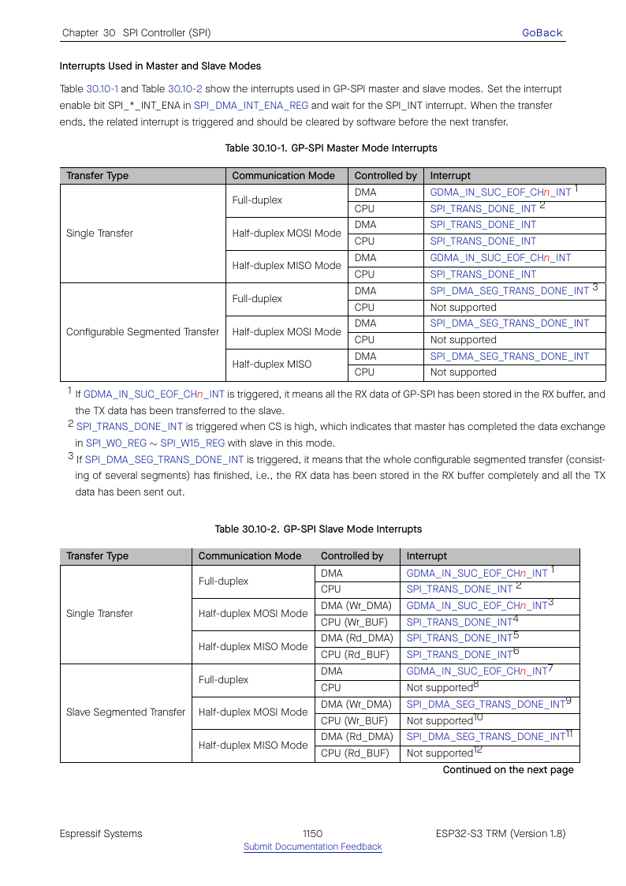

# Cornell Notes

## Topic: GP-SPI Interrupts

## Date: 20/07/2026

---

### Cue Column (Questions, Keywords, or Prompts)

- Which conditions signal completion and errors?
- How are raw, enabled, status, clear, and set registers related?
- Which interrupt does each driver role consume?

---

### Notes Section (Main Notes)

The DMA interrupt block follows the usual raw → enable → status pattern. `SPI_DMA_INT_RAW_REG` latches events, `SPI_DMA_INT_ENA_REG` gates them, `SPI_DMA_INT_ST_REG` reports enabled status, and clear/set registers acknowledge or inject events.

Important events include `SPI_TRANS_DONE_INT`, slave completion, FIFO underflow/overflow, and slave-HD command/DMA events. A handler must read the relevant status, clear it, finish the active software descriptor, and only then arm the next transaction. GDMA EOF is a separate interrupt source and may be required to prove RX data has reached memory.

ESP-IDF installs an ISR during initialization, usually leaving it disabled until work is queued. Callback code executes in ISR context and must obey IRAM and nonblocking restrictions.

TRM source: §30.10, pages 1149–1151.

#### Related notes

- [Callback and ISR safety](../03_use_cases/11_callbacks_interrupts_iram_and_thread_safety.md)
- [Queued master ISR sequence](../03_use_cases/05_interrupt_queued_master_sequence.md)
- [Interrupt symbol inventory](../03_use_cases/15_spi_apis.md#interrupt-callback-and-power-boundaries)

---

### Summary Section (Summary of Notes)

SPI and GDMA completion are distinct. Correct ISR order is inspect, clear, collect/return the active descriptor, prepare the next descriptor, then re-enable or start hardware.
