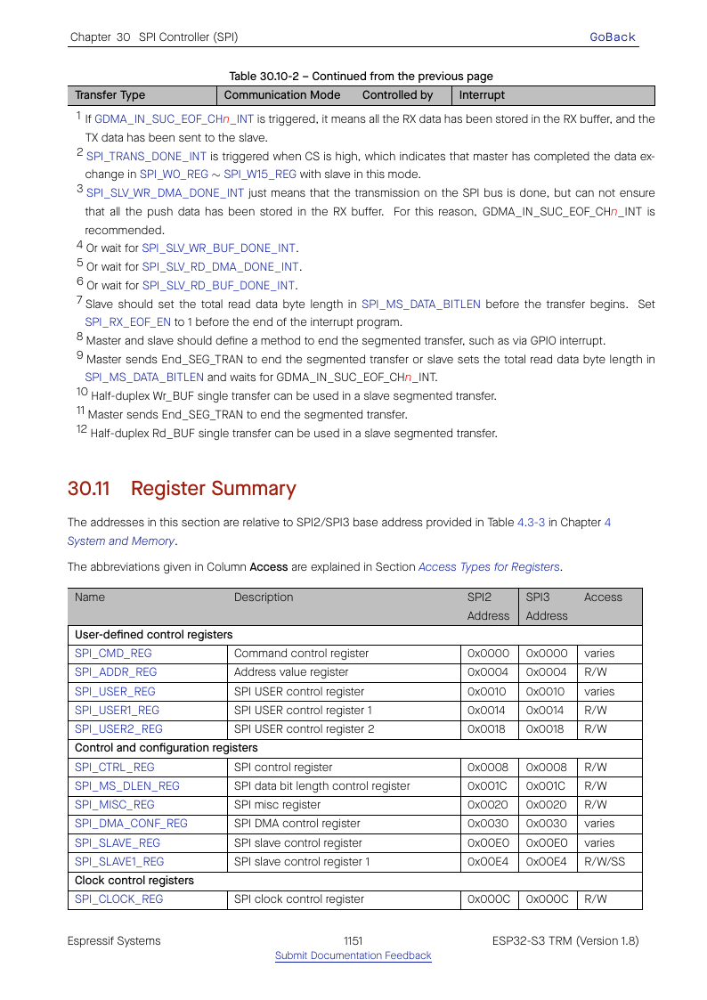

# Cornell Notes

## Topic: GP-SPI Register Summary and Access Rules

## Date: 20/07/2026

---

### Cue Column (Questions, Keywords, or Prompts)

- Which register families configure a transaction?
- Which fields are role- or host-specific?
- Why should applications avoid direct register writes while using ESP-IDF drivers?

---

### Notes Section (Main Notes)

| Family | Representative registers | Purpose |
|---|---|---|
| Core control | `SPI_CMD`, `SPI_CTRL`, `SPI_USER`, `SPI_USER1/2` | start, role, line modes, phases, lengths |
| Clock/CS | `SPI_CLOCK`, `SPI_MISC`, `SPI_DIN_MODE/NUM`, `SPI_DOUT_MODE/NUM` | divider, CS polarity/timing, sampling delays |
| Data lengths | `SPI_MS_DLEN`, `SPI_SLV_WRBUF_DLEN`, `SPI_SLV_RDBUF_DLEN` | master/slave bit counts |
| DMA | `SPI_DMA_CONF`, DMA interrupt registers | FIFO ownership, resets, EOF/error status |
| Slave/HD | `SPI_SLAVE`, `SPI_SLV_*` | slave state, received length, segment/shared-register services |
| Buffer | `SPI_W0`…`SPI_W15` | 64-byte CPU TX/RX storage |

Register headers use `DR_REG_SPI2_BASE`/`DR_REG_SPI3_BASE`; `spi_dev_t` supplies typed fields. Target LL code is the authoritative mapping from HAL intent to fields. Fields documented “SPI2 only” or invalid for SPI3 must be capability-gated.

Direct application writes race with driver ISR, bus locking, DMA, and shadow software state. Use public APIs; inspect registers for learning/debugging only.

TRM source: §§30.11–30.12, pages 1151–1184.

#### Related notes

- [API-to-register inventory](../03_use_cases/15_spi_apis.md#register-and-trm-crosswalk)

---

### Summary Section (Summary of Notes)

Transaction configuration spans several register families. HAL/LL centralize the required write order and capability checks, which is why driver and direct-register control must not be mixed.
