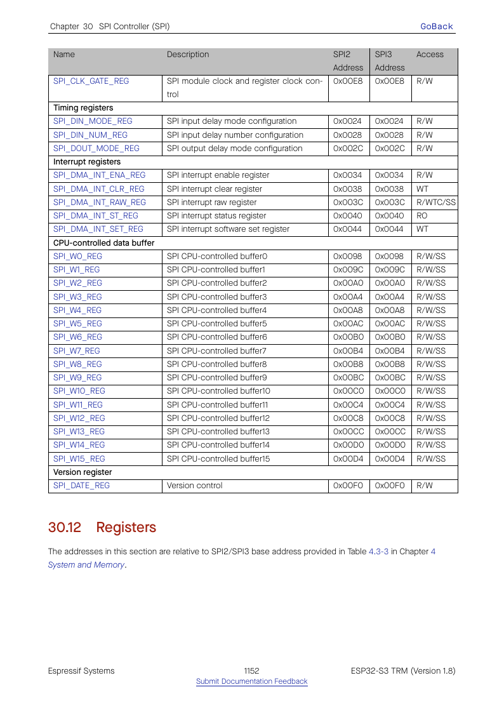

# Cornell Notes

## Topic: Control, Clock, Timing, and Phase Registers

## Date: 20/07/2026

---

### Cue Column (Questions, Keywords, or Prompts)

- Which fields represent `spi_transaction_t` phases?
- Which LL functions program clock, line modes, and timing?
- What is the start/complete handshake?

---

### Notes Section (Main Notes)

`spi_hal_setup_device()` establishes relatively stable device configuration: clock divider, SPI mode, CS timing/polarity, bit order, and input delay. `spi_hal_setup_trans()` establishes per-transaction phases and lengths. The target LL layer maps these to `SPI_CLOCK_REG`, `SPI_MISC_REG`, `SPI_CTRL_REG`, `SPI_USER_REG`, `SPI_USER1_REG`, `SPI_USER2_REG`, `SPI_MS_DLEN_REG`, and DIN/DOUT timing registers.

| LL operation | Main hardware effect |
|---|---|
| `spi_ll_master_set_clock*` | divider and duty counts in `SPI_CLOCK` |
| `spi_ll_master_set_mode` | CPOL/CPHA edge fields |
| `spi_ll_master_set_cs_setup/hold` | CS extension fields in `SPI_USER`/`SPI_CTRL2`-style controls |
| `spi_ll_set_command/address/dummy` | enables and sizes command/address/dummy phases |
| `spi_ll_master_set_line_mode` | single/dual/quad/octal phase widths |
| `spi_ll_set_mosi_bitlen`/`spi_ll_set_miso_bitlen` | output/input data lengths |
| `spi_ll_user_start` | sets `SPI_USR` |
| `spi_ll_usr_is_done` | observes `SPI_USR` clear/completion |

TRM source: §30.12 register definitions, pages 1152–1174.

#### Related notes

- [Master internal sequence](../03_use_cases/15_spi_apis.md#master-call-sequences)

---

### Summary Section (Summary of Notes)

Stable device settings and variable transaction settings are loaded separately, then one start bit launches the fixed hardware phase sequence.
