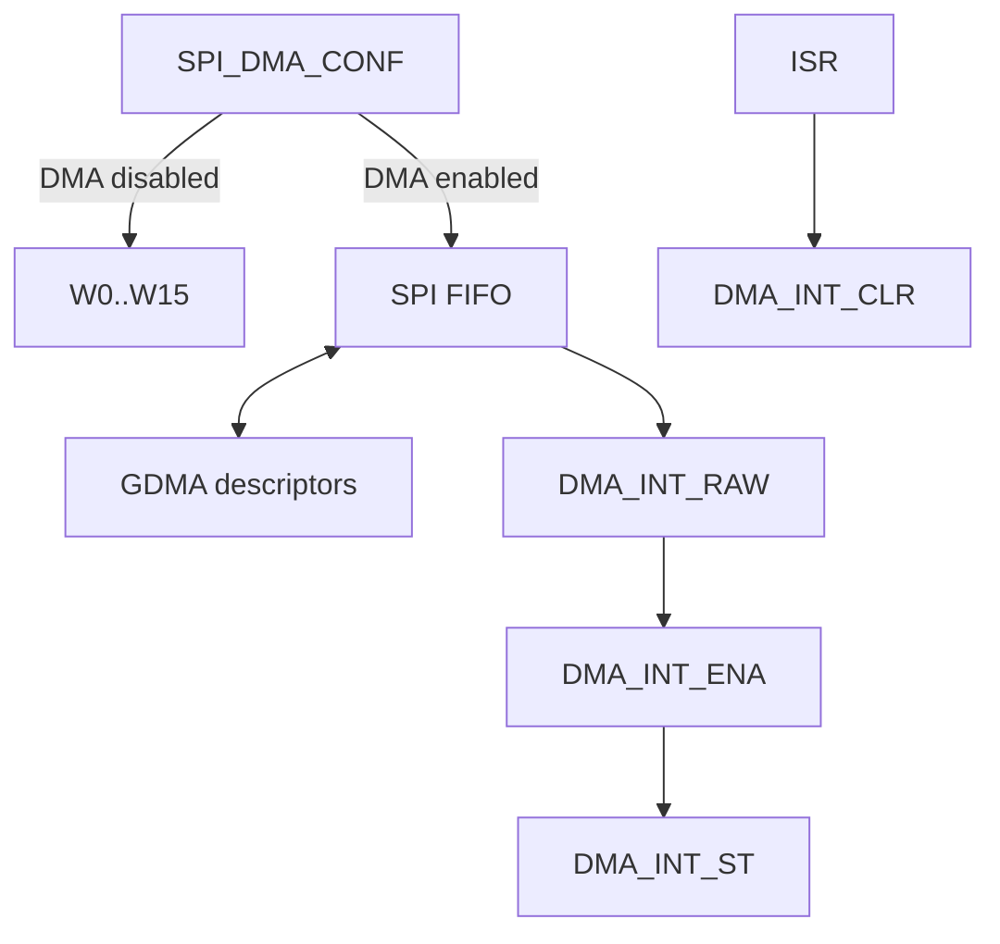

# Cornell Notes

## Topic: DMA, Interrupt, Status, and Data-Buffer Registers

## Date: 20/07/2026

---

### Cue Column (Questions, Keywords, or Prompts)

- Which registers select CPU versus GDMA data movement?
- How are interrupt events acknowledged?
- How do W registers and received-length fields expose results?

---

### Notes Section (Main Notes)

`SPI_DMA_CONF_REG` enables TX/RX DMA paths and controls FIFO resets. The DMA raw/status/enable/clear/set registers represent SPI-side transaction and FIFO events; GDMA descriptor EOF/status lives in the GDMA peripheral. Slave registers expose actual received bit length and slave-HD command/shared-register state.

`SPI_W0_REG`…`SPI_W15_REG` form a 16-word, 64-byte window. HAL buffer helpers handle unaligned ends and byte order when pushing or fetching CPU-mode data. With DMA enabled these registers are not the application data path.

Error handling resets both SPI FIFO state and the associated DMA channel before descriptor reuse. Clearing only the interrupt bit does not repair an underflow/overflow condition.

TRM source: §30.12, pages 1174–1184.

#### Related notes

- [DMA descriptor flow](../03_use_cases/08_dma_buffers_descriptors_and_gdma.md)
- [Interrupt recovery](../03_use_cases/14_debugging_and_common_failures.md)

---

### Summary Section (Summary of Notes)

CPU and DMA paths converge at the SPI FIFO but expose different storage and completion evidence. Recovery must reset the data path, not merely acknowledge its interrupt.
