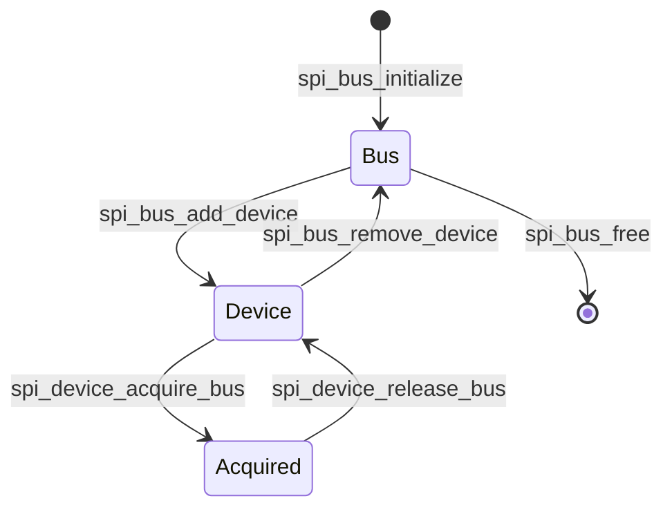

# Cornell Notes

## Topic: Master Lifecycle, Devices, and Bus Ownership

## Date: 20/07/2026

---

### Cue Column (Questions, Keywords, or Prompts)

- What is the valid master allocation/deletion order?
- How do several devices share one host?
- What does exclusive bus acquisition guarantee?

---

### Notes Section (Main Notes)

`spi_bus_add_device()` validates CS/timing/queue configuration, allocates the device and transaction queues, registers it with the SPI bus lock, calculates the clock, and assigns a CS slot. Multiple devices may share pins and host hardware; each transaction causes `spi_setup_device()` to load the acquiring device's stable settings.

`spi_device_acquire_bus()` waits for queued work and other devices, then grants exclusive ownership to one device. It is required when CS must remain active across transactions and recommended around bursts of polling transactions. `spi_device_release_bus()` returns arbitration to queued interrupt transactions.

Removal fails while transactions are outstanding or the device owns the bus. Bus free fails while any device remains. Therefore cleanup order is release → drain results → remove every device → free bus.

#### Related notes

- [Common lifecycle](../03_use_cases/02_lifecycle_ownership_and_cleanup.md)
- [Polling/exclusive sequence](../03_use_cases/06_polling_and_exclusive_bus_sequence.md)

---

### Summary Section (Summary of Notes)

The bus owns hardware; device objects own peer-specific configuration; the bus lock serializes their transactions. Delete strictly in reverse ownership order.
