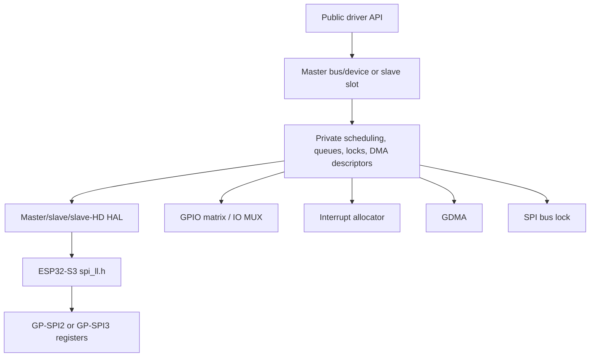

# Cornell Notes

## Topic: SPI Resource and Software-Layer Relationships

## Date: 20/07/2026

---

### Cue Column (Questions, Keywords, or Prompts)

- How do driver objects map to GP-SPI hardware?
- Which interfaces are safe for applications?
- Where do GDMA, GPIO, interrupts, and bus locks enter?

---

### Notes Section (Main Notes)

Applications use only `driver/spi_common.h`, `spi_master.h`, `spi_slave.h`, and `spi_slave_hd.h`. Private driver, HAL, and LL symbols explain implementation but are not compatibility-stable APIs.

The implementation baseline is pinned to ESP-IDF [`v6.0.1`](https://github.com/espressif/esp-idf/tree/v6.0.1/components/esp_driver_spi): public/private GP-SPI driver → [`esp_hal_gpspi`](https://github.com/espressif/esp-idf/tree/v6.0.1/components/esp_hal_gpspi) → [ESP32-S3 `spi_ll.h`](https://github.com/espressif/esp-idf/blob/v6.0.1/components/esp_hal_gpspi/esp32s3/include/hal/spi_ll.h) → TRM registers.

Master hierarchy is host/bus → devices → transactions. Full-duplex slave and slave-HD each exclusively own a host. The common layer owns pins and DMA context; role drivers own scheduling and callbacks; HAL owns register configuration order; LL owns field-level access.

| Keyword | Software owner | TRM relationship |
|---|---|---|
| host | common driver context | GP-SPI2/3 register instance |
| device | master driver | CS, clock, mode, timing configuration |
| transaction | role driver/private descriptor | one hardware state-machine run |
| DMA context | common driver/GDMA | `SPI_DMA_CONF` and FIFO handshake |
| bus lock | master/common driver | arbitration above hardware |

#### Related notes

- [TRM architecture](../01_technical_reference_manual/02_architecture_and_hardware_resources.md)
- [TRM overview and glossary](../01_technical_reference_manual/01_overview_glossary_and_features.md)
- [Programming-guide scope](../02_programming_guide/01_driver_scope_terminology_and_features.md)
- [API inventory](15_spi_apis.md)

---

### Summary Section (Summary of Notes)

The public driver manages lifetime and policy; private code schedules; HAL formats; LL writes registers. External services support the path but remain separate subsystems.
