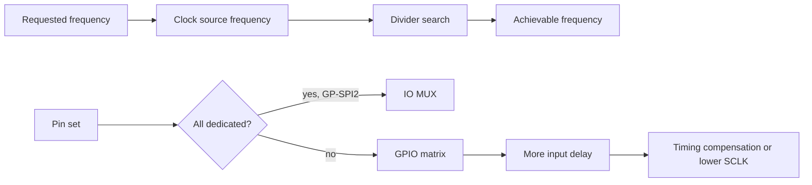

# Cornell Notes

## Topic: Clock Selection, IO MUX, and GPIO Matrix

## Date: 20/07/2026

---

### Cue Column (Questions, Keywords, or Prompts)

- How is an achievable SPI clock selected?
- When does the driver use IO MUX versus GPIO matrix?
- How does routing affect full-duplex timing?

---

### Notes Section (Main Notes)

Set `spi_device_interface_config_t.clock_source` and `clock_speed_hz`. The driver queries the selected source, searches the legal pre/N/H/L divider space, stores the resulting register value, and exposes the realized value through `spi_device_get_actual_freq()` in kHz.

The common driver compares all requested bus pins with the target `spi_periph_signal` IO-MUX table. A complete valid dedicated set uses IO MUX; any nonmatching signal routes through the GPIO matrix. GP-SPI3 is matrix-only on ESP32-S3. CS pins are configured per device.

For full-duplex reads, include the peer's clock-to-data delay and routing delay in timing calculations. Half-duplex reads can add dummy cycles more freely.

#### Related notes

- [TRM clock control](../01_technical_reference_manual/10_cs_timing_and_clock_control.md)
- [Timing compensation](12_timing_compensation_and_performance.md)
- [Clock/timing API and LL inventory](15_spi_apis.md#clocktiming-helpers)

---

### Summary Section (Summary of Notes)

Always inspect actual frequency. Prefer GP-SPI2 IO-MUX pins at high speed; matrix routing consumes sampling margin and may require compensation or a slower clock.
