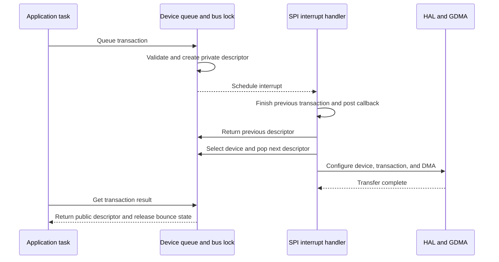

# Cornell Notes

## Topic: Interrupt-Driven Queued Master Sequence

## Date: 20/07/2026

---

### Cue Column (Questions, Keywords, or Prompts)

- What occurs from `spi_device_queue_trans()` to result return?
- How does the bus lock select work?
- Which work executes in ISR context?

---

### Notes Section (Main Notes)

The bus lock prevents devices from interleaving atomic hardware transactions. ISR work includes callbacks, device setup when ownership changes, DMA preparation, `spi_new_trans()`, completion checking, `spi_post_trans()`, and selection of the next queued item. Queue APIs may block in task context; ISR code may not.

`spi_device_transmit()` uses the same sequence synchronously by queueing and immediately waiting for the returned pointer.

#### Related notes

- [Interrupt/polling guide](../02_programming_guide/05_interrupt_queued_and_polling_transactions.md)
- [TRM master/slave data flow](../01_technical_reference_manual/07_master_slave_data_flow.md)
- [Interrupt registers](../01_technical_reference_manual/12_interrupts.md)
- [Master ISR/private-function inventory](15_spi_apis.md#master-private-functions)

---

### Summary Section (Summary of Notes)

Queueing prepares software state; the ISR owns hardware transitions; result collection returns ownership and releases temporary memory.
