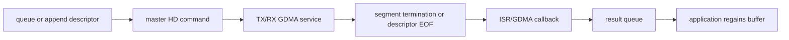

# Cornell Notes

## Topic: Slave-HD and Segmented Transfer Sequences

## Date: 20/07/2026

---

### Cue Column (Questions, Keywords, or Prompts)

- How do TX/RX channel queues map to HD commands?
- What changes between segment and append modes?
- How are completed descriptors returned?

---

### Notes Section (Main Notes)

In segment mode, queue `spi_slave_hd_data_t` on TX or RX. The matching master command starts the channel; the segment ISR/HAL identifies the completed descriptor and event, invokes callbacks, and sends the pointer to the channel return queue. Retrieve it with `spi_slave_hd_get_trans_res()`.

Append mode links new descriptors to a live GDMA chain. `spi_slave_hd_append_trans()` appends ownership; GDMA or legacy ISR callbacks record completed chains; `spi_slave_hd_get_append_trans_res()` returns descriptors. The application must not reuse a buffer before it returns.

Shared-register reads/writes and CMD9/CMDA callbacks form a small control plane alongside the payload channels. CMD8 has protocol-specific termination meaning and is not a free application event.

#### Related notes

- [Slave-HD guide](../02_programming_guide/09_slave_hd_protocol_and_lifecycle.md)
- [TRM slave protocols](../01_technical_reference_manual/09_slave_protocols_and_segmented_transfers.md)
- [Slave-HD internal functions](15_spi_apis.md#slave-hd-private-functions)

---

### Summary Section (Summary of Notes)

Segment mode returns bounded transactions; append mode extends live chains. In both, buffer ownership returns only through the matching result API.
