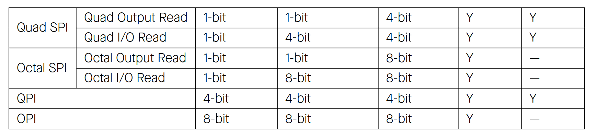

# Cornell Notes

## Topic: Functional Description - Data Modes

## Date: 16/05/2026

---

### Cue Column (Questions, Keywords, or Prompts)

- [Insert question or keyword]
- [Insert question or keyword]
- [Insert question or keyword]

---

### Notes Section (Main Notes)

#### Data Modes
- GP-SPI can be configured as either a master or a slave to communicate with other SPI devices in the following data modes, see Table

 

---

### Summary Section (Summary of Notes)

[Insert a brief summary of the key ideas and takeaways]