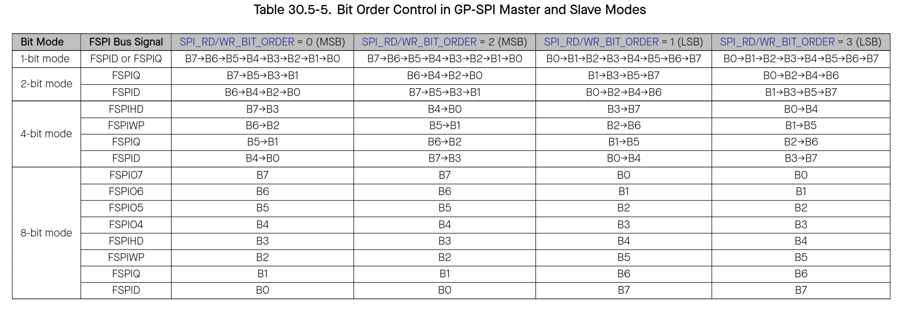

# Cornell Notes

## Topic: Functional Description - Bit Read/Write Order Control

## Date: 16/05/2026

---

### Cue Column (Questions, Keywords, or Prompts)

- What controls the bit order of the command, address, and data sent by the GP-SPI master?
- What controls the bit order of the data received by the GP-SPI master?
- How does the bit read/write order affect SPI communication?

---

### Notes Section (Main Notes)

#### Bit Read/Write Order Control
- In master mode:
  - The bit order of the command, address and data sent by the GP-SPI master is controlled by `SPI_WR_BIT_ORDER`.
  - The bit order of the data received by the master is controlled by `SPI_RD_BIT_ORDER`.
- In slave mode:
  - The bit order of the data sent by the GP-SPI slave is controlled by `SPI_WR_BIT_ORDER`.
  - The bit order of the command, address and data received by the slave is controlled by `SPI_RD_BIT_ORDER`.

- Table below shows the function of `SPI_RD_BIT_ORDER` and `SPI_WR_BIT_ORDER`. In this table, FSPI Bus signals are used for description. The bit order of SPI3 Bus signals can be referred to this table.

---

### Summary Section (Summary of Notes)

[Insert a brief summary of the key ideas and takeaways]