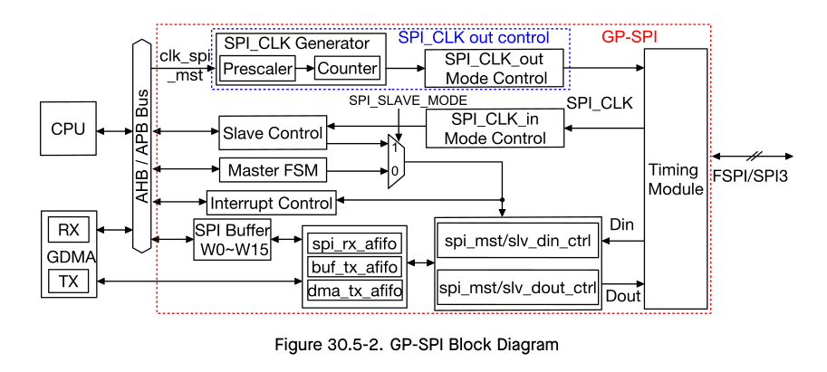
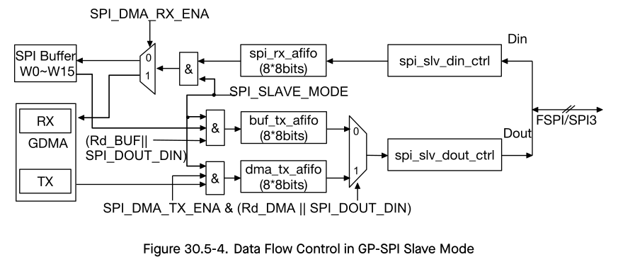

# Cornell Notes

## Topic: Data

## Date: 

---

### Cue Column (Questions, Keywords, or Prompts)

- [Insert question or keyword]
- [Insert question or keyword]
- [Insert question or keyword]

---

### Notes Section (Main Notes)

#### Data Flow Control in GP-SPI Master and Slave Modes

CPU-controlled and DMA-controlled transfers are supported in GP-SPI master and slave modes.

CPU-controlled transfer means that data transfers between registers `SPI_W0_REG` ~ `SPI_W15_REG` and the SPI device. DMA-controlled transfer means that data transfers between the configured GDMA TX/RX buffer and the SPI device. To select between the two transfer modes, configure `SPI_DMA_RX_ENA` and `SPI_DMA_TX_ENA` before the transfer starts.

#### GP-SPI Functional Blocks

Figure 30.5-2 shows main functional blocks in GP-SPI, including:

- **Master FSM**: all the features, supported in GP-SPI master mode, are controlled by this state machine together with register configuration.
- **SPI Buffer**: `SPI_W0_REG` ~ `SPI_W15_REG`, see Figure 30.5-1. The data transferred in CPU-controlled mode is prepared in this buffer.
- **Timing Module**: capture data on FSPI/SPI3 bus.
- **spi_mst/slv_din/dout_ctrl**: convert the TX/RX data into bytes.
- **spi_rx_afifo**: store the received data.
- **buf_tx_afifo**: store the data to send.
- **dma_tx_afifo**: store the data from GDMA.
- **clk_spi_mst**: this clock is the module clock of GP-SPI and derived from `PLL_CLK`. It is used in GP-SPI master mode, to generate `SPI_CLK` signal for data transfer and for slaves.
- **SPI_CLK Generator**: generate `SPI_CLK` by dividing `clk_spi_mst`. The divider is determined by `SPI_CLKCNT_N` and `SPI_CLKDIV_PRE`.
- **SPI_CLK_out Mode Control**: output the `SPI_CLK` signal for data transfer and for slaves.
- **SPI_CLK_in Mode Control**: capture the `SPI_CLK` signal from SPI master when GP-SPI works as a slave.

#### Data Flow Control in Master Mode

Figure 30.5-3 shows the data flow of GP-SPI in master mode. Its control logic is as follows:
- **RX data**: data in FSPI/SPI3 bus is captured by Timing Module, converted in units of bytes by `spi_mst_din_ctrl` module, then buffered in `spi_rx_afifo`, and finally stored in corresponding addresses according to the transfer modes.
  - CPU-controlled transfer: the data is stored to registers `SPI_W0_REG` ~ `SPI_W15_REG`.
  - DMA-controlled transfer: the data is stored to GDMA RX buffer.
- **TX data**: the TX data is from corresponding addresses according to transfer modes and is saved to `buf_tx_afifo`.
  - CPU-controlled transfer: TX data is from `SPI_W0_REG` ~ `SPI_W15_REG`.
  - DMA-controlled transfer: TX data is from GDMA TX buffer.

The data in `buf_tx_afifo` is sent out to Timing Module in 1/2/4/8-bit modes, controlled by GP-SPI state machine. The Timing Module can be used for timing compensation. For more information, see section GP-SPI Timing Compensation.

#### Data Flow Control in Slave Mode

Figure 30.5-4 shows the data flow in GP-SPI slave mode. Its control logic is as follows:

- In CPU/DMA-controlled full-duplex/half-duplex modes, when an external SPI master starts the SPI transfer, data on the FSPI/SPI3 bus is captured, converted into unit of bytes by `spi_slv_din_ctrl` module, and then is stored in `spi_rx_afifo`.
  - In CPU-controlled full-duplex transfer, the received data in `spi_rx_afifo` will be later stored into registers `SPI_W0_REG` ~ `SPI_W15_REG`, successively.
  - In half-duplex Wr_BUF transfer, when the value of address (SLV_ADDR[7:0]) is received, the received data in `spi_rx_afifo` will be stored in the related address of registers `SPI_W0_REG` ~ `SPI_W15_REG`.
  - In DMA-controlled full-duplex transfer or in half-duplex Wr_DMA transfer, the received data in `spi_rx_afifo` will be stored in the configured GDMA RX buffer.

- In CPU-controlled full-/half-duplex transfer, the data to send is stored in `buf_tx_afifo`. In DMA-controlled full-/half-duplex transfer, the data to send is stored in `dma_tx_afifo`. Therefore, Rd_BUF transaction controlled by CPU and Rd_DMA transaction controlled by DMA can be done in one slave segmented transfer. TX data comes from corresponding addresses according to the transfer modes.
  - In CPU-controlled full-duplex transfer, when `SPI_SLAVE_MODE` and `SPI_DOUTDIN` are set and `SPI_DMA_TX_ENA` is cleared, the data in `SPI_W0_REG` ~ `SPI_W15_REG` will be stored into `buf_tx_afifo`.
  - In CPU-controlled half-duplex transfer, when `SPI_SLAVE_MODE` is set, `SPI_DOUTDIN` is cleared, Rd_BUF command and `SLV_ADDR[7:0]` are received, the data started from the related address of `SPI_W0_REG` ~ `SPI_W15_REG` will be stored into `buf_tx_afifo`.
  - In DMA-controlled full-duplex transfer, when `SPI_SLAVE_MODE`, `SPI_DOUTDIN` and `SPI_DMA_TX_ENA` are set, the data in the configured GDMA TX buffer will be stored into `dma_tx_afifo`.
  - In DMA-controlled half-duplex transfer, when `SPI_SLAVE_MODE` is set, `SPI_DOUTDIN` is cleared, and Rd_DMA command is received, the data in the configured GDMA TX buffer will be stored into `dma_tx_afifo`.

The data in `buf_tx_afifo` or `dma_tx_afifo` is sent out by `spi_slv_dout_ctrl` module in 1/2/4-bit modes.

---

### Summary Section (Summary of Notes)

[Insert a brief summary of the key ideas and takeaways]