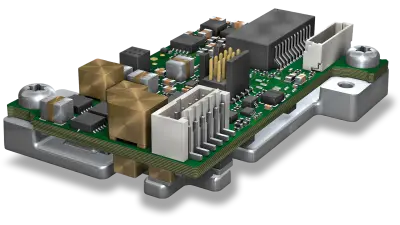
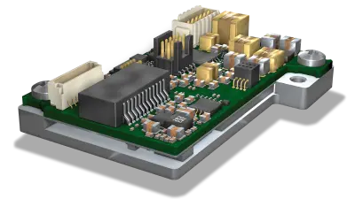
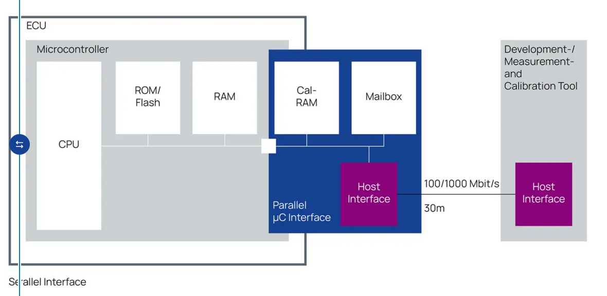
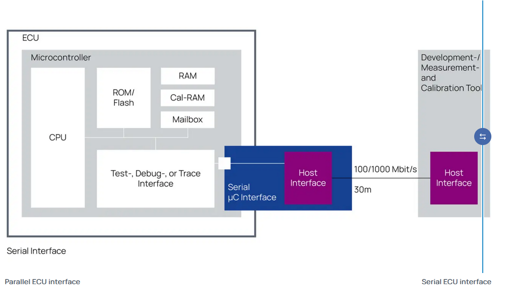

# Cornell Notes

## Topic: ECU Interfaces Overview

## Date: 15/05/2026

---

### Cue Column (Questions, Keywords, or Prompts)

- First question or keyword
- Second question or keyword
- Third question or keyword

---

### Notes Section (Main Notes)

#### What is ECU Interface?
- ECU Interfaces is the Powerful ECU measuring and calibration access
- This tool is introduced by ETAS and is used for measuring and calibrating ECUs in automotive applications.
- There are three types of ECU interfaces: ETK / FETK / XETK
- The ETAS Ethernet-based ECU interfaces ETK, FETK, and XETK provide direct access to the measurement variables and control parameters of an ECU. 
  - Access is enabled via the parallel data and address bus, or via a serial microcontroller testing or debugging interface. 
  - Their extremely compact design allows to accommodate ETKs, FETKs, and XETKs inside the housings of production ECUs, ensuring utmost interface protection.

#### What is the benefits of using ECU Interfaces?
- **Facilitates development**: Powerful and microcontroller-independent interface between development ECU and PC-based tools.
- **High-speed**: Ethernet-based data exchange with high bandwidth.
- **Flexible use**: Easily adaptable to various microcontrollers.

#### Features

- **Flexible, small, and durable**: Easily adaptable to various microcontrollers; compact design; mechanically and electrically robust.

- **Real-time data exchange**: Time and angle-synchronized capture of hundreds of measured variables in up to 32 resolutions; support for up to 16 bypass resolutions.

- **Parallel operations**: Simultaneous access to the ECU for measurement, calibration, and rapid prototyping tools.
- **Dedicated power supply**: Enables the preparation and initiation of cold-start testing independently of the ECU.

#### Parallel and serial ECU interface
- The data exchange between ETK, FETK, XETK and microcontroller uses a mailbox as intermediate memory for measurements and real-time applications. 
- When the microcontroller does not provide an external data and address bus, a microcontroller variant containing extended memory is often used for ECU development. 
- In both test bench and in-vehicle testing, the interfaces facilitate access to the microcontroller over a long distance through a powerful test, debug, or trace interface.

##### Parallel ECU interface

##### Serial ECU interface

#### Extremely robust
- ETK, FETK, and XETK interfaces are mechanically and electrically robust. They resist temperature extremes and vibrations at the ECU’s location in the vehicle.

#### Reducing computing overhead in ECUs:
- ETK, FETK, and XETK interfaces call for very little computing overhead on the part of the ECU.
- On engine ECUs, for example, large numbers of measured values can be acquired easily without impact on ECU overhead, even at high engine speeds that impact computing power.
- Using an ETK, FETK, or XETK development ECU, series-production software can be readily calibrated and verified with the production ECU. This helps minimize driver changes in the platform software.

#### Supported microcontrollers
- ETAS provides a broad portfolio of ETKs, FETKs, and XETKs for commonly used microcontrollers for engine and transmission ECUs from NXP, Infineon, Renesas, Texas Instruments and STMicroelectronics. 
- ETKs, FETKs, and XETKs are designed according to customer requirements, for example regarding memory sizes and mechanical integration with the ECU.

#### Technical data

| Microcontroller type (manufacturer/family) | Interface to ETK/FETK/XETK                             | ETK/FETK/XETK type   | Products                                                            |
| ------------------------------------------ | ------------------------------------------------------ | -------------------- | ------------------------------------------------------------------- |
| Infineon Traveo / Traveo II                | JTAG interface                                         | Serial XETK          | XETK-S16.0                                                          |
| NXP* MPC5500                               | Data and address bus                                   | Parallel ETK         | ETK‑11.0                                                            |
| NXP* MPC5600, ST SPC56x                    | Data and address bus (standardized VertiCal interface) | Serial XETK          | XETK-V2.0                                                           |
| NXP* MPC5700, ST SPC57x, ST SPC58x         | JTAG interface                                         | Serial ETK/FETK/XETK | ETK-S21.1, XETK-S21.0, XETK-S31.0                                   |
| NXP S32                                    | JTAG interface                                         | Serial XETK          | XETK-S16.0, FETK-T5.0                                               |
| Infineon Aurix                             | DAP                                                    | Serial ETK/FETK/XETK | ETK‑S20.1, FETK‑S1.1, FETK‑T1.1, XETK‑S20.1, XETK‑S30.0, BR_XETK‑S3 |
| Infineon TriCore                           | Data and address bus                                   | Parallel ETK / XETK  | ETK‑T2.2                                                            |
|                                            | JTAG interface                                         | Serial ETK/XETK      | ETK‑S4.2, XETK-S4.2                                                 |
| Renesas RH 850                             | JTAG                                                   | Serial ETK           | ETK-S22, XETK-S22, FETK-T3.0                                        |
| Renesas SH                                 | AUD II                                                 | Serial ETK           | ETK‑S6.0                                                            |
| STM Stellar SR6                            | SWD interface  II                                      | Serial FETK/XETK     | BR_XETK-S4, FETK-T4                                                 |
| Texas Instruments C2000                    | JTAG interface                                         | Serial XETK          | XETK-S23                                                            |
| Various third-party microcontrollers       | Data and address bus                                   | Parallel ETK         | ETK‑11.0                                                            |

---

### Summary Section (Summary of Notes)

Brief summary of key ideas and takeaways