# Cornell Notes

## Topic: Bus Off Detection

## Date: 11/05/2026

---

### Cue Column (Questions, Keywords, or Prompts)

- First question or keyword
- Second question or keyword
- Third question or keyword

---

### Notes Section (Main Notes)

#### 1. Requirement Analysis

- Customer has a requirement for the BusOff-End-Detection: BusOff-State is left after the first successful transmission.

- For BusOff-End-Detection and leaving the BusOff-State, the BSW offers 2 different options:
  - **Option 1**: Wait a configured time and check if at least one PDU was transmitted successfully.
  - **Option 2**: Immediately after successful transmission of one PDU.

##### Option 1
- To leave the BusOff-State, a configured time needs to elapse (CanSMBorTimeTxEnsured).
- The value for the configured time depends on the cycle-time of the TX-PDUs on the bus and therefore is dependent on the K-Matrix.
- The value of CanSMBorTimeTxEnsured is set to 60ms in all the line. The value assumes, that if only the slowest PDU was enabled, that PDU was transmitted within 60ms. The PDU-Start-Delay-Time-Configuration shall ensure this. 
- The Lastenheft-Requirement [A: CAN_1193] (BusOff-State is left after the first successful transmission.) is not fulfilled.

##### Option 2
- Immediately after successful transmission of one PDU, BusOff-Sate is left and there is no need to wait for a configured time. Hence, the requirement is fulfilled.
- No need to configure a K-Matrix dependent time to check for the BusOff-End. Configuration is simplified.
- This can be activated via CanSMBorTxConfirmationPolling set to True.

#### 2. Fundamentals Knowledge About Bus Off

##### 2.1. What is Bus-Off
- Bus-off is the state of a node in which it does not influence the bus
- A node is in the bus-off state when it is switched off from the bus due to an FCE request. In the bus-off state, a node neither sends nor receives frames, a node does not send any dominant bits.

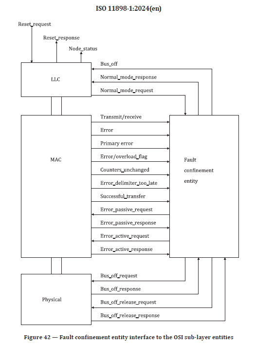

- Nodes with disabled error signalling do not enter bus-off state.
- In the image below, if the transmit error counter of a node is greater than 255 (carry condition in case of an 8-bit transmit error counter) then the supervisor shall request the PL to set the node into the bus-off state.

- The **transmit error counter** shall register the number of errors during the transmission
- When frames are sent or received correctly, the counters shall be decremented. When frames are sent or received with errors, the counters shall be incremented more than they are decremented in the absence of errors.

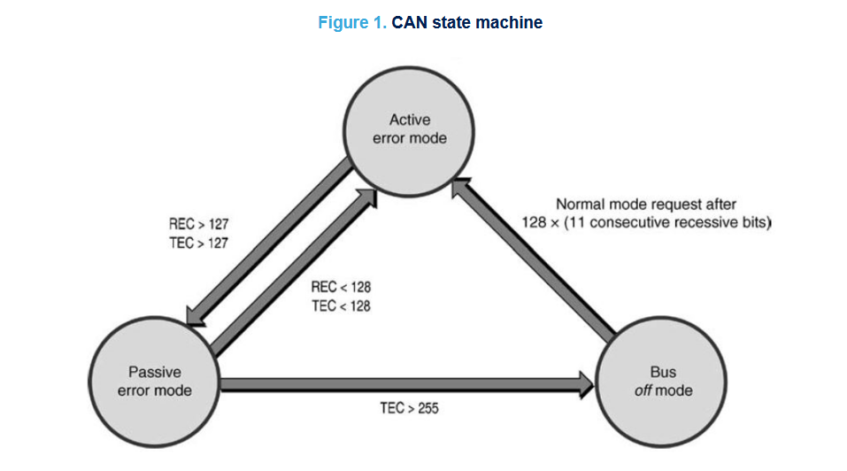

- *Note:*
  - *The TEC field has 8-bit and so, it could happen that on the base of counter values the addiction of 8 units, due to the last error before entering bus off condition, will cause the counter overflow and so the counter is not updated also if the bus off condition is detected.*
  - *The bus off condition can be easily reached for debugging reasons with a **short circuit** between CAN-H and CAN-L lines while the controller is transmitting messages.*

##### 2.2. Error

There are five different error types, which are not mutually exclusive:
- Bit error
- Stuff error
- PCRC error and frame CRC error
- Form error
- ACK error

> Q: What type of the error will the short circuit will cause here?
> A: A short circuit typically causes multiple error types at once, not just one.

##### 2.3. OSI Model Relation
- In ISO 11898-1, `error singaling` and `error detection` are handled in the Data Link Layer (Layer 2) of the OSI model. The bus-off event is a result of error detection and handling mechanisms in this layer, which ensures the integrity of communication on the CAN bus.

##### 2.3. Bus-Off-End-Detection (Bus-Off Recovery)

**ISO 11898-1**
- Upon a restart request, a node which is in the bus-off state shall be re-integrating to the CAN communication and may become **error-active** (no longer bus-off) with its error counters both set to zero after having monitored 128 occurrences of the **idle condition** on the bus.

- **idle condition:** detection of a consecutive sequence of 11 sampled recessive bits

#### 3. AUTOSAR Specification for BusOff-End-Detection
- The AUTOSAR specification for BusOff-End-Detection with two options is described in the AUTOSAR SWS for CAN State Manager (CanSM), [AUTOSAR_CP_SWS_CANStateManager](https://www.autosar.org/fileadmin/standards/R23-11/CP/AUTOSAR_CP_SWS_CANStateManager.pdf).
- The requirement for `CanIf_GetTxConfirmationState` [AUTOSAR_SWS_CANInterface](https://www.autosar.org/fileadmin/standards/R21-11/CP/AUTOSAR_SWS_CANInterface.pdf)

#### 4. Scope of the requirement

##### CanSMBorTimeTxEnsured
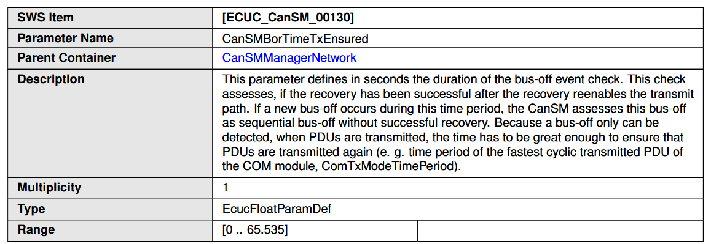

##### CanSMBorTxConfirmationPolling

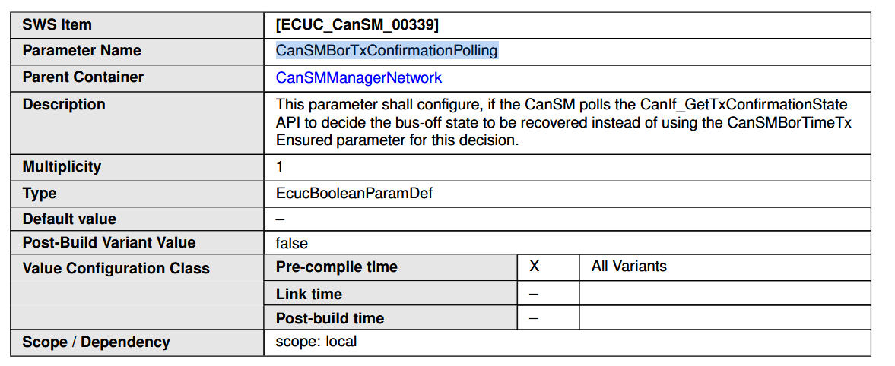

- In the SWS_CanSM_00497, there is a requirement which mentions that if the Tx Confirmation Polling is enabled, the bus-off state is left immediately after the successful transmission of one PDU. This means that the bus-off state will be left as soon as the CAN State Manager receives a notification from the CAN driver that a PDU has been successfully transmitted, without waiting for any configured time and should return `CANIF_TX_RX_NOTIFICATION`.

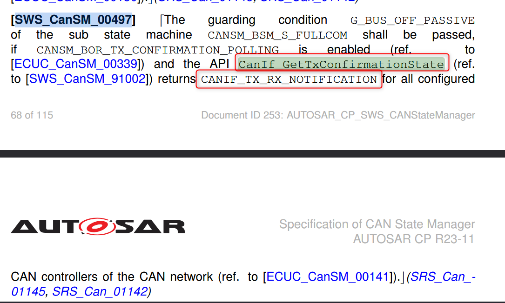

- Function `CanIf_GetTxConfirmationState` is used to check the status of the Tx Confirmation, which is relevant for the bus-off detection when `CanSMBorTxConfirmationPolling` is enabled. This function will return the status of the Tx Confirmation, which can be used by the CAN State Manager to determine if a PDU has been successfully transmitted and therefore if the bus-off state can be left.

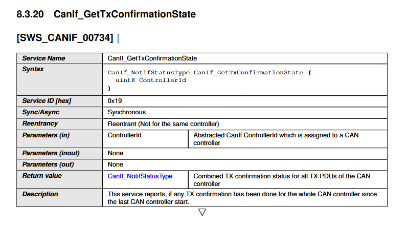
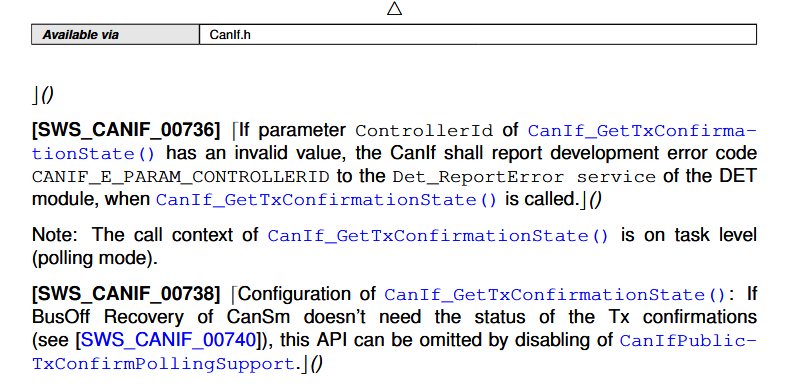

- For more detail, will be discussed in the software section below.


#### 5. Bus-Off-Detection in Software

In Can State Manager, the bus-off detection is handled in the main function `CanSM_MainFunction()`, which is called cyclically. As discussed, there are two options for the bus-off detection, which are determined by the configuration parameter `CanSMBorTxConfirmationPolling`. The handling of the bus-off detection will be different based on the value of this parameter.

In software, simply the condition as below picture:

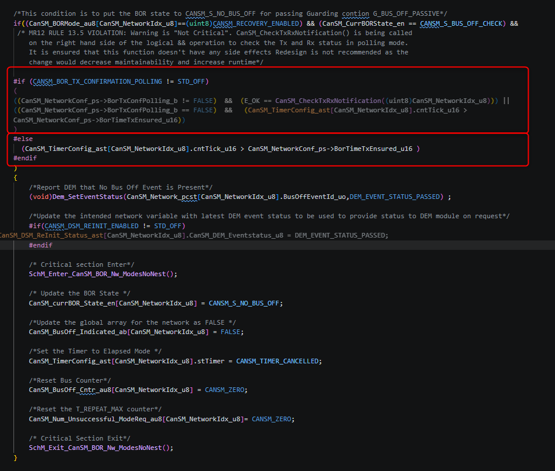

##### CAN State Manager (CanSM) - `CanSMBorTxConfirmationPolling = false`:

- Bus-off recovery is the procedure the CAN State Manager receive the status of CAN controller tells that is already recovered, in order to bring communication back and verify that recovery was successful.
- **Detect the bus-off**: After receiving the information from Can controller -> CanIf, the bus-off data is then considered by the CAN network state machine and wait for the configured recovery time**: 
  - The recovery waiting time is configurable:
    - `BorTimeL1` = level 1, short recovery time
    - `BorTimeL2` = level 2, long recovery time
    - `BorTimeTxEnsured` = the time to ensure the transmission of at least one PDU after bus-off event which is already mentioned in the autosar specification.
    - These values are configured via CanSM_Network_pcst[]

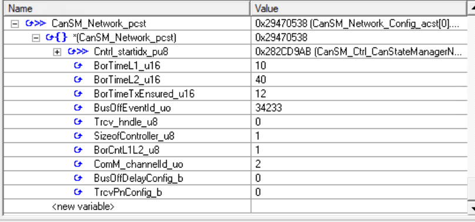

- When the time is exceeds the BorTimeL2, the CAN State Manager will then try to recover from the bus-off state by restarting the CAN controller and checking if communication is successful again. by jumping to the state `CANSM_S_BUS_OFF_CHECK`.
  - If it is successful, the CAN State Manager will then report `CANSM_S_NO_BUS_OFF`, else, it just looping the state `CANSM_S_BUS_OFF_CHECK` -> `CANSM_S_BUS_OFF_RECOVERY_L2`. as the configuration for `BorCntL1L2_u8 = 1`, it wont check for `CANSM_S_BUS_OFF_RECOVERY_L1` in current checked software.

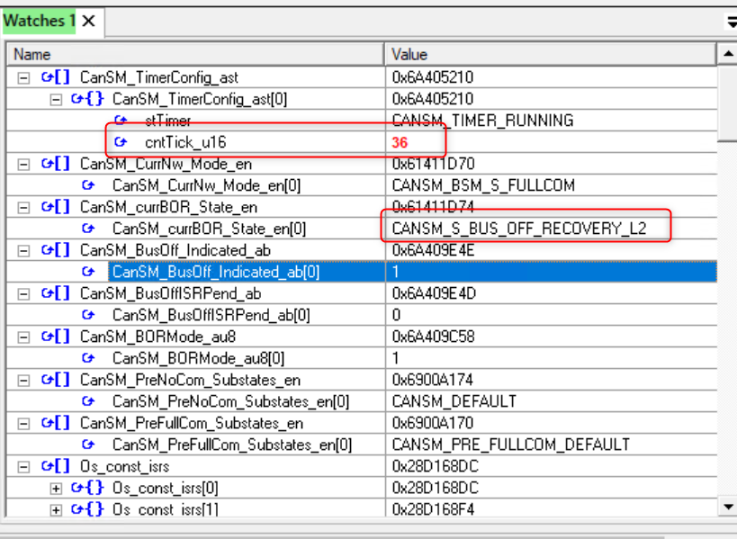

- The sequence is mentioned in the below code:

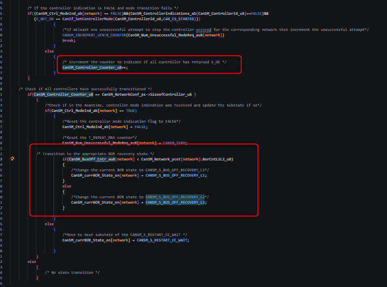

- Of course, this will be called in `CanSM_BusOffTransitions()` and which is also called in `CanSM_MainFunction()`, so that the bus-off recovery can be handled in the main function of the CAN State Manager.

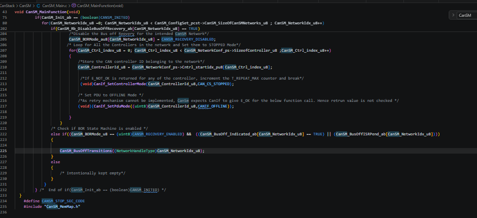


- CAN State Manager will only handle the notification from the CAN driver whether it is in bus-off state or not. The procedure will be as follows:

> Q: What and how is the time exceed the `BorTimeTxEnsured_u16`

- `cntTick_u16`, `BorTimeL1`, `BorTimeL2`, `BorTimeTxEnsured`,... will be generated in `CanSM_Network_Config_acst[]`

> Q: Why is the BorTimeTxEnsured_u16 is defined as `12`, not `60ms` as mentioned in the RSD?

- The generated file is `CanSM_Generate_CfgC_StaticCode_c.xpt`:

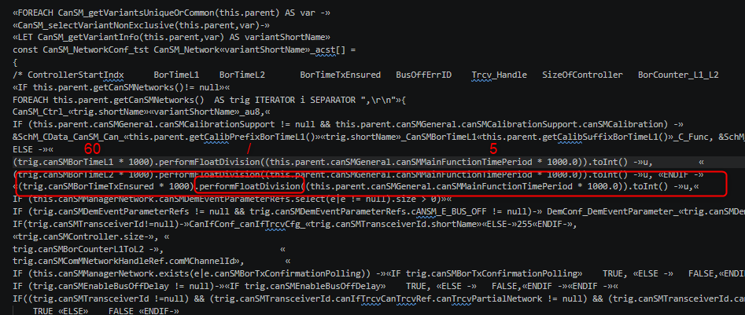

- As mentioned in the image, there is a division between `canSMBorTimeTxEnsured` and `canSMMainFunctionTimePeriod`. The result of it is `12`, as there would be 12 cycles of the main function in 60ms, so that the time can be ensured for at least one PDU is transmitted after bus-off event. The value of `canSMMainFunctionTimePeriod` is defined as `5ms` in `CanSM_Cfg.h`, which is the cycle time of the main function of the CAN State Manager.

> Q1: Where does the status of `cntTick_u16` come from?

- The time is defined as `cntTick_u16` which is mentioned in below image. And it can increase by checking the `stTimer` status.

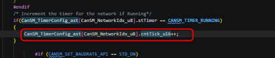

- **Check the .stTimer**: via `CanSM_TimerConfig_ast[CanSM_NetworkIdx_u8].stTimer`, it will monitor the state of the timer, there are 4 types of timer:
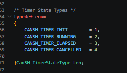
- Can State Manager will check the if the condition is in the `CANSM_TIMER_RUNNING` state, then it will count the `CanSM_TimerConfig_ast[CanSM_NetworkIdx_u8].cntTick_u16++`. Here is the requirements which begins making sense that will be discussed below.

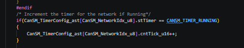


- The status of `.stTimer` is the result of the function called in `CanSM_StartTimer()` which will update the status of `.stTimer` to be `CANSM_TIMER_RUNNING`. And it also being called in `CanSM_BusOffTransitions()` which is finally called in `CanSM_MainFunction()`. So, the status of `.stTimer` is updated in the main function of the CAN State Manager. The sequence to be summarized as below:

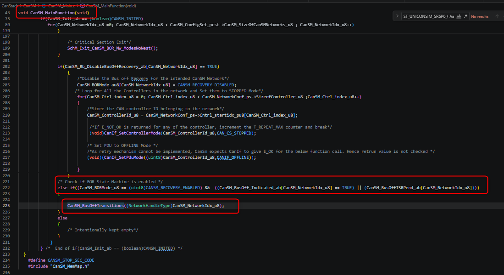

- In the image, there is a condition to check. Indeed, in the bus-off state, the condition is matched as the followed image:

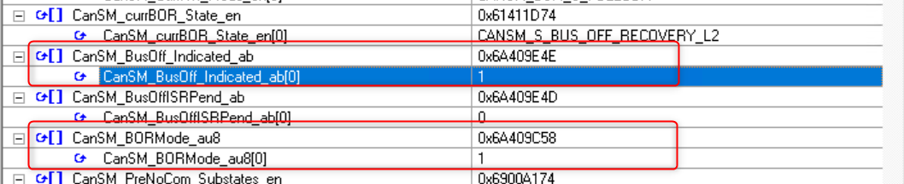

> Q2: Where does those status come from?

- The status of `CanSM_BusOff_Indicated_ab[network_indx_u8] = TRUE` will be set in `CanSM_ControllerBusOff()` in `CanSM_ControllerBusoff.c`, and then will be called in a callback function `CanIf_Callback` function in `CanIf_Cfg.c`:

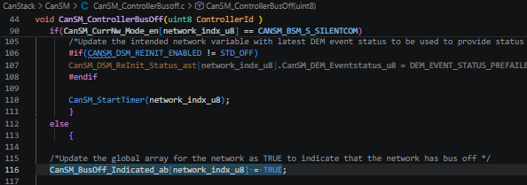

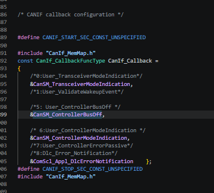

- `CanIf_Callback` is also called in `CANIF_CONTROLLERBUSOFF_FNAME` function in `CanIf_Controller.c`:

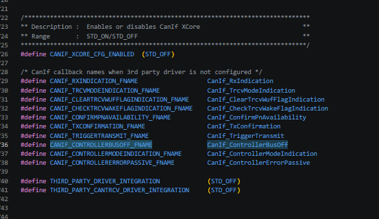

- `CanIf_ControllerBusOff` is defined as `CANIF_CONTROLLERBUSOFF_FNAME`, and then will be called in `rba_CanMcan_BusErrorHandler(uint8 Controller_u8)` in `Can.c`.
- Finally, `rba_CanMcan_BusErrorHandler`, this will be triggered in `Can_MainFunction_BusOff()`

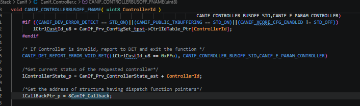

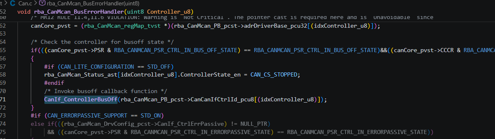

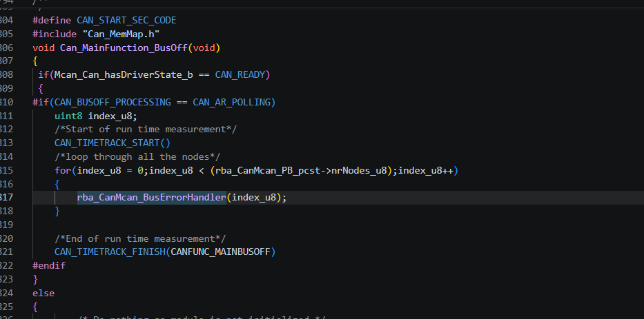

- In the function `rba_CanMcan_BusErrorHandler`, there is a condition that check the controller for bus-off state. After passing that condition, it will call the `CanIf_ControllerBusOff` function to report the bus-off event to the CAN Interface, which will then notify the CAN State Manager about the bus-off event.

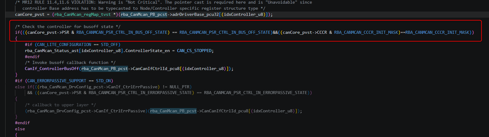

- We can have a look in the UDE for the register `PSR` and `CCCR` by using the `Peripheral Register` view. As the information about the bus-off will be handled by the CAN controller, we can only check the status of the bus-off event in the CAN controller. In the image below, we can see that the `PSR` register has a bit called `BO` which stands for bus-off, and when this bit is set to 1, it indicates that the CAN controller is in the bus-off state. The `CCCR` register has a bit called `INIT` which stands for initialization, and when this bit is set to 1, it indicates that the CAN controller is in the initialization state. The bus-off event is detected when the `BO` bit in the `PSR` register is set to 1, and the CAN controller will be in the bus-off state until it is reset or re-initialized.

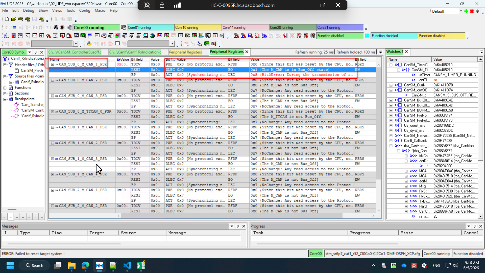

- `Can_MainFunction_BusOff()` will be called in `TASK(OS_5Q1_5ms_Task)` and is scheduled before the `CanSM_MainFunction()`, so that the bus-off event can be detected before the main function of the CAN State Manager is executed.

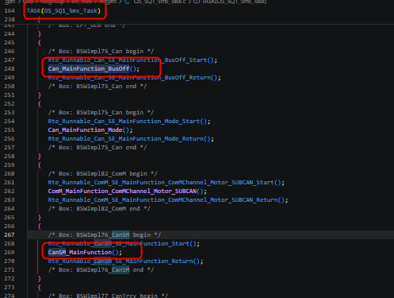

> Q3: How `Mcan_Can_hasDriverState_b` is set to be `CAN_READY`?
> A: It is called in `Can_Init()`

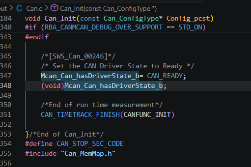


##### CAN State Manager (CanSM) - `CanSMBorTxConfirmationPolling = true`:

- The bus-off event is detected by the CAN controller and reported to the software (CAN State Manager) via an interrupt. The CAN State Manager then handles the bus-off event as described in the previous point.
```c
// Flow of bus-off event recieve 
ISR(OS_2Q1_Can_Transfer_ISR_MCAN_1) // Operating System
{
  Can_Transfer_ISR_MCAN_1();
}
// Can_Transfer_ISR_MCAN_1()
void Can_Transfer_ISR_MCAN_1(void) // Can_Cfg.c -> CanStack/rba_Can
{
  rba_CanMcan_TransferISR((uint8)MCAN_1);
}
// rba_CanMcan_TransferISR
void rba_CanMcan_TransferISR(uint8 Controller_u8) // Can.c -> CanStack/rba_Can
{
  rba_CanMcan_Prv_ProcessTxFIFOList(Controller_u8);
}
// rba_CanMcan_Prv_ProcessTxFIFOList
static void rba_CanMcan_Prv_ProcessTxFIFOList(uint8 Controller_u8) // Can.c -> CanStack/rba_Can
{
  rba_CanMcan_Prv_OnInterruptTxEventReceived(idxController_u8, MessageMarkerVal_u8);
}
// rba_CanMcan_Prv_OnInterruptTxEventReceived
LOCAL_INLINE void rba_CanMcan_Prv_OnInterruptTxEventReceived(uint8 idxController_u8, uint8 MessageMarkerVal_u8) // Can.c -> CanStack/rba_Can
{
  CanIf_TxConfirmation(idxTxPdu_u16);
}
// CanIf_TxConfirmation
#define CANIF_TXCONFIRMATION_FNAME                 CanIf_TxConfirmation
void CANIF_TXCONFIRMATION_FNAME(PduIdType CanTxPduId) // CanIf_TxConfirmation.c -> CanStack/CanIf
{
    lControllerState_p->CanIf_TxCnfmStatus = CANIF_TX_RX_NOTIFICATION;
}
CanIf_NotifStatusType CanIf_GetTxConfirmationState(
    uint8 ControllerId) // CanIf_GetTxConfirmationState.c -> CanStack/CanIf
{
      /*Read TxConfirmationState of the requested controller*/
    lTxConfmStatus = (CanIf_Prv_ControllerState_ast + ControllerId)->CanIf_TxCnfmStatus;
    return lTxConfmStatus;
}
```
- After the bus-off event is reported via `lTxConfmStatus`, the CAN State Manager can then handle the bus-off event via the flow below:
```c
Std_ReturnType CanSM_CheckTxRxNotification(NetworkHandleType network) // CanSM_ControllerBusOff.c -> CanStack/CanSM
{
    CanSM_NetworkConf_ps = &CanSM_Network_pcst[network];
  ... = CanIf_GetTxConfirmationState(CanSM_ControllerId_u8)
}
```
- Now, the sequence comes to picture, the handling for the recovery action in the 
`CanSM_MainFunction()` 
```c
void CanSM_MainFunction(void) // CanSM_Main.c -> CanStack/CanSM
{
... = CanSM_CheckTxRxNotification((uint8)CanSM_NetworkIdx_u8)
}
```

#### Difference between two options in generated code:

- There are 3 main differences:
  - `BorTxConfPolling_b = TRUE` -> CanM_PBCfg.c
  - `CANIF_PUBLIC_TXCONFIRM_POLLING_SUPPORT = STD_ON` -> CanIf_Cfg.c
  - `CANSM_BOR_TX_CONFIRMATION_POLLING = STD_ON` -> CanSM_Cfg.h

- In the generated code in , there is a variable called `BorTxConfPolling_b`, this will be generated if the `CANSM_BOR_TX_CONFIRMATION_POLLING` is set to `STD_ON`

> Q4: How `BorTxConfPolling_b` and `CANSM_BOR_TX_CONFIRMATION_POLLING` can be assigned to be `true` and `STD_ON`?
> A: `CANSM_BOR_TX_CONFIRMATION_POLLING` is a macro defined in `CanSM_Cfg.h`, and it is generated based on the configuration in the ARXML file. If the option for bus-off detection is set to use Tx Confirmation Polling, then this macro will be defined as `STD_ON`. The variable `BorTxConfPolling_b` is then assigned the value of this macro, so it will be `true` if `CANSM_BOR_TX_CONFIRMATION_POLLING` is `STD_ON`.

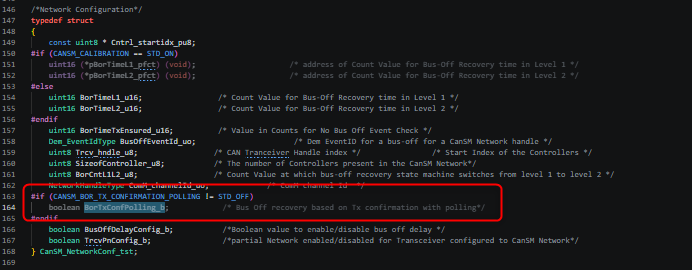

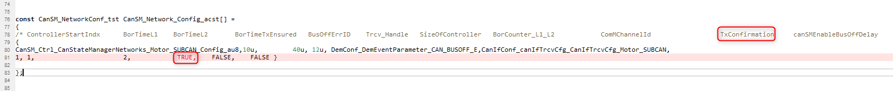

- `CANIF_PUBLIC_TXCONFIRM_POLLING_SUPPORT = STD_ON` will be served for TxConfirmation status in `CanIf_TxConfirmation.c`.

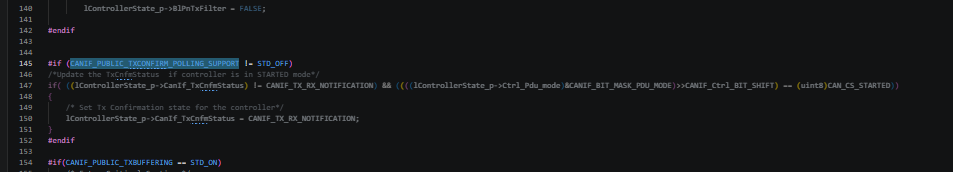

##### AUTOSAR Architecture for Bus-Off Event Handling:

- And obviously, it is matched with the AUTOSAR architecture for the bus-off event handling as shown in the image below for both options:

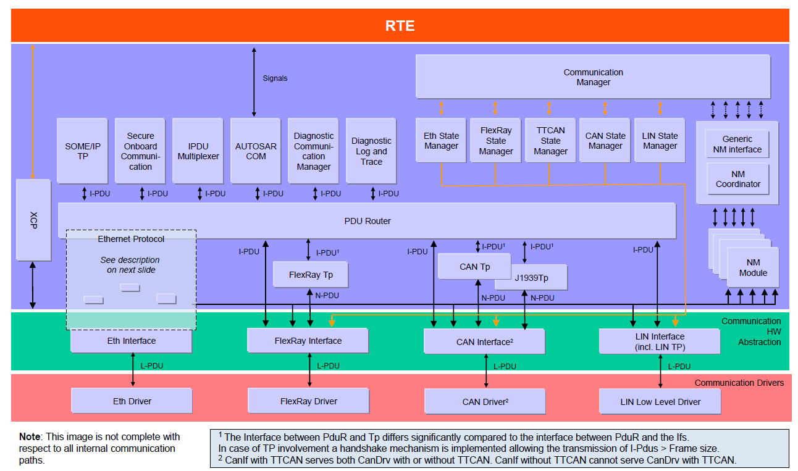


---

### Summary Section (Summary of Notes)

Brief summary of key ideas and takeaways