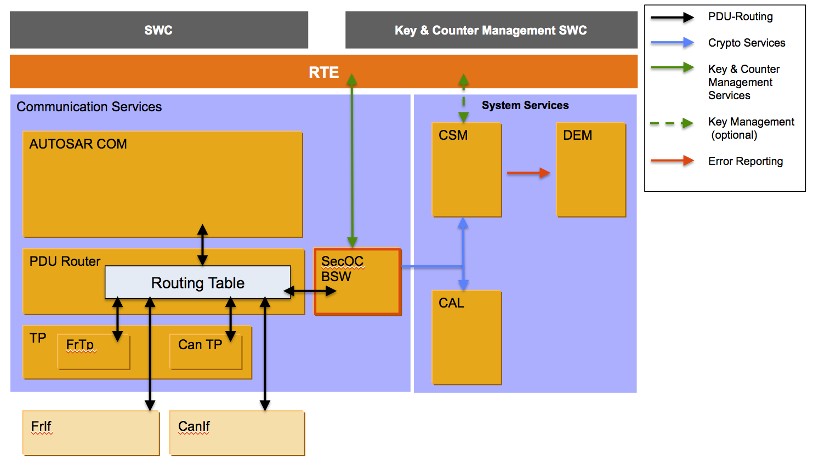

# Cornell Notes

## Topic: SecOC Overview

## Date: 29/06/2026

---

<strong><em>"DO NOT JUST TALK ABOUT IT — SHOW IT"</em></strong>

---
### Cue Column (Questions, Keywords, or Prompts)

- [Insert question or keyword]
- [Insert question or keyword]
- [Insert question or keyword]

---

### Notes Section (Main Notes)

#### What is SecOC?

This specification is the AUTOSAR Secure Onboard Communication (SecOC) module Software Specification. It is based on AUTOSAR SecOC [5] and specifies how the requirements of the AUTOSAR SecOC SRS shall be realized. It describes the basic security features, the functionality and the API of the AUTOSAR SecOC module.

The SecOC module aims for resource-efficient and practicable authentication mechanisms for critical data on the level of PDUs. The authentication mechanisms shall be seamlessly integrated with the current AUTOSAR communication systems. The impact with respect to resource consumption should be as small as possible in order to allow protection as add-on for legacy systems. The specification is based on the assumption that **mainly symmetric authentication approaches with message authentication codes (MACs) are used**. They achieve the **same level of security with much smaller keys than asymmetric approaches** and can be implemented compactly and efficiently in software and in hardware. However, the specification provides the necessary level of abstraction so that both, symmetric approaches as well as asymmetric authentication approaches can be used.

The SecOC module integrates on the level of the AUTOSAR PduR. Figure below shows the integration of the SecOC module as part of the Autosar communication stack.

In this setting, PduR is responsible to route incoming and outgoing security related I-PDUs to the SecOC module. The SecOC module shall then add or process the security relevant information and shall propagate the results in the form of an I-PDU back to the PduR. PduR is then responsible to further route the I-PDUs. Moreover, **the SecOC module makes use of the cryptographic services** provided by the **CSM** and interacts with the RTE to allow key and counter management.  The SecOC module shall support all kind of communication paradigms and principles that are  supported by PduR, specially **Multicast communications**, **Transport Protocols** and the **PduR Gateway**. The following sections provide a detailed specification of SecOC interfaces, functionality and configuration.

---

### Summary Section (Summary of Notes)

[Insert a brief summary of the key ideas and takeaways]