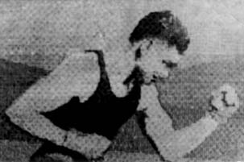
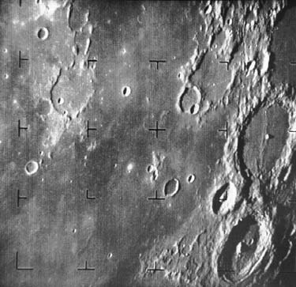

# Cornell Notes

## Topic: Origins of Digital Image Processing

## Date: 24/05/2026

---

### Cue Column (Questions, Keywords, or Prompts)

- Why is the Bartlane system a precursor rather than modern image processing?
- Which computer developments enabled digital image processing?
- Why were the space program and medical imaging major catalysts?
- How did Ranger 7 and CT demonstrate the field's value?

---

### Notes Section (Main Notes)

The origins of digital image processing (DIP) are deeply rooted in both the human desire to manipulate pictorial information and the technological advancements that made such manipulation computationally feasible. Within the broader context of Chapter 1: Introduction, the sources trace the historical path of DIP, distinguishing its modern form from earlier precursors and highlighting the critical role of digital computers.

#### What is Digital Image Processing?
The modern definition of **digital image processing refers to processing digital images by means of a digital computer**. The field serves two main purposes: **improvement of pictorial information for human interpretation** and **processing of image data for storage, transmission, and representation for autonomous machine perception**. This definition is crucial because it differentiates modern DIP from earlier methods that didn't involve computers.

#### Early Precursors (Pre-Computer Era)
Before the advent of digital computers, there were efforts to transmit and reproduce images digitally, but these are not considered "digital image processing results" in the modern sense.
*   **Newspaper Industry**: One of the earliest applications involved transmitting pictures via submarine cable in the early 1920s. The Bartlane cable picture transmission system reduced the time to send a picture across the Atlantic from over a week to less than three hours.
*   **Coded Tapes**: Specialized printing equipment coded pictures for cable transmission and reconstructed them at the receiving end, using telegraph printers with special typefaces simulating halftone patterns (e.g., Figure 1.1).
*   **Improved Reproduction**: Initially, systems used five distinct levels of gray, increasing to 15 levels by 1929. Techniques evolved to use photographic reproduction from perforated tapes and film plates developed via modulated light beams for better quality (e.g., Figure 1.2 and Figure 1.3).
*   While these examples involved digital images, they lacked the computational element, thus not fitting the definition of modern DIP.

#### Extracted source figure: Bartlane coded image

*Figure 1.1. Source: Gonzalez and Woods, Section 1.2, printed p. 3 (PDF p. 26). Native raster extracted from the locally supplied textbook PDF for study reference.*

#### How to read this image

- **Inspect:** the visible character pattern, coarse tone steps, and loss of smooth detail.
- **Encoding idea:** printing symbols approximate local brightness; they are not individual modern square pixels.
- **Why it matters:** the system demonstrated coded image transmission before programmable computer processing.
- **Do not infer:** digital transmission alone makes this modern DIP; decoding and printing were specialized communication operations.

#### The Crucial Role of Digital Computers
The actual birth of modern digital image processing is **intimately tied to the development of the digital computer**. Digital images demand significant storage and computational power, meaning progress in DIP has been **dependent on advancements in digital computers and supporting technologies** like data storage, display, and transmission.

#### Key Technological Advancements
The evolution of computers provided the necessary infrastructure for DIP:
*   **Foundational Concepts**: Modern digital computing dates back to the 1940s with John von Neumann's introduction of **memory for stored programs and data, and conditional branching**, which are fundamental to the Central Processing Unit (CPU).
*   **Transistor and IC**: The invention of the **transistor in 1948** and the **integrated circuit (IC) in 1958** were pivotal.
*   **Software Development**: High-level programming languages (COBOL, FORTRAN) in the 1950s and 60s, and operating systems in the early 1960s, provided the tools to manage complex computational tasks.
*   **Miniaturization**: The development of the microprocessor in the early 1970s and subsequent miniaturization (LSI, VLSI, ULSI) significantly increased computing power and accessibility.
*   **Mass Storage and Display**: Concurrent advancements in **mass storage and display systems** were also fundamental requirements for DIP.

#### Early Applications and Catalysts
The emergence of powerful computers in the **early 1960s** coincided with the **onset of the space program**, which together "brought into focus the potential of digital image processing concepts".
*   **Space Program (NASA)**: Work on improving images from space probes began at the Jet Propulsion Laboratory in **1964**. Ranger 7 pictures of the moon were processed by a computer to correct distortions from the on-board television camera (e.g., Figure 1.4). This early work laid the foundation for processing images from subsequent missions like Surveyor, Mariner, and Apollo.
*   **Medical Imaging**: In parallel with space applications, DIP techniques began to be used in **medical imaging** in the late 1960s and early 1970s. The invention of **computerized axial tomography (CAT), or CT**, was a significant event, earning Sir Godfrey N. Hounsfield and Professor Allan M. Cormack the 1979 Nobel Prize in Medicine. These two inventions, almost a century after X-rays were discovered, led to some of today's most important applications.

#### Expansion and Modern Relevance
From the 1960s to the present, DIP has grown vigorously, expanding into diverse fields including:
*   **Medical Diagnostics**: Enhancing X-rays and other images for easier interpretation.
*   **Remote Sensing**: Studying pollution patterns from aerial and satellite imagery.
*   **Archaeology**: Restoring blurred pictures of artifacts.
*   **Physics**: Enhancing images of experiments in areas like high-energy plasmas and electron microscopy.
*   **Machine Perception**: Extracting information for automated tasks such as character recognition, industrial inspection, military reconnaissance, fingerprint processing, and screening X-rays and blood samples.

Falling compute and storage costs plus expanding communication bandwidth accelerated the spread of digital image processing into science, medicine, industry, and consumer devices.

#### Extracted source figure: Ranger 7 lunar image

*Figure 1.4. Source: Gonzalez and Woods, Section 1.2, printed p. 5 (PDF p. 28). Native image extracted from the locally supplied textbook PDF for study reference.*

#### How to read this image

- **Look for:** crater rims, shadows, smooth plains, and changing sharpness across the frame.
- **What the pixels mean:** brightness mainly records reflected sunlight, modified by surface orientation, camera response, transmission, and later correction.
- **Why it matters:** Ranger data demonstrated that computer correction could make remotely acquired images more useful for scientific interpretation.
- **Do not infer:** a bright patch is not automatically a different material; illumination angle and slope can produce the same effect.

### Learning checkpoint

**Outcomes:** Separate digital transmission from computer processing; identify the technologies and applications that enabled modern DIP.

**Prerequisite:** [What is DIP?](01_what_is_digital_image_processing.md)

**Original example:** Fifteen gray levels require $\lceil\log_2 15\rceil=4$ bits/sample. Coding those samples for cable transmission is not DIP by itself; correcting geometric distortion with a computer is.

**Common mistakes:** Digital image transmission does not necessarily process an image. CT reconstructs slices from projections; it does not directly photograph internal slices. Ranger 7 is a major historical milestone, not proof of one universally unique “first.”

**Self-check:** Why is Bartlane a precursor? Name three technologies required before large digital images became practical.

**Activity:** Build a five-event timeline; annotate each event as sensing, coding, processing, storage, or display.

**ESP32-S3 connection:** One board now combines programmable compute, frame storage, networking, and camera control—capabilities once distributed across large systems.

**Previous/next:** [What is DIP?](01_what_is_digital_image_processing.md) · [Application fields](03_fields_using_digital_image_processing.md)

---

### Summary Section (Summary of Notes)

Early cable-picture systems established digital transmission and reconstruction, but modern digital image processing required programmable computers. Computing, storage, sensors, space exploration, and CT drove the field from the 1960s onward.

**Source:** Section 1.2, printed pp. 3–7 (PDF pp. 26–30).