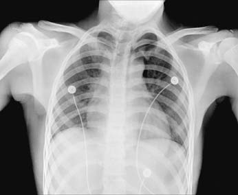
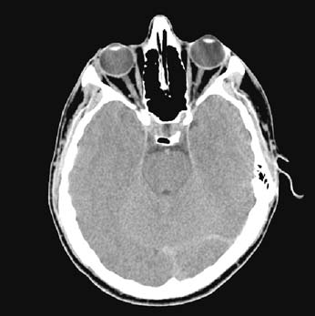
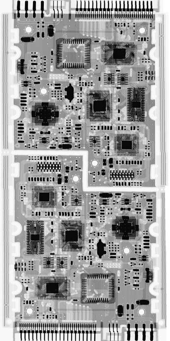
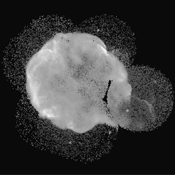
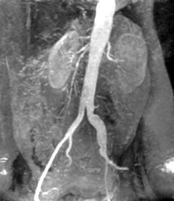
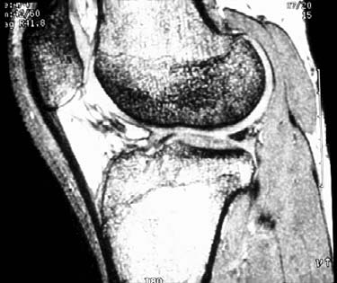
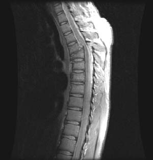
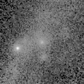
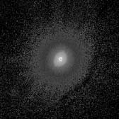
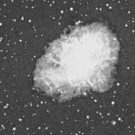

# Cornell Notes

## Topic: Fields Using Digital Image Processing

## Date: 25/05/2026

---

### Cue Column (Questions, Keywords, or Prompts)

- Which electromagnetic bands produce useful images?
- How does wavelength constrain observable detail?
- Which applications use gamma rays, X-rays, radar, or radio waves?
- Which imaging modalities do not use electromagnetic radiation?

---

### Notes Section (Main Notes)

The sources establish **digital image processing (DIP)** as the processing of digital images using a digital computer, driven by two core objectives: **improving pictorial information for human interpretation** and **processing image data for storage, transmission, and representation for autonomous machine perception**. This broad definition, which includes both image-to-image transformations and the extraction of attributes up to object recognition, underpins DIP's pervasive influence across numerous fields. Digital image processing now affects nearly every technical field.

#### Fields Using Digital Image Processing

The breadth of DIP applications is effectively illustrated by categorizing images based on their energy source (e.g., electromagnetic spectrum, acoustic, electron beams):

*   **Electromagnetic (EM) Energy Spectrum**: This is the dominant source for images, covering a vast range from gamma rays to radio waves.
    *   **Gamma-Ray Imaging (Highest Energy)**:
        *   **Nuclear Medicine**: Used in bone scans to identify pathologies like infections or tumors. Positron Emission Tomography (PET) is another key application, where gamma rays from positron-electron annihilation are detected to image tumors in organs like the brain or lung.
        *   **Astronomy**: Captures celestial phenomena, such as images of the Crab Pulsar or the Cygnus Loop, from the object's natural radiation.
        *   **Industrial Applications**: For example, imaging gamma radiation from a valve in a nuclear reactor.
    *   **X-Ray Imaging**:
        *   **Medical Diagnostics**: Used extensively for internal body structures, notably through **Computerized Axial Tomography (CAT) or CT**, which reconstructs 3-D images from X-ray projections. This was a pivotal development that earned a Nobel Prize.
        *   **Industrial Inspection**: Enhancing X-rays for easier interpretation in industrial settings.
    *   **Ultraviolet (UV) Band Imaging**: Used in fields like forensic analysis and industrial inspection.
    *   **Visible and Infrared Bands (Most Familiar)**: These bands have the broadest range of applications.
        *   **Light Microscopy**: Applications in pharmaceuticals, microinspection, and materials characterization (e.g., Taxol, Cholesterol, Microprocessor, Nickel oxide thin film, Surface of audio CD, Organic superconductor). DIP enhances these for human interpretation or measurement.
        *   **Remote Sensing**: NASA's LANDSAT satellites monitor Earth's environmental conditions, population growth, and pollution patterns using thematic bands in the visual and infrared regions. Infrared images can show populated areas and highlight features like rivers.
        *   **Industrial Applications**: Quality control and inspection of manufactured goods, such as circuit board controllers, packaged pills, bottles, clear-plastic products for air bubbles, and cereal. DIP uses techniques like structured light to highlight deformations in intraocular implants.
        *   **Law Enforcement and Security**: Includes processing fingerprints for enhancement or feature extraction, automated counting and serial number reading of paper currency, and automated license plate reading for traffic monitoring and surveillance.
        *   **Astronomy**: Images of the Crab Pulsar in the optical and infrared bands provide different views compared to other parts of the spectrum.
    *   **Microwave Band (Radar)**:
        *   **Remote Sensing**: Radar's unique ability to collect data regardless of weather or ambient lighting makes it essential for exploring inaccessible regions of Earth's surface (e.g., spaceborne radar images of mountains in Tibet).
    *   **Radio Band**:
        *   **Medical Imaging**: **Magnetic Resonance Imaging (MRI)** uses radio waves in a strong magnetic field to produce 2-D pictures of internal body sections (e.g., human knee and spine).
        *   **Astronomy**: Images of celestial bodies like the Crab Pulsar in the radio band.

*   **Other Imaging Modalities**:
    *   **Acoustic Imaging (Ultrasound)**:
        *   **Medical Diagnosis**: Imaging internal structures (e.g., babies, thyroids, muscle lesions).
        *   **Geological Exploration**: Seismic imaging for identifying hydrocarbon traps (oil and gas).
    *   **Electron Microscopy**: Provides extremely high magnifications (over 1000x) to view specimen failures (e.g., due to thermal overload).
    *   **Synthetic (Computer-Generated) Images**:
        *   **Modeling and Visualization**: Includes fractals for artistic or mathematical formulations and 3-D modeling for visualization systems (e.g., flight simulators), medical training, criminal forensics, and special effects.

#### Extracted source figure: X-ray imaging applications

| Chest X-ray | Aortic angiogram | Head CT | Circuit boards | Cygnus Loop |
| --- | --- | --- | --- | --- |
|  |  |  |  |  |

*Figure 1.7. Source: Gonzalez and Woods, Section 1.3, printed p. 10 (PDF p. 33). Native raster panels extracted from the locally supplied textbook PDF for study reference.*

#### How to compare these panels

- **Same energy band, different tasks:** diagnosis, vascular visualization, tomographic reconstruction, industrial inspection, and astronomy.
- **Chest/angiogram:** brightness represents transmitted X-ray attenuation after detector and display mapping; contrast agent makes vessels more distinguishable.
- **Head CT:** each pixel is a reconstructed attenuation-related value, not a direct camera measurement.
- **Circuit boards/Cygnus Loop:** X-rays expose internal material structure or high-energy celestial emission invisible to visible-light cameras.
- **Do not compare brightness numerically:** acquisition geometry, units, processing, and display mappings differ.

#### Extracted source figure: Crab Pulsar across the spectrum

| Gamma ray | X-ray | Optical | Infrared | Radio |
| --- | --- | --- | --- | --- |
|  |  |  |  |  |

*Figure 1.18. Source: Gonzalez and Woods, Section 1.3, printed p. 21 (PDF p. 44). Native image panels extracted from the locally supplied textbook PDF for study reference.*

#### How to compare the five panels

- **Same object, different measurement:** each detector responds to a different energy band, so each panel reveals different physical processes—not merely a recolored visible photograph.
- **Gamma ray/X-ray:** emphasize energetic regions around the pulsar and its surrounding nebula.
- **Optical:** emphasizes structures emitting or reflecting visible light.
- **Infrared:** reveals longer-wavelength emission and dust-related structure.
- **Radio:** reveals charged-particle and magnetic-field-related emission extending beyond obvious optical detail.
- **Comparison rule:** align position and scale first; then compare shape, extent, and bright regions. Display brightness cannot be compared numerically across panels unless their mappings and units match.

### Learning checkpoint

**Outcomes:** Match an imaging source to the physical property measured; distinguish reflection, emission, transmission, and reconstruction.

**Prerequisite:** Basic wave vocabulary. See Chapter 2 for formal $\lambda$, $\nu$, and $E$ relations.

| Question | Suitable modality | Reason |
|---|---|---|
| Surface color | Visible | Measures reflected visible light |
| Night heat pattern | Thermal IR | Temperature/emissivity affect emitted radiation |
| Bone through tissue | X-ray | Differential transmission reveals attenuation |
| Fetal anatomy | Ultrasound | Echo timing and strength reveal interfaces |

The “wavelength no larger than the detail” rule is only a first heuristic. Aperture, geometry, contrast, sensor response, reconstruction, and signal-to-noise ratio also limit resolution. Near-IR commonly measures reflected radiation; thermal IR commonly measures emission. CT reconstructs 2-D slices from X-ray projections; stacked slices form a volume.

**Common mistakes:** Bright thermal pixels do not always mean higher temperature because emissivity matters. MRI radio-frequency excitation is non-ionizing. Magnification is not the same as resolving power.

**Self-check:** Match visible camera, thermal camera, CT, and ultrasound to reflection, emission, transmission/reconstruction, and echo measurement.

**Activity:** For one visible and one thermal image, list source, scene interaction, sensor output, and assumptions required for interpretation.

**ESP32-S3 connection:** OV2640 data depends on visible/near-IR response, optics, illumination, and any IR-cut filter; software cannot recover information the sensor never measured.

**Previous/next:** [Origins](02_origins_of_digital_image_processing.md) · [Fundamental steps](04_fundamental_steps_in_digital_image_processing.md)

---

### Summary Section (Summary of Notes)

Digital imaging spans the electromagnetic spectrum and also uses acoustic energy, electron beams, and synthetic models. Different sources expose different physical properties, enabling medicine, astronomy, remote sensing, inspection, security, and visualization.

**Source:** Section 1.3, printed pp. 7–25 (PDF pp. 30–48).