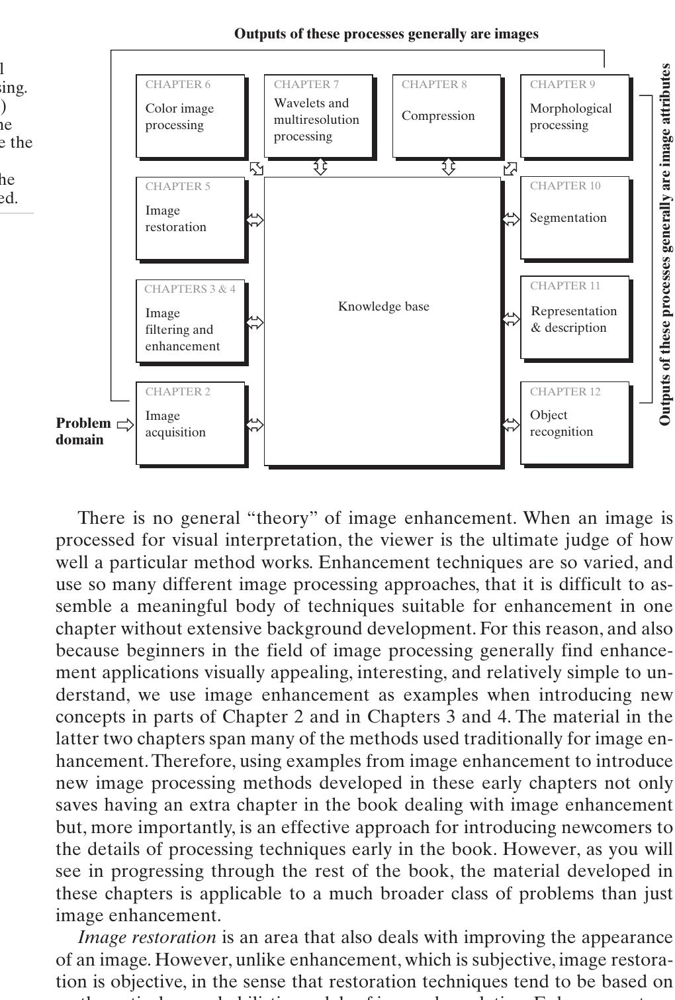
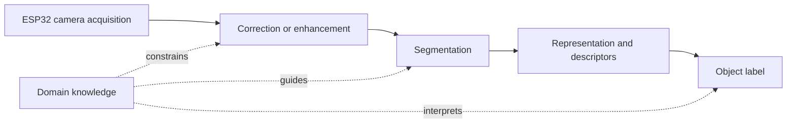

# Cornell Notes

## Topic: Fundamental Steps in Digital Image Processing

## Date: 29/05/2026

---

### Cue Column (Questions, Keywords, or Prompts)

- Which stages produce images, and which produce attributes?
- How do enhancement and restoration differ?
- Why are segmentation and feature description difficult?
- How does the knowledge base guide the processing pipeline?

---

### Notes Section (Main Notes)

The "Fundamental Steps in Digital Image Processing" are a core component of Chapter 1, which serves as an **introduction to the field of digital image processing**. This chapter aims to define the scope of image processing, provide historical context, highlight key application areas, discuss principal approaches, and outline the components of a typical image processing system. The "Fundamental Steps" specifically detail the **methodologies that can be applied to images for various purposes**, thereby providing a foundational understanding of how digital images are manipulated and processed, which is crucial for the rest of the book.

The methodologies within these fundamental steps are broadly categorized into two types:
1.  **Methods whose input and output are images**. These often relate to low-level processing tasks.
2.  **Methods whose inputs may be images but whose outputs are attributes extracted from those images**. These typically correspond to mid-level and high-level processing.

Here's a discussion of the fundamental steps, as outlined in the sources:

*   **Image Acquisition**: This is the initial process in digital image processing. It involves acquiring an image, which can be as simple as receiving an already digital image or a more complex process involving a physical device (sensor) and a digitizer to convert analog signals to digital data. Chapter 2 further elaborates on this topic.
*   **Image Enhancement**: This process aims to **manipulate an image to make the result more suitable for a specific application**. It is considered a subjective process, where the viewer is the ultimate judge of the method's effectiveness, especially for visual interpretation. Enhancement techniques are problem-oriented, meaning a method useful for X-ray images might not be best for satellite images. Examples of enhancement are used early in the book to introduce concepts due to their visual appeal and relative simplicity.
*   **Image Restoration**: Unlike enhancement, restoration is an **objective process that attempts to recover a degraded image** using a priori knowledge about the degradation phenomenon. It involves modeling the degradation and applying an inverse process to approximate the original image. This approach usually seeks an optimal estimate based on a criterion of goodness.
*   **Color Image Processing**: This area has gained significance with the increased use of digital images. It involves fundamental concepts in color models and processing within the digital domain. Color can also be used as a basis for extracting features of interest.
*   **Wavelets and Multiresolution Processing**: While not extensively detailed in the "Fundamental Steps" summary itself, it is mentioned as a chapter in the book. The purpose of Chapter 7 is to establish a solid mathematical foundation for understanding wavelets and multiresolution analysis in image processing.
*   **Compression**: This step is aimed at efficiently representing image data. Chapter 8 is dedicated to image data compression.
*   **Morphological Processing**: This step provides tools for **extracting image components useful for shape representation and description**. It marks a transition from processes that output images to those that output image attributes.
*   **Segmentation**: This procedure involves **partitioning an image into its constituent parts or objects**. Autonomous segmentation is often one of the most challenging tasks in digital image processing, and a robust segmentation procedure is crucial for the successful identification of objects.
*   **Representation and Description**: This step typically follows segmentation, converting raw pixel data (either boundaries or regions) into a form suitable for computer processing. The choice between boundary or regional representation depends on whether the focus is on external shape characteristics (e.g., corners) or internal properties (e.g., texture). Description, also known as feature selection, extracts quantitative information or attributes for differentiating objects.
*   **Object Recognition**: This is the final step discussed, where a label (e.g., "vehicle") is assigned to an object based on its descriptors. The book concludes its coverage of digital image processing with methods for individual object recognition.

An overarching element in this framework is the **Knowledge Base**. Knowledge about a problem domain is coded into an image processing system and guides the operation and interaction between processing modules. This knowledge can range from simple details about regions of interest to complex inter-related lists of defects or high-resolution image databases.

It's important to note that **not every process is applied to every image**, nor are all these modules necessarily required in every application. For instance, image enhancement for human visual interpretation might not require other stages, but as the complexity of an image processing task increases, so does the number of processes needed. The results of image processing can be viewed at the output of any stage.

#### Extracted source figure: fundamental processing steps

*Figure 1.23. Source: Gonzalez and Woods, Section 1.4, printed p. 26 (PDF p. 49). Rendered and cropped from the locally supplied textbook PDF because the diagram is vector page content; retained for study reference.*

#### How to read the diagram

1. **Start at acquisition:** a sensor or stored source supplies the first digital image.
2. **Follow image-producing stages:** enhancement, restoration, color processing, wavelets, compression, and morphology usually transform one image representation into another.
3. **Notice the transition:** segmentation divides the image into meaningful regions or objects.
4. **Follow attribute-producing stages:** representation and description convert regions into boundaries, areas, textures, or feature vectors; recognition assigns labels.
5. **Read the knowledge-base links as feedback:** expected sizes, positions, classes, or defects can tune earlier decisions. They are not a mandatory linear stage.
6. **Do not treat every box as required:** choose only stages needed by the application.

### Learning checkpoint

**Outcomes:** Explain each processing stage; separate enhancement from restoration; select the minimum pipeline for an application.

**Prerequisite:** [What is DIP?](01_what_is_digital_image_processing.md)

Acquisition may include simple preprocessing such as scaling. Enhancement improves suitability for a purpose, usually judged subjectively. Restoration estimates an undegraded image using an explicit degradation model and criterion; it cannot guarantee recovery of the original. Wavelets represent images at multiple scales. Compression reduces storage or transmission cost. Stage boundaries are useful, not absolute; morphology may output an image or attributes.

**Original design example:** Barcode reading needs acquisition, correction, segmentation, line/pattern description, and recognition. Display-only contrast improvement may stop after enhancement.

**Common mistakes:** Every application does not require every stage. Enhancement and restoration are not synonyms. A knowledge base can be rules, expected geometry, thresholds, or reference data—not only machine-learning data.

**Self-check:** Choose the minimum stages for barcode reading and for brightening a dark preview. Where does each pipeline stop producing images?

**Activity:** Design a three-stage colored-marker detector. State each stage’s input and output.

**ESP32-S3 connection:** [Chapter 1 camera pipeline lab](../../../../Examples/ESP32/FreeRTOS/05_Advanced-Topics/03_Digital_Image_Processing/01_demo_project/README.md)

**Previous/next:** [Application fields](03_fields_using_digital_image_processing.md) · [System components](05_components_of_an_image_processing_system.md)

---

### Summary Section (Summary of Notes)

A typical pipeline acquires and improves images, partitions them into objects, represents their shape or region, extracts descriptors, then recognizes objects. Applications use only the required stages. Domain knowledge coordinates and constrains the pipeline.

**Source:** Section 1.4, printed pp. 25–28 (PDF pp. 48–51).