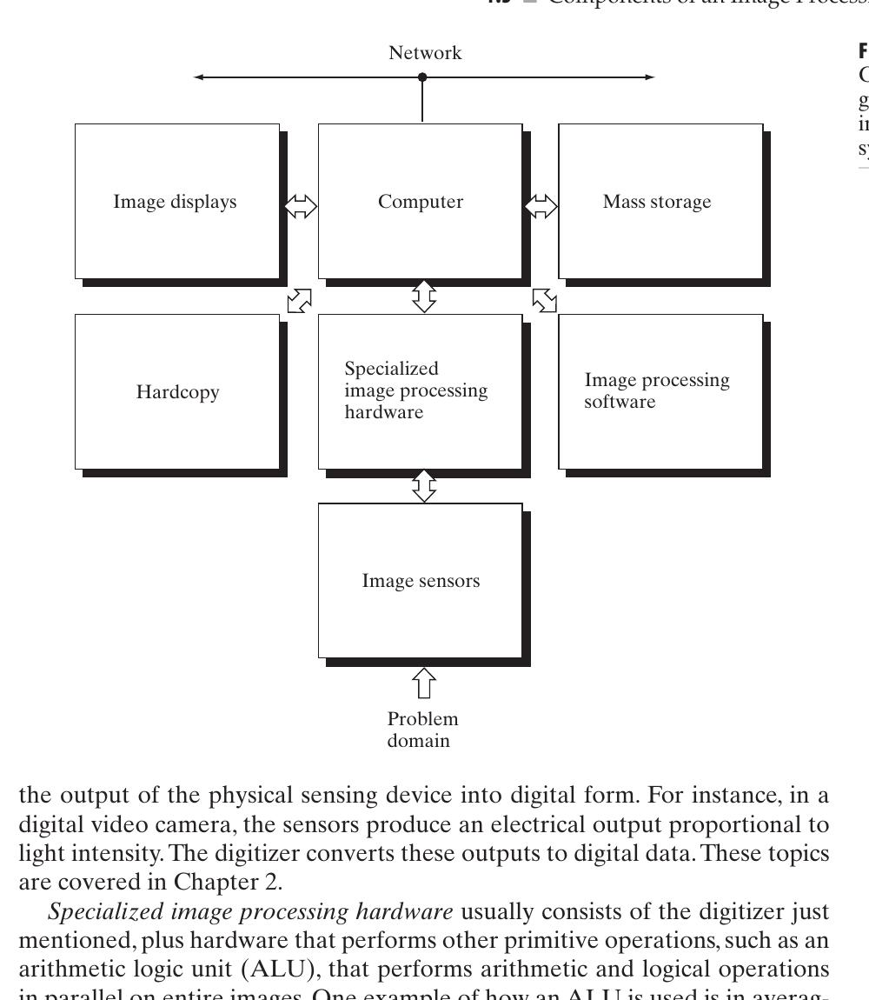

# Cornell Notes

## Topic: Components of an Image Processing System

## Date: 29/05/2026

---

### Cue Column (Questions, Keywords, or Prompts)

- Which components acquire, process, store, display, and transmit images?
- Why is specialized front-end hardware useful?
- What are short-term, online, and archival storage?
- Where does software fit in a general-purpose imaging system?

---

### Notes Section (Main Notes)

The discussion of **Components of an Image Processing System** serves as a vital part of **Chapter 1: Introduction** in the study of digital image processing. This initial chapter aims to provide a comprehensive overview, defining the field's scope, its historical origins, key application areas, principal approaches, and, critically, the constituent elements of a typical image processing system. Understanding these components is foundational to grasping how digital images are acquired, processed, and utilized in various applications.

The field of digital image processing involves processing digital images using a digital computer. Historically, progress in this area has been closely tied to advancements in digital computers and supporting technologies like data storage, display, and transmission. The continuous decline in the price-to-performance ratio of computers and the expansion of networking (such as the World Wide Web and Internet) have created significant opportunities for the growth of digital image processing.

A typical general-purpose image processing system comprises several key components:

*   **Image Sensing and Acquisition**
    This is the initial stage, where images are captured and converted into a digital format. It requires two main elements:
    *   A **physical device** sensitive to the energy radiated by the object to be imaged.
    *   A **digitizer**, which converts the analog output from the physical sensor into digital data. For example, in a digital video camera, sensors produce an electrical output proportional to light intensity, and the digitizer converts these into digital data. This topic is explored in greater detail in Chapter 2.

*   **Specialized Image Processing Hardware**
    This usually includes the aforementioned digitizer. Beyond that, it often features an **arithmetic logic unit (ALU)** capable of performing arithmetic and logical operations on entire images in parallel. An example of its use is rapidly averaging images as they are digitized to reduce noise. Such hardware is sometimes called a **front-end subsystem** because it handles functions demanding fast data throughputs (e.g., digitizing and averaging video at 30 frames/second) that a general-purpose main computer might struggle with.

*   **Computer**
    The central processing unit in an image processing system is typically a **general-purpose computer**, which can range significantly in power from a personal computer (PC) to a supercomputer. While dedicated applications might use custom computers for specific performance needs, most general-purpose systems utilize well-equipped PCs for off-line image processing tasks.

*   **Image Processing Software**
    This consists of **specialized modules** designed to perform specific tasks. A robust software package will also allow users to write their own code to leverage these specialized modules. More advanced software allows the integration of these modules with general-purpose software commands from standard programming languages.

*   **Mass Storage**
    Adequate storage capacity is crucial due to the substantial data requirements of images. For instance, a single 1024x1024 pixel image with 8-bit intensity per pixel requires 1 megabyte of storage if uncompressed. Managing thousands or millions of images presents a significant storage challenge. Digital storage is categorized into three main types:
    *   **Short-term storage** for active use during processing.
    *   **On-line storage** for relatively quick recall.
    *   **Archival storage** for data that is accessed infrequently. Storage is commonly measured in bytes, Kbytes, Mbytes, Gbytes, and Tbytes.

*   **Image Displays**
    Modern systems predominantly use **color (preferably flat screen) TV monitors**. These monitors are driven by image and graphics display cards that are an integral part of the computer system. Commercial display cards typically meet most display requirements, though some specialized applications may necessitate stereo displays, such as head-mounted goggles with small embedded screens.

*   **Hardcopy**
    Printers and other permanent-output devices preserve images or reports outside the active computer system.

*   **Network**
    Figure 1.24 explicitly includes networking for image transfer, remote access, and distributed processing. Required bandwidth depends on frame size, frame rate, compression, and protocol overhead.

A **knowledge base** guides processing methods in Section 1.4, but it is not one of the physical system components shown in Figure 1.24.

The evolution of image processing systems has seen a trend towards **miniaturization and the blending of general-purpose small computers with specialized image processing hardware**, even as large-scale systems continue to be used for massive applications like satellite image processing. Viewing results can occur at any stage of the processing pipeline, indicating the modular and iterative nature of digital image processing.

#### Extracted source figure: image processing system components

*Figure 1.24. Source: Gonzalez and Woods, Section 1.5, printed p. 29 (PDF p. 52). Rendered and cropped from the locally supplied textbook PDF because the diagram is vector page content; retained for study reference.*

#### How to read the system image

- **Sensor plus digitizer:** converts scene energy into samples. Some modern sensors integrate both functions.
- **Specialized hardware:** handles high-rate or regular work such as acquisition, DMA, filtering, or codec acceleration.
- **Computer plus software:** controls the pipeline and runs flexible algorithms.
- **Storage tiers:** short-term frame buffers need speed; archival storage needs capacity.
- **Display/hardcopy/network:** consume or transport results; any can become the throughput bottleneck.
- **ESP32-S3 mapping:** OV2640 = sensor; camera peripheral/DMA = specialized hardware; CPU = computer; firmware = software; PSRAM/flash = storage; Wi-Fi/browser = network/display.

### Learning checkpoint

**Outcomes:** Identify system components; calculate frame memory and throughput; locate a bottleneck.

**Prerequisite:** Bits, bytes, rates, and [fundamental steps](04_fundamental_steps_in_digital_image_processing.md).

| Quantity | Typical unit |
|---|---|
| Frame size | bytes or MiB |
| Pixel throughput | pixels/s |
| Transfer bandwidth | bytes/s or bits/s |
| Processing delay | ms/frame |

**Original example:** A $320\times240$ RGB565 frame stores $320\times240\times2=153{,}600$ bytes. At 30 fps, raw payload is $4{,}608{,}000$ bytes/s before buffering and protocol overhead. Two frame buffers require $307{,}200$ bytes.

The source’s whole-image parallel ALU is an architecture example, not a modern requirement. $1024^2$ 8-bit pixels equal $1{,}048{,}576$ bytes: 1 MiB, approximately 1.05 MB.

**Common mistakes:** A sensor is not necessarily the digitizer. Compute speed alone does not determine frame rate. Buffers, bus bandwidth, compression, and network backpressure matter.

**Self-check:** Given sensor output 20 fps, processing 40 ms/frame, and network capacity 12 fps, what limits sustained delivery?

**Activity:** Budget camera frame buffers, intermediate buffers, and network throughput for one ESP32-S3 mode.

**ESP32-S3 mapping:** OV2640 sensor → camera peripheral/DMA → PSRAM frame buffers → CPU/JPEG handling → HTTP network/display or storage.

**Previous/lab:** [Fundamental steps](04_fundamental_steps_in_digital_image_processing.md) · [Chapter 1 lab](../../../../Examples/ESP32/FreeRTOS/05_Advanced-Topics/03_Digital_Image_Processing/01_demo_project/README.md)

---

### Summary Section (Summary of Notes)

A general-purpose system combines sensing and digitization, specialized processing hardware, a computer, modular software, storage, displays, hardcopy devices, and networking. Component choices follow throughput, capacity, latency, and application requirements.

**Source:** Section 1.5, printed pp. 28–31 (PDF pp. 51–54).