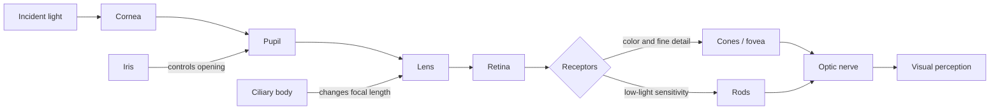

# Cornell Notes

## Topic: Elements of Visual Perception

## Date: 29/05/2026

---

### Cue Column (Questions, Keywords, or Prompts)

- How do rods, cones, and the fovea affect vision?
- How does the eye focus an image on the retina?
- Why is brightness perception approximately logarithmic?
- What causes Mach bands, simultaneous contrast, and false contouring?

---

### Notes Section (Main Notes)

The "Elements of Visual Perception" are detailed in **Section 2.1 of Chapter 2: Digital Image Fundamentals**. This section provides crucial background information for understanding digital image processing, emphasizing that **human intuition and analysis play a central role in technique selection, often based on subjective, visual judgments**. The primary objective is to introduce the mechanics and parameters of human visual perception, including how images are formed in the eye and its capabilities for brightness adaptation and discrimination.

The discussion on visual perception covers:

*   **Structure of the Human Eye**:
    *   The human eye is nearly spherical, with an approximate diameter of 20 mm.
    *   It is enclosed by three membranes: the **cornea** and **sclera** (outer cover), the **choroid**, and the **retina**.
    *   The **cornea** is a transparent tissue covering the eye's anterior surface. The **sclera** is an opaque membrane continuous with the cornea.
    *   The **choroid**, located below the sclera, contains a network of blood vessels that nourish the eye and is heavily pigmented to reduce extraneous light and backscatter. It includes the **ciliary body** and the **iris**.
    *   The **iris** controls the light entering the eye, with its central opening (the **pupil**) varying in diameter from about 2 to 8 mm.
    *   The **retina** contains light-sensitive receptors called **rods** and **cones**. A **blind spot** exists where the optic nerve emerges, lacking receptors. The **fovea** is the region of highest receptor density, crucial for focused vision.

*   **Image Formation in the Eye**:
    *   Unlike a photographic camera that adjusts lens-to-film distance, the human eye maintains a fixed distance between its lens and the retina.
    *   Focusing is achieved by varying the shape of the lens (flattening or thickening) via the ciliary body, which changes its focal length from approximately 14 mm to 17 mm.
    *   Perception occurs when light receptors transform radiant energy into electrical impulses, which are then decoded by the brain.

*   **Brightness Adaptation and Discrimination**:
    *   The human visual system can adapt to an enormous range of light intensities, roughly $10^{10}$.
    *   **Subjective brightness** (intensity perceived by the human visual system) is a logarithmic function of the light intensity incident on the eye.
    *   This wide range is managed through **brightness adaptation**, where the eye changes its overall sensitivity.
    *   Under a fixed background/adaptation condition, the eye discriminates only a limited number of incremental intensity changes. As gaze and adaptation change, the usable overall range becomes much broader.
    *   Coarse quantization can produce **false contouring**, especially in smooth gradients. Visibility depends on quantizer spacing, display, noise, and viewing conditions; there is no universal level-count threshold.
    *   The visual system exhibits phenomena where perceived brightness is not solely dependent on actual intensity:
        *   **Mach bands** show that the visual system tends to undershoot or overshoot around boundaries of different intensities, creating scalloped brightness patterns.
        *   **Simultaneous contrast** illustrates that a region's perceived brightness is influenced by its surrounding background, making identical intensities appear different against varying backgrounds.
        *   **Optical illusions** demonstrate the eye's tendency to fill in missing information or misinterpret geometrical properties.

#### Extracted source figure: simultaneous contrast

| Dark surround | Mid-gray surround | Light surround |
| --- | --- | --- |
|  |  |  |

*Figure 2.8. Source: Gonzalez and Woods, Section 2.1, printed p. 42 (PDF p. 65). Native raster panels extracted from the locally supplied textbook PDF for study reference.*

#### How to read the illusion

- **Hold constant:** each inner square has the same measured intensity.
- **Change:** only the surrounding background becomes lighter.
- **Observe:** the unchanged center appears progressively darker because perception judges local contrast.
- **Verify:** sample the center pixels with software; perception changes while stored center values remain equal.
- **Do not infer:** perceived brightness is a direct measurement of pixel intensity.

#### Extracted source figure: human eye

*Figure 2.1. Source: Gonzalez and Woods, Section 2.1, printed p. 36 (PDF p. 59). Extracted from the locally supplied textbook PDF for study reference.*

#### What each visible structure does

- **Cornea:** supplies much of the eye’s fixed optical power and begins focusing incoming light.
- **Iris/pupil:** controls aperture size, trading light intake against optical effects such as depth of field.
- **Lens/ciliary body:** changes optical power for near or far focus.
- **Retina:** curved receptor surface where an inverted optical image forms.
- **Fovea:** small cone-dense retinal area used for highest-detail vision.
- **Optic disk:** exit point of nerve fibers; it has no receptors and creates the physiological blind spot.
- **Optic nerve:** carries encoded neural signals, not a raw pixel array, toward the brain.

#### Original visual: human visual pathway

This conceptual redraw shows how optical structures focus light and how retinal receptors convert it into signals. It summarizes Section 2.1 and supplements the extracted source figure.

### Learning checkpoint

**Outcomes:** Explain retinal image formation, compare rods and cones, distinguish adaptation from discrimination, and recognize context-dependent brightness effects.

**Prerequisite:** Ratios, logarithms, and similar triangles.

The retina contains roughly 6–7 million cones and 75–150 million rods. Cones support photopic vision, color, and fine detail, especially in the fovea. Rods support sensitive scotopic vision but do not provide color discrimination. The lens-to-retina distance is about 17 mm; accommodation changes lens shape and focal length, roughly within 14–17 mm.

The Weber ratio models threshold discrimination:

$$\frac{\Delta I_c}{I}$$

Here $I$ is background intensity and $\Delta I_c$ is the increment detected about half the time. Smaller ratios indicate finer discrimination.

**Original example:** A 2 m object viewed from 20 m forms an approximate retinal image $h=17\text{ mm}\times2/20=1.7$ mm high using similar triangles.

**Common mistakes:** Rods do not detect color. The fovea is cone-dense, not rod-dense. Perceived brightness is not identical to measured intensity.

**Self-check:** Why can two equal gray patches look different? What does a smaller Weber ratio mean? Which receptors dominate dim-light vision?

**Activity:** Place identical gray patches on black and white backgrounds; predict, then compare perceived brightness.

**ESP32-S3 connection:** Camera exposure/noise and display contrast affect what a person sees; quantized values alone do not predict perceived quality.

**Next:** [Light and the electromagnetic spectrum](02_light_and_the_electromagnetic_spectrum.md)

---

### Summary Section (Summary of Notes)

The retina converts focused light into neural signals using rods and cones. Human vision adapts across a huge intensity range but discriminates far fewer levels at one adaptation state. Context and local contrast strongly influence perceived brightness.

**Source:** Section 2.1, printed pp. 36–43 (PDF pp. 59–66).