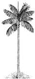
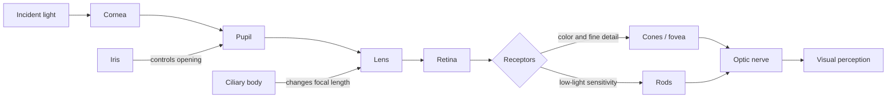

# Cornell Notes

## Topic: Elements of Visual Perception

## Date: 29/05/2026

---

### Cue Column (Questions, Keywords, or Prompts)

- How do rods, cones, and the fovea affect vision?
- How does the eye focus an image on the retina?
- Why is brightness perception approximately logarithmic?
- What cause Mach bands, simultaneous contrast, and false contouring?

---

### Notes Section (Main Notes)

The "Elements of Visual Perception" are detailed in **Section 2.1 of Chapter 2: Digital Image Fundamentals**. This section provides crucial background information for understanding digital image processing, emphasizing that **human intuition and analysis play a central role in technique selection, often based on subjective, visual judgments**. The primary objective is to introduce the mechanics and parameters of human visual perception, including how images are formed in the eye and its capabilities for brightness adaptation and discrimination.

The discussion on visual perception covers:

*   **Structure of the Human Eye**:
    *   The human eye is nearly spherical, with an approximate diameter of 20 mm.
    *   It is enclosed by three membranes: the **cornea** and **sclera** (outer cover), the **choroid**, and the **retina**.
    *   The **cornea** is a transparent tissue covering the eye's anterior surface. The **sclera** is an opaque membrane continuous with the cornea.
    *   The **choroid**, located below the sclera, contains a network of blood vessels that nourish the eye and is heavily pigmented to reduce extraneous light and backscatter. It includes the **ciliary body** and the **iris**.
    *   The **iris** controls the light entering the eye, with its central opening (the **pupil**) varying in diameter from about 2 to 8 mm.
    *   The **retina** contains light-sensitive receptors called **rods** and **cones**. A **blind spot** exists where the optic nerve emerges, lacking receptors. The **fovea** is the region of highest receptor density, crucial for focused vision.

*   **Image Formation in the Eye**:
    *   Unlike a photographic camera that adjusts lens-to-film distance, the human eye maintains a fixed distance between its lens and the retina.
    *   Focusing is achieved by varying the shape of the lens (flattening or thickening) via the ciliary body, which changes its focal length from approximately 14 mm to 17 mm.
    *   Perception occurs when light receptors transform radiant energy into electrical impulses, which are then decoded by the brain.

*   **Brightness Adaptation and Discrimination**:
    *   The human visual system can adapt to an enormous range of light intensities, roughly $10^{10}$.
    *   **Subjective brightness** (intensity perceived by the human visual system) is a logarithmic function of the light intensity incident on the eye.
    *   This wide range is managed through **brightness adaptation**, where the eye changes its overall sensitivity.
    *   The total range of distinct intensity levels the eye can discriminate *simultaneously* is relatively small (one to two dozen) for a given adaptation level. However, as the eye roams, the adaptation level changes, allowing for a much broader overall intensity discrimination.
    *   Using fewer than approximately two dozen intensity levels in monochrome images can lead to visible **false contouring**.
    *   The visual system exhibits phenomena where perceived brightness is not solely dependent on actual intensity:
        *   **Mach bands** show that the visual system tends to undershoot or overshoot around boundaries of different intensities, creating scalloped brightness patterns.
        *   **Simultaneous contrast** illustrates that a region's perceived brightness is influenced by its surrounding background, making identical intensities appear different against varying backgrounds.
        *   **Optical illusions** demonstrate the eye's tendency to fill in missing information or misinterpret geometrical properties.

#### Extracted source figure: human eye

*Source: Gonzalez and Woods, Section 2.1, printed p. 36 (PDF p. 59). Extracted from the locally supplied textbook PDF for study reference.*

#### Original visual: human visual pathway

This conceptual redraw shows how optical structures focus light and how retinal receptors convert it into signals. It summarizes Section 2.1 and supplements the extracted source figure.

In the larger context of Chapter 2, "Digital Image Fundamentals," the section on "Elements of Visual Perception" establishes a foundational understanding of the capabilities and limitations of human vision. This knowledge is critical for subsequent discussions on various aspects of digital imaging. For example, it helps to understand:
*   The nature of light and the electromagnetic spectrum (Section 2.2), as light is what the human eye senses.
*   Image sensing and acquisition (Section 2.3), by outlining how natural vision works as a comparison for artificial systems.
*   Image sampling and quantization (Section 2.4), particularly informing choices related to intensity resolution to avoid artifacts like false contouring, based on the eye's discrimination capabilities.
*   The basic mathematical tools introduced later (Section 2.6), as these tools are often applied to image properties that ultimately aim to optimize visual perception or extract information for machine perception.

---

### Summary Section (Summary of Notes)

The retina converts focused light into neural signals using rods and cones. Human vision adapts across a huge intensity range but discriminates far fewer levels at one adaptation state. Context and local contrast strongly influence perceived brightness.

**Source:** Section 2.1, printed pp. 36–43 (PDF pp. 59–66).