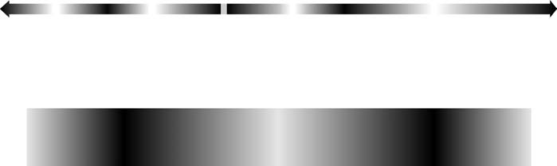

# Cornell Notes

## Topic: Light and the Electromagnetic Spectrum

## Date: 29/05/2026

---

### Cue Column (Questions, Keywords, or Prompts)

- How are wavelength, frequency, and photon energy related?
- Which wavelengths form the visible spectrum?
- How do radiance, luminance, and brightness differ?
- Why must imaging wavelength match the scale of the target detail?

---

### Notes Section (Main Notes)

The sources define **Light and the Electromagnetic Spectrum** as a fundamental topic within **Chapter 2: Digital Image Fundamentals**, providing essential background for understanding how images are formed, sensed, and processed digitally.

Here's a detailed discussion based on the provided information:

**1. Nature of the Electromagnetic (EM) Spectrum**
*   The electromagnetic spectrum encompasses a wide range of energy.
*   It can be conceptualized as **propagating sinusoidal waves of varying wavelengths** or as a **stream of massless particles (photons)**, each traveling in a wavelike pattern at the speed of light.
*   Each photon contains a certain amount of energy.
*   The spectrum is arranged according to **energy per photon**, ranging from **gamma rays (highest energy)** to **radio waves (lowest energy)**.
*   Bands of the EM spectrum are not distinct but transition smoothly from one to the other.
*   The electromagnetic spectrum can be expressed in terms of **wavelength ($\lambda$)**, **frequency ($\nu$)**, or **energy (E)**.
    *   Wavelength and frequency are related by the expression $\lambda\nu = c$, where $c$ is the speed of light ($2.998 \times 10^8$ m/s).
    *   Photon energy is $E=h\nu=hc/\lambda$, where $h\approx6.626\times10^{-34}\ \mathrm{J\,s}$. Thus **higher-frequency (shorter-wavelength) radiation carries more energy per photon**.
*   Common units: wavelength in meters, micrometers ($\mu$m), or nanometers (nm); frequency in hertz (Hz); energy in joules (J) or electron-volts (eV).

#### Extracted source figure: electromagnetic spectrum

*Figure 2.10. Source: Gonzalez and Woods, Section 2.2, printed p. 44 (PDF p. 67). Extracted from the locally supplied textbook PDF for study reference.*

#### How to read the spectrum

- Moving toward **shorter wavelength** means moving toward **higher frequency** because $\lambda\nu=c$.
- Higher frequency also means **higher energy per photon** because $E=h\nu$.
- Band borders are approximate; the spectrum is continuous.
- The enlarged visible strip is tiny compared with the entire spectrum. Violet lies at the shorter-wavelength/higher-energy end; red lies at the longer-wavelength/lower-energy end.
- An imaging band states what energy reaches the detector. It does not by itself state whether that energy was reflected, emitted, transmitted, or reconstructed.

**2. Visible Light – A Small Portion of the Spectrum**
*   **Light** is a specific type of electromagnetic radiation that the human eye can sense.
*   The **visible spectrum** is a very small portion of the overall electromagnetic spectrum, spanning approximately **0.43 $\mu$m (violet) to 0.79 $\mu$m (red)**.
*   This visible band is divided into six broad regions: **violet, blue, green, yellow, orange, and red**.
*   The colors perceived in an object are determined by the **nature of the light reflected from it**.
    *   A body reflecting light balanced in all visible wavelengths appears **white**.
    *   A body favoring reflectance in a limited range of the visible spectrum exhibits specific **shades of color** (e.g., green objects reflect light primarily in the 500 to 570 nm range).

**3. Characteristics of Light and Color**
*   **Monochromatic (or achromatic) light** is void of color, and its only attribute is its **intensity** or amount. This intensity is perceived as varying from black to grays to white, and the term **gray level** is commonly used to denote monochromatic intensity. The range from black to white is called the **gray scale**, and monochromatic images are often referred to as **gray-scale images**.
*   **Chromatic (color) light** spans from approximately 0.43 to 0.79 $\mu$m.
*   Three basic quantities describe a chromatic light source:
    *   **Radiometric quantities** describe physical radiant energy. Radiant flux uses watts; radiance normally uses $\mathrm{W\,m^{-2}\,sr^{-1}}$.
    *   **Photometric quantities** weight radiation by human visual sensitivity. Luminous flux uses lumens; luminance uses $\mathrm{cd\,m^{-2}}$.
    *   **Brightness** is a subjective perceptual attribute, not interchangeable with radiance or luminance.

**4. Other Bands of the EM Spectrum and Their Applications**
*   **Gamma rays**: Used in nuclear medicine, astronomical observations, and imaging radiation in nuclear environments.
*   **X-rays**: Oldest source of EM radiation for imaging. Widely used in medical diagnostics (e.g., chest X-rays, CT scans) and industrial applications (e.g., inspecting circuit boards). Hard (high-energy) X-rays for industrial use, soft (lower energy) X-rays for medical.
*   **Ultraviolet (UV) band**: Applications include lithography, industrial inspection, microscopy (e.g., fluorescence microscopy), lasers, biological imaging, and astronomical observations.
*   **Infrared (IR) band**: Often used with visual imaging. Radiates heat, making it useful in imaging applications that rely on "heat signatures" (e.g., remote sensing, satellite images). Near-infrared is close to the visible spectrum, while far-infrared blends with the microwave band.
*   **Microwave band**: Known for microwave ovens, but also used in communications, radar (e.g., spaceborne radar imaging), and satellite imagery.
*   **Radio band**: Major applications in medicine (e.g., Magnetic Resonance Imaging - MRI) and astronomy.

**5. Imaging Modalities Beyond the EM Spectrum**
*   While imaging predominantly relies on electromagnetic waves, other methods exist:
    *   **Acoustic imaging**: Uses sound reflected from objects (e.g., ultrasonic images, medical ultrasound of babies or organs).
    *   **Electron beams**: Used in electron microscopy for very high magnification (e.g., Scanning Electron Microscope - SEM images of material failures).
    *   **Synthetic (computer-generated) images**: Fractals and 3D computer models used for visualization and modeling.

**6. Wavelength and Object Visibility**
*   A crucial principle is that **the wavelength of an electromagnetic wave required to "see" an object must be of the same size as or smaller than the object**. This physical limitation, along with sensor material properties, dictates the capabilities of imaging sensors. For instance, studying molecules with diameters around $10^{-10}$ m requires sources in the far ultraviolet or soft X-ray regions.

### Learning checkpoint

**Outcomes:** Relate wavelength, frequency, and photon energy; distinguish radiometric, photometric, and perceptual quantities; explain why source and sensor spectra matter.

**Prerequisite:** Scientific notation and unit conversion.

| Symbol | Meaning | SI unit |
|---|---|---|
| $\lambda$ | Wavelength | m |
| $\nu$ | Frequency | Hz |
| $c$ | Vacuum light speed | m/s |
| $h$ | Planck constant | J·s |
| $E$ | Photon energy | J |

Strictly, *monochromatic* means one wavelength or a narrow band; *achromatic* means without perceived hue. Introductory imaging texts sometimes use them loosely together. Resolution depends on wavelength plus aperture, geometry, contrast, sensor response, reconstruction, and noise. Near-IR often records reflection; thermal IR commonly records emission affected by temperature and emissivity.

**Original example:** For $\nu=500$ THz, $\lambda=c/\nu\approx600$ nm and $E=h\nu\approx3.31\times10^{-19}$ J, about 2.07 eV.

**Common mistakes:** Higher frequency does not mean faster propagation in vacuum. Not every IR image measures temperature. Radiance, luminance, and brightness are different quantities.

**Self-check:** Convert 500 nm to frequency. Which carries more photon energy: red or blue light? Why can a hot object and a reflective object both appear bright in different IR systems?

**Activity:** View an IR remote LED through a camera only if the camera can detect near-IR. Never stare into high-power or unknown emitters.

**ESP32-S3 connection:** OV2640 response, illumination spectrum, and IR-cut filtering determine measured pixel values before firmware processing begins.

**Previous/next:** [Visual perception](01_elements_of_visual_perception.md) · [Sensing and acquisition](03_image_sensing_and_acquisition.md)

---

### Summary Section (Summary of Notes)

Electromagnetic radiation may be modeled as waves or photons, with $\lambda\nu=c$ and $E=h\nu$. Visible light occupies only a narrow spectral band. Sensor response, wavelength, illumination, and reflectance determine what an imaging system can observe.

**Source:** Section 2.2, printed pp. 43–46 (PDF pp. 66–69).