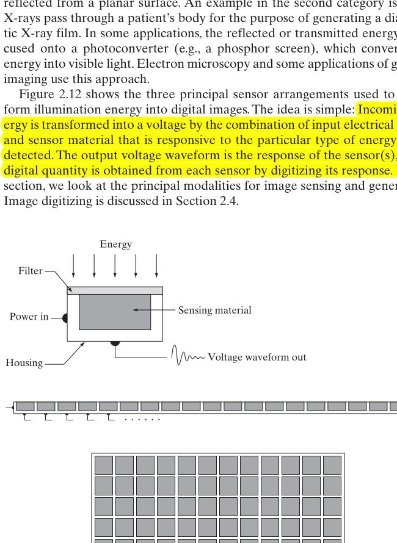
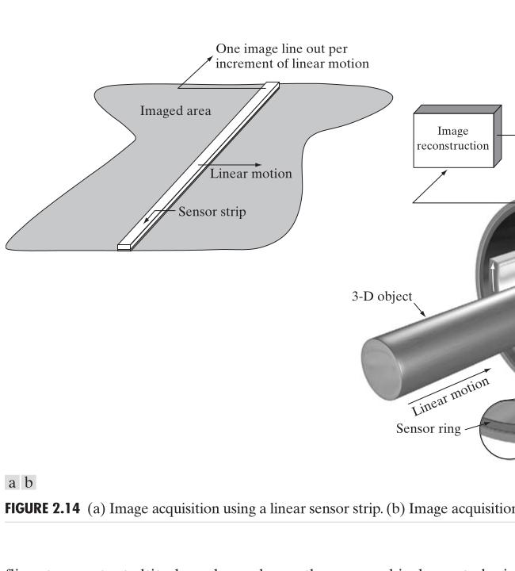
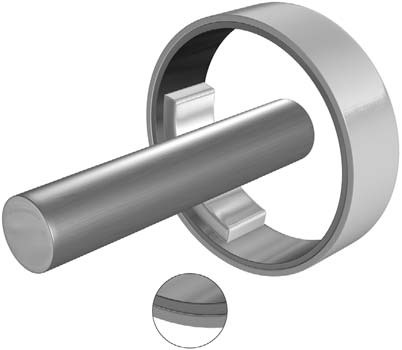

# Cornell Notes

## Topic: Image Sensing and Acquisition

## Date: 13/06/2026

---

<strong><em>"DO NOT JUST TALK ABOUT IT — SHOW IT"</em></strong>

---

### Cue Column (Questions, Keywords, or Prompts)

- How does a sensor convert scene energy into image data?
- How do single sensors, line sensors, and arrays acquire 2-D images?
- What do illumination and reflectance represent?
- Why are sampling and quantization required after sensing?

---

### Notes Section (Main Notes)

In the context of **Digital Image Fundamentals (Chapter 2)**, **Image Sensing and Acquisition (Section 2.3)** is presented as the foundational step in converting real-world information into a digital image format. This chapter lays out the basic concepts necessary for understanding how digital images are created and processed.

The primary objective of image sensing and acquisition is to **generate digital images from sensed data**. This process typically involves two main elements: an **illumination source** and the **interaction of energy from that source with the scene elements** being imaged. This interaction can be through reflection or absorption of energy. For instance, light reflecting from a surface or X-rays transmitting through a patient's body are examples of these interactions. In some cases, the reflected or transmitted energy is focused onto a **photoconverter** (like a phosphor screen) that converts the energy into visible light.

Images can originate from various energy sources, not just visible light:
*   **Electromagnetic energy spectrum**: This includes gamma-ray, X-ray, ultraviolet, visible and infrared, microwave, and radio bands.
*   **Acoustic and ultrasonic energy**.
*   **Electronic energy** (e.g., electron beams in electron microscopy).
*   **Synthetic images** generated by computers.

A key limitation of imaging is that the **wavelength of the electromagnetic wave needed to "see" an object must be the same size as or smaller than the object itself**. This, along with sensor material properties, sets fundamental limits on imaging capabilities.

The sensing process transforms incoming energy into a voltage waveform using a physical device (sensor material) sensitive to the specific type of energy being detected, powered by electrical input. The output voltage is then digitized.

The textbook outlines three principal sensor arrangements for image acquisition:

#### Extracted source figure: sensor arrangements

*Figure 2.12. Source: Gonzalez and Woods, Section 2.3, printed p. 47 (PDF p. 70). Vector/composite page content rendered and cropped from the locally supplied textbook PDF for study reference.*

#### How to read the arrangements

- **Single sensor:** one detector produces one spatial sample at a time; two-axis relative motion builds a 2-D image.
- **Line sensor:** many detectors capture one row simultaneously; perpendicular motion supplies the second dimension.
- **Array sensor:** a 2-D detector grid receives the complete projected image without scene scanning.
- **Common chain:** incident energy → sensing material → voltage response → sampling/quantization.
- **Do not infer:** an array needs no readout scan; rows and columns still require electronic transfer.

1.  **Image Acquisition Using a Single Sensor**:
    *   Consists of a single sensing element, such as a photodiode, which produces an output voltage proportional to light intensity.
    *   A filter can be used in front of the sensor to improve selectivity (e.g., a green filter for green light).
    *   To create a 2-D image, there must be **relative displacement between the sensor and the area to be imaged in both x and y directions**.
    *   Examples include high-precision scanning where a film negative rotates on a drum for one dimension, and the sensor moves along a lead screw for the other. This method is inexpensive but slow and can achieve high-resolution images due to precise mechanical control. Laser sources can also be used with moving mirrors for scanning.

2.  **Image Acquisition Using Sensor Strips**:
    *   Involves an **in-line arrangement of sensors**, providing imaging elements in one direction.
    *   Motion perpendicular to the strip provides imaging in the other direction.
    *   This arrangement is common in **most flatbed scanners** and airborne imaging applications.
    *   **Circular sensor strips** are utilized in computed tomography (CT) scanners, where a ring of detectors and an X-ray source rotate around an object to produce cross-sectional images. Other modalities like magnetic resonance imaging (MRI) and positron emission tomography (PET) conceptually use similar approaches.

*Figure 2.14. Source: Gonzalez and Woods, Section 2.3, printed p. 49 (PDF p. 72). Vector/composite page content rendered and cropped from the locally supplied textbook PDF for study reference.*

- **Linear case:** strip position supplies one coordinate; object/platform motion supplies the other.
- **Circular case:** source and detector geometry collect projections from multiple angles; reconstruction computes a slice.
- **Do not infer:** the circular detector directly photographs internal anatomy.

3.  **Image Acquisition Using Sensor Arrays**:
    *   In this setup, individual sensors are arranged in a **2-D array**.
    *   This is the **predominant arrangement in digital cameras (e.g., CCD arrays)**.
    *   A key advantage is that a **complete image can be acquired by focusing the energy pattern directly onto the array surface, eliminating the need for motion**.
    *   CCD sensors offer broad sensing properties and can integrate input light signals over long periods for low-noise images.
    *   The process involves an imaging system (e.g., optical lens) that collects and focuses energy onto the sensor array, which then produces outputs that are converted to an analog signal and finally digitized into a digital image.

#### Extracted source figure: digital image acquisition

*Figure 2.15. Source: Gonzalez and Woods, Section 2.3, printed p. 49 (PDF p. 72). Extracted from the locally supplied textbook PDF for study reference.*

#### Read the acquisition image from left to right

1. **Energy source:** illumination supplies photons or another probing signal.
2. **Scene interaction:** objects reflect, emit, transmit, or scatter different amounts.
3. **Optics/sensor:** geometry focuses the spatial energy pattern onto sensing elements.
4. **Electrical response:** each element converts received energy into a measurable signal.
5. **Digital image:** sampling assigns locations; quantization assigns finite values.

A dark output pixel can result from weak illumination, low reflectance, lens shading, low exposure, sensor response, or digital mapping. One pixel value alone cannot identify which cause dominated.

A **simple reflective image formation model** separates illumination $i(x,y)$ from surface reflectance $r(x,y)$:

$$f(x,y)=i(x,y)r(x,y),\qquad 0<i(x,y)<\infty,\qquad 0\le r(x,y)\le1$$

Thus $L_{\min}\le f(x,y)\le L_{\max}$ for a particular system and scene. Endpoints model total absorption or reflection; practical calibrated ranges may differ. For transmission imaging, replace reflectance with an appropriate transmissivity/attenuation model. Raw $f$ may represent voltage, digital counts, radiance-related measurements, or reconstructed coefficients—not universally a calibrated gray level.

Finally, sensor physics and readout electronics produce electrical measurements. Sampling discretizes position/time; quantization maps amplitudes to discrete values. Array sensors still require row/column readout even though the scene need not move.

### Learning checkpoint

**Outcomes:** Compare single, line, and array sensing; trace energy to a frame buffer; apply the illumination–reflectance model with stated assumptions.

**Prerequisite:** [Light and spectrum](02_light_and_the_electromagnetic_spectrum.md)

**Original example:** If the simplified model uses $i=800$ relative illumination units and $r=0.25$, then $f=200$ response units. These are proportional model values unless calibrated physical units are supplied.

Longer exposure may improve photon statistics, but motion, saturation, dark current, read noise, and thermal effects impose limits. CT requires reconstruction from projection measurements; rotation alone does not create the slice.

**Common mistakes:** Sensor samples are not automatically calibrated intensity. More exposure is not always better. A 2-D array removes scene scanning, not electronic readout.

**Self-check:** Choose single, line, or array sensing for a drum scanner, push-broom satellite, and camera. Which model term changes when a lamp brightens?

**Activity:** Trace OV2640 sensor output through camera readout, DMA, PSRAM, JPEG handling, and HTTP delivery.

**Previous/next:** [Light and spectrum](02_light_and_the_electromagnetic_spectrum.md) · [Sampling and quantization](04_image_sampling_and_quantization.md) · [Chapter 1 lab](../../../../Examples/ESP32/FreeRTOS/05_Advanced-Topics/03_Digital_Image_Processing/01_demo_project/README.md)

---

### Summary Section (Summary of Notes)

Image acquisition converts scene energy into electrical measurements using a single sensor, a line, or a 2-D array. The formation model separates illumination from reflectance. Sampling coordinates and quantizing amplitudes convert continuous sensor output into pixels.

**Source:** Section 2.3, printed pp. 46–52 (PDF pp. 69–75).