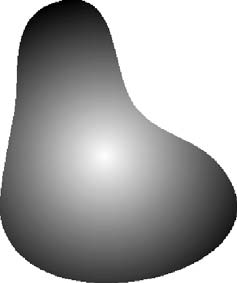
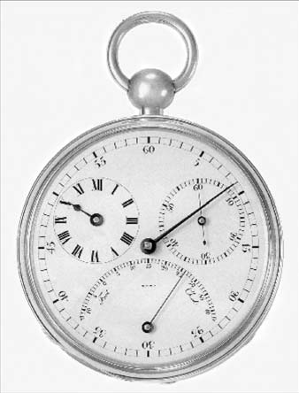
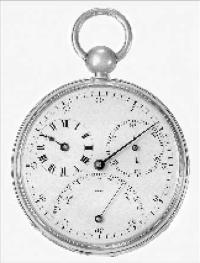

# Cornell Notes

## Topic: Image Sampling and Quantization

## Date: 13/06/2026

---

<strong><em>"DO NOT JUST TALK ABOUT IT — SHOW IT"</em></strong>

---
### Cue Column (Questions, Keywords, or Prompts)

- What is the difference between sampling and quantization?
- How do spatial and intensity resolution affect image quality?
- How many bits store an $M\times N$ image with $k$ bits per pixel?
- When should nearest-neighbor, bilinear, or bicubic interpolation be used?

---

### Notes Section (Main Notes)

In the larger context of **Digital Image Fundamentals (Chapter 2)**, Image Sampling & Quantization (Section 2.4) represents the crucial processes that convert continuous, real-world data into a discrete digital image format suitable for computational processing. These fundamental steps directly follow image sensing and acquisition and lay the groundwork for nearly all subsequent digital image processing techniques discussed throughout the book.

### Preceding Context: Image Sensing and Acquisition

Before sampling and quantization can occur, raw image data must be sensed and acquired. This initial stage involves an **illumination source** interacting with a "scene" (through reflection or absorption of energy) and a physical device (sensor) that converts this energy into a continuous voltage waveform. The energy source can be diverse, including the electromagnetic spectrum (gamma, X-ray, visible light, etc.), acoustic, ultrasonic, or even electronic energy.

The method of sensing significantly influences how the image is initially captured and subsequently sampled:
*   **Single Sensor Acquisition:** A single sensing element (e.g., a photodiode) produces a voltage proportional to light intensity. To create a 2-D image, **relative displacement between the sensor and the area to be imaged in both x and y directions** is necessary, often through precise mechanical motion. Spatial sampling here is achieved by controlling the number of mechanical increments at which the sensor collects data.
*   **Sensor Strip Acquisition:** An in-line arrangement of sensors captures data in one dimension, with motion perpendicular to the strip providing the other dimension. This is common in flatbed scanners and CT scanners. The number of sensors in the strip sets sampling limits in one direction, while mechanical motion allows control in the other.
*   **Sensor Array Acquisition:** Individual sensors are arranged in a **2-D array**, a predominant setup in **digital cameras (e.g., CCD arrays)**. This method allows a complete image to be acquired by focusing the energy pattern directly onto the array surface, **eliminating the need for mechanical motion**. The number of sensors in the array inherently defines the sampling limits in both directions.

Regardless of the sensing method, the output at this stage is typically a **continuous voltage waveform**.

### The Core Processes: Sampling and Quantization

To transform this continuous sensed data into a digital image, two essential processes are performed:

1.  **Sampling (Digitizing Coordinate Values):** This involves digitizing the spatial coordinates (x, y) of the image. Conceptually, it means taking equally spaced samples along a continuous image.
2.  **Quantization (Digitizing Amplitude Values):** This involves digitizing the amplitude (intensity) values of these samples. The continuous intensity levels are mapped to a discrete set of values. The accuracy of this process is notably affected by the noise content of the sampled signal.

#### Extracted source figure: projected and digitized image

*Figure 2.17(b). Source: Gonzalez and Woods, Section 2.4, printed p. 54 (PDF p. 77). Native raster panel extracted from the locally supplied textbook PDF for study reference.*

#### What this panel represents

- The sensor-array projection is continuous in the textbook model before digitization.
- **Sampling** chooses discrete row/column locations.
- **Quantization** assigns one finite intensity value at each chosen location.
- Individual cells become visible only when enlarged sufficiently; display scaling does not change the original sample count.
- **Do not infer:** digitization preserves all spatial and tonal information from the continuous scene.

### Representing Digital Images

A digital image, after sampling and quantization, is formally represented as a **two-dimensional function, $f(x, y)$, where x and y are discrete spatial coordinates, and the amplitude (value) of $f$ at any pair of coordinates $(x, y)$ is the intensity or gray level**. When x, y, and the intensity values are all finite and discrete, it is called a **digital image**. The individual elements of a digital image are most commonly referred to as **pixels** (or picture elements, image elements, pels).

*   **Spatial Domain:** The real plane section spanned by the coordinates of an image is known as the **spatial domain**, with x and y as spatial variables.
*   **Structure:** A digital image can be viewed as a 2-D array or matrix, containing M rows and N columns of discrete coordinates.
*   **Origin Convention:** In this textbook, the origin is top-left, $x$ denotes the row increasing downward, and $y$ denotes the column increasing rightward. This differs from Cartesian plots and many graphics APIs, where $x$ is horizontal. In code, $(r,c)$ avoids ambiguity.
*   **Valid indices:** $x\in\{0,\ldots,M-1\}$ and $y\in\{0,\ldots,N-1\}$, with matrix element $a_{ij}=f(i,j)$.
*   **Formal Definition:** More formally, a digital image is a function whose coordinates and stored amplitudes come from finite discrete sets.

### Intensity Levels and Resolution

The digitization process necessitates decisions on the image's dimensions (M, N) and the number of discrete intensity levels (L).

*   **Number of Intensity Levels (L):** Due to hardware considerations, L is typically an **integer power of 2**, expressed as $L = 2^k$, where $k$ is the number of bits. For instance, an 8-bit image has $2^8 = 256$ intensity levels.
*   **Gray Scale:** The interval of intensity values, $[0, L-1]$, is called the **gray scale**, where 0 usually represents black and $L-1$ represents white.
*   **Dynamic Range and Contrast:** The **dynamic range** of an imaging system is the ratio of the maximum to minimum detectable intensity, bounded by saturation and noise. **Image contrast** is the intensity difference between the highest and lowest levels in an image. High dynamic range often results in high contrast images, while low dynamic range can lead to a "dull, washed-out" appearance.
*   **Storage Requirements:** The number of bits ($b$) needed to store a digitized image of size $M \times N$ with $k$ bits per pixel is given by the formula: $b = M \times N \times k$. For a square image ($M=N$), this simplifies to $b = N^2 \times k$. This highlights that storage needs can be significant for larger images.

**Resolution** refers to the level of detail an image can capture and display:
*   **Spatial Resolution:** This measures the **smallest discernible detail** in an image. It is commonly expressed in terms of **line pairs per unit distance** or **dots (pixels) per unit distance** (e.g., dots per inch, dpi). For meaningful comparison, spatial resolution must be stated with respect to spatial units; simply listing pixel dimensions (e.g., "1024x1024 pixels") is insufficient.
*   **Intensity Resolution:** This refers to the **smallest discernible change in intensity level**. It is typically indicated by the number of bits ($k$) used for quantization (e.g., an 8-bit image has 8 bits of intensity resolution). While 8 bits is common, 16 bits may be used for applications requiring enhancement of specific intensity ranges. True discernible changes are influenced by noise, saturation, and human perception.

### Effects on Image Quality

Varying the spatial resolution (N) and intensity resolution (k) can significantly impact perceived image quality:

*   **Reducing Spatial Resolution:** As spatial resolution (e.g., dpi) decreases, images show visible degradation, particularly in fine details. For example, reducing an image from 1250 dpi to 72 dpi can lead to significant degradation across most features.

#### Extracted source figure: reduced spatial resolution

| 1250 dpi | 300 dpi |
| --- | --- |
|  |  |
| 150 dpi | 72 dpi |
|  |  |

*Figure 2.20. Source: Gonzalez and Woods, Section 2.4, printed p. 61 (PDF p. 84). Native image panels extracted from the locally supplied textbook PDF for study reference.*

#### What changes across the four images

- **Held conceptually constant:** scene content and tonal-level capability.
- **Changed:** spatial sampling density—the number of samples representing the same physical extent.
- **Inspect first:** numerals, thin hands, tick marks, and curved edges. Fine structures merge or disappear before large regions become unrecognizable.
- **At low sampling density:** block boundaries and stair-step edges become obvious; missing fine detail cannot be recreated by later interpolation.
- **Do not confuse:** this comparison changes spatial resolution, not the number of gray levels. Intensity quantization produces tonal banding/false contours instead of primarily blocky geometry.

*   **Reducing Intensity Levels:** Decreasing the number of intensity levels (while keeping the number of samples constant) can lead to **false contouring**. This effect, characterized by "ridge-like structures" resembling topographic contours, is particularly noticeable in images with 16 or fewer uniformly spaced intensity levels, especially in regions with smooth, subtle intensity variations.
*   **Interaction of Spatial and Intensity Resolution (N and k):** Early studies, such as those by Huang , used "isopreference curves" to quantify the subjective effects of simultaneously varying N and k. These studies showed that for images with high detail (e.g., a crowded scene), only a few intensity levels might be needed, as perceived quality could be nearly independent of 'k' within a certain range. Interestingly, a decrease in 'k' can sometimes **increase apparent contrast**, which humans might perceive as improved quality. A rough guideline suggests that $256 \times 256$ pixel images with 64 intensity levels, printed on a $5 \times 5$ cm format, can be reasonably free of objectionable sampling artifacts.

### Image Interpolation

Interpolation is a crucial process that closely relates to sampling and quantization, serving as a fundamental tool for **resampling images**.

*   **Function:** It is used extensively in tasks such as zooming, shrinking, rotation, and geometric corrections.
*   **Mechanism:** Interpolation involves **using known data (pixel values) to estimate values at unknown locations (new pixel positions)**. For example, when zooming an image, new pixels are introduced, and their intensity values are estimated from surrounding known pixels.
*   **Methods:** Common interpolation techniques include:
    *   **Nearest Neighbor Interpolation:** Assigns the value of the closest known pixel to the new location. It is computationally simple but can result in "blocky" artifacts, especially when enlarging images.
    *   **Bilinear Interpolation:** Computes a weighted average of the four nearest known pixels. It generally produces smoother results than nearest neighbor interpolation.
    *   **Bicubic Interpolation:** Uses 16 nearest pixels to estimate the new value through a more complex polynomial function. It yields even smoother results and better preserves fine details compared to bilinear, often being preferred for general-purpose image processing due to good results and reasonable computational efficiency.
*   **Relation to Aliasing:** Interpolation estimates values on a new grid but cannot by itself prevent aliasing. Downsampling requires an appropriate low-pass prefilter before samples are discarded. Reconstruction quality then depends on the interpolation method.

### Learning checkpoint

**Outcomes:** Separate sampling from quantization; calculate levels/storage; use unambiguous indices; explain resampling and aliasing.

**Prerequisite:** Binary numbers, arrays, and [image acquisition](03_image_sensing_and_acquisition.md).

| Symbol | Meaning | Assumption/range |
|---|---|---|
| $M,N$ | Rows, columns | Positive integers |
| $k$ | Bits per sample | Positive integer |
| $L$ | Number of levels | Often $2^k$, not mandatory |
| $b$ | Storage | $MNk$ bits for unpacked grayscale |

Uniform integer quantization commonly adopts levels $0,\ldots,L-1$. Dynamic range is a ratio between useful extrema; contrast is an intensity difference or ratio. Pixel count, optical resolution, sampling density, and display DPI are related but distinct.

**Original storage example:** One $320\times240$ RGB565 frame requires $320\times240\times2=153{,}600$ bytes. Ten uncompressed frames require $1{,}536{,}000$ bytes.

**Original bilinear example:** For a $2\times2$ patch $\begin{bmatrix}0&100\\200&255\end{bmatrix}$, the center estimate is the equal-weight average $138.75$, rounded according to output rules. Bilinear interpolation has form $v(x,y)=a+bx+cy+dxy$ inside one cell; bicubic uses a $4\times4$ neighborhood and may overshoot.

**Common mistakes:** Do not swap row and column. Bits are not bytes. Resizing creates estimates, not new measured detail. Quantization error is not sensor noise.

**Self-check:** How many levels use 4 bits? What are valid indices for a $3\times5$ image? Why prefilter before shrinking?

**Activity:** Quantize `[0, 63, 64, 127, 128, 191, 192, 255]` to 2 significant bits; calculate each error and inspect transitions.

**ESP32-S3 connection:** [Sampling and quantization lab](../../../../Examples/ESP32/FreeRTOS/05_Advanced-Topics/03_Digital_Image_Processing/02_sampling_quantization/README.md)

**Previous/next:** [Image acquisition](03_image_sensing_and_acquisition.md) · [Pixel relationships](05_basic_relationships_between_pixels.md)

---

### Summary Section (Summary of Notes)

Sampling discretizes image coordinates; quantization discretizes intensity. Spatial resolution controls visible detail, while intensity resolution controls tonal precision. Interpolation estimates values on a new sampling grid, trading speed against smoothness and fidelity.

**Source:** Section 2.4, printed pp. 52–68 (PDF pp. 75–91).