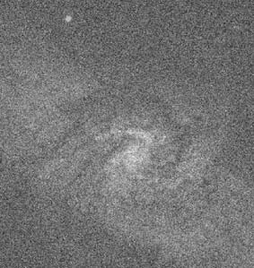
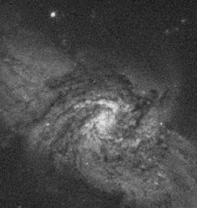
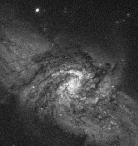
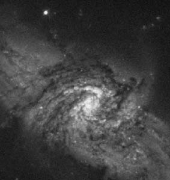
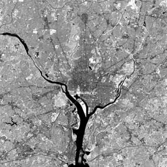
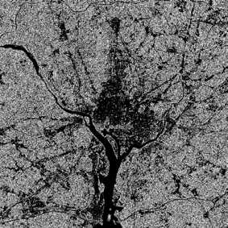

# Cornell Notes

## Topic: Mathematical Tools

## Date: 20/06/2026

---

<strong><em>"DO NOT JUST TALK ABOUT IT — SHOW IT"</em></strong>

---
### Cue Column (Questions, Keywords, or Prompts)

- How do array operations differ from matrix operations?
- What conditions make an image operator linear?
- Which arithmetic, logical, spatial, and probabilistic tools recur later?
- Why transform an image into another domain?

---

### Notes Section (Main Notes)

Within the larger context of **Digital Image Fundamentals (Chapter 2)**, Section 2.6, titled "An Introduction to the Mathematical Tools Used in Digital Image Processing," serves as a crucial foundational element. This introduction was specifically highlighted as a need by a survey involving faculty, students, and independent readers, leading to a more comprehensive treatment in this edition of the book.

The primary objectives of Section 2.6 are twofold:
1.  To **introduce the various mathematical tools** that will be utilized throughout the book.
2.  To help readers develop an **intuitive understanding** of how these tools are applied to fundamental image-processing tasks.

The scope of these tools and their applications is progressively expanded in subsequent chapters. This section provides the groundwork for systematically processing and analyzing digital images, which themselves are derived from physical processes like sensing, acquisition, sampling, and quantization, as introduced in earlier sections of Chapter 2. The understanding of these tools is critical for both human interpretation and autonomous machine perception of images from diverse sources, ranging across the electromagnetic spectrum.

Here's a discussion of the specific mathematical tools introduced:

*   **Array versus Matrix Operations**
    *   The distinction is fundamental: **array operations** are performed element-by-element (pixel-by-pixel), and this is the default assumption throughout the book unless stated otherwise. For example, raising an image to a power means raising each individual pixel's value to that power.
    *   **Matrix operations**, on the other hand, apply matrix theory to images, treating images as matrices. This approach is particularly valuable for solving numerous image processing problems.

*   **Linear versus Nonlinear Operations**
    *   An operator `H` is **linear** if it satisfies the properties of additivity (output for a sum of inputs is the sum of outputs for individual inputs) and homogeneity (scaling an input scales the output by the same constant).
    *   If these conditions are not met, the operator is **nonlinear**. This classification is vital for understanding different image-processing methodologies, such as the median filter being a nonlinear operator. Linear systems theory is a cornerstone for many image processing techniques.

*   **Arithmetic Operations**
    *   These are array operations (pixel-by-pixel) including addition, subtraction, multiplication, and division.
    *   **Addition (averaging)** is commonly used for **noise reduction**, such as averaging multiple noisy images.
    *   **Subtraction** is effective for **enhancing differences** between images, useful for tasks like change detection (e.g., in digital subtraction angiography) or medical imaging.
    *   **Multiplication** applies masks or gains; **division** commonly performs shading/flat-field correction. Division requires explicit zero handling.
    *   Practical implementations for 8-bit images often involve scaling to manage pixel values that might exceed the 0-255 range after an operation.

#### Extracted source figure: noise reduction by averaging

| Noisy image | Average of 5 |
| --- | --- |
|  |  |
| Average of 10 | Average of 20 |
|  |  |
| Average of 50 | Average of 100 |
|  |  |

*Figure 2.26. Source: Gonzalez and Woods, Section 2.6, printed p. 76 (PDF p. 99). Native image panels extracted from the locally supplied textbook PDF for study reference.*

#### What averaging changes

- Compare flat background regions first: random bright/dark fluctuations become progressively weaker as the number $K$ of averaged frames increases.
- Compare galaxy shape next: stable scene structure reinforces because it occurs at the same registered coordinates in every frame.
- Improvement is rapid initially, then shows diminishing visual returns because noise standard deviation falls as $1/\sqrt K$, not $1/K$.
- The sequence assumes aligned images plus independent, zero-mean noise. Camera movement, object motion, fixed-pattern noise, or exposure drift violates those assumptions and may blur or bias the result.
- Averaging 100 images uses ten times as many frames as averaging 10, but reduces standard deviation only by an additional factor of $\sqrt{10}\approx3.16$.

#### Extracted source figure: least-significant-bit difference

| Original infrared image | Least-significant bit cleared | Scaled difference |
| --- | --- | --- |
|  |  |  |

*Figure 2.27. Source: Gonzalez and Woods, Section 2.6.3, printed p. 77 (PDF p. 100). Native raster panels extracted from the locally supplied textbook PDF for study reference.*

#### How to read the subtraction example

- Clearing the least-significant bit changes each pixel by only $0$ or $1$ count.
- The first two panels therefore look nearly identical at normal display scale.
- Their raw difference contains only tiny values; display scaling expands those values to $[0,255]$ so their spatial pattern becomes visible.
- The bright difference panel does **not** mean a large radiometric error; it visualizes amplified one-count changes.
- Use signed or wider arithmetic when subtraction may produce negative values.

*   **Set and Logical Operations**
    *   These operations are grounded in **set theory**, especially relevant for **binary images**, where pixels are categorized as foreground or background. Basic set operations like union, intersection, and complement correspond to OR, AND, and NOT logical operations for binary images.
    *   For **gray-scale images**, these operations are defined as maximum, minimum, and differences between corresponding pixel pairs, making them array operations.
    *   The concept of **fuzzy sets** is introduced as a framework for handling imprecise concepts (e.g., "dark," "gray," "bright") in intensity transformations and spatial filtering. This topic is elaborated further in Section 3.8.

*   **Spatial Operations**
    *   These directly manipulate image pixels and are categorized into:
        *   **Single-pixel operations**: Adjust individual pixel values based on their intensity, like creating an image negative.
        *   **Neighborhood operations**: Determine an output pixel's value based on an operation involving pixels within its defined neighborhood in the input image. These are fundamental to many image enhancement, restoration, morphology, and segmentation techniques. They are efficient due to their speed and ease of hardware/firmware implementation.
        *   **Geometric spatial transformations**: Modify spatial relationships through scaling, rotation, translation, or shearing. Coordinate transformation locates output samples; nearest-neighbor, bilinear, or bicubic interpolation assigns intensities. **Image registration** uses these operations to align images.

*   **Vector and Matrix Operations**
    *   These are crucial for **multispectral imaging**, where each pixel (e.g., in a color image) can be represented as a vector (e.g., RGB components).
    *   Vector-matrix theory provides tools like Euclidean distance for analyzing these pixel vectors.
    *   Applications extend to color image processing, restoration, compression, and object recognition.

*   **Image Transforms**
    *   Some image processing tasks are more effectively performed by transforming an image into a **transform domain**, processing it there, and then applying an inverse transform to return to the spatial domain. This is distinct from spatial domain processing.
    *   The **2-D Discrete Fourier Transform (DFT)** is highlighted as a particularly important linear transform, covered extensively in Chapter 4, and forms the basis for frequency domain processing. Other transforms like Walsh, Hadamard, discrete cosine, Haar, and slant transforms are also mentioned as fitting a similar mathematical form.

*   **Probabilistic Methods**
    *   Intensity values are often treated as random quantities.
    *   Concepts of **probability** (e.g., the likelihood of an intensity level, estimated from normalized histograms) and **statistical characteristics** (mean, variance) are used for image analysis.
    *   Probability is central to algorithms for intensity transformations, image restoration, segmentation, texture description, and object recognition. More advanced concepts like stochastic image processing and random fields are also noted as extending this area.

### Essential equations and assumptions

Element-wise arithmetic for equal-sized images:

$$s=f+g,\quad d=f-g,\quad p=f\odot g,\quad v=f\oslash g$$

Use wider signed intermediates for subtraction; define division-by-zero behavior. A linear operator satisfies

$$H[af+bg]=aH[f]+bH[g].$$

For $K$ registered observations $g_i=f+n_i$ with independent zero-mean noise of variance $\sigma_n^2$:

$$\bar g=\frac1K\sum_{i=1}^{K}g_i,\qquad
\operatorname{Var}(\bar g)=\frac{\sigma_n^2}{K},\qquad
\sigma_{\bar g}=\frac{\sigma_n}{\sqrt K}.$$

A rectangular mean filter illustrates a neighborhood operation:

$$g(x,y)=\frac1{mn}\sum_{(r,c)\in S_{xy}}f(r,c).$$

Its result depends on border policy. Geometric processing first maps coordinates, then interpolates intensities; inverse mapping avoids unfilled output holes. For an RGB vector $\mathbf z=[R,G,B]^T$:

$$D(\mathbf z,\mathbf a)=\sqrt{(\mathbf z-\mathbf a)^T(\mathbf z-\mathbf a)}.$$

For histogram counts $n_k$:

$$p(z_k)=\frac{n_k}{MN},\quad
\mu=\sum_k z_kp(z_k),\quad
\sigma^2=\sum_k(z_k-\mu)^2p(z_k).$$

Variance has squared intensity units; standard deviation has intensity units. Min–max display scaling changes absolute measurements:

$$f_s=K\frac{f-\min(f)}{\max(f)-\min(f)}.$$

### Learning checkpoint

**Outcomes:** Distinguish array/matrix operations; test linearity; apply arithmetic, neighborhoods, geometry, vectors, transforms, and probability with assumptions.

**Prerequisite:** Algebra, matrices, sums, probability, and [pixel relationships](05_basic_relationships_between_pixels.md).

**Original $2\times2$ example:** For $f=\begin{bmatrix}0&2\\2&4\end{bmatrix}$, the mean is 2 and population variance is 2. With ROI mask $m=\begin{bmatrix}0&1\\1&0\end{bmatrix}$, $f\odot m=\begin{bmatrix}0&2\\2&0\end{bmatrix}$. This is element-wise multiplication, not matrix multiplication.

**Common mistakes:** Unsigned subtraction loses negative differences. Averaging unregistered frames blurs motion. Forward mapping can leave holes. Median filtering and thresholding are nonlinear. Variance does not use the original intensity unit.

**Self-check:** Classify mean filter, median filter, threshold, and affine warp as linear/nonlinear and local/global. Why must a four-frame 8-bit sum use more than 8 bits?

**Activity:** Average four aligned grayscale frames using at least a 10-bit accumulator; verify the maximum sum $4\times255=1020$ cannot overflow.

**ESP32-S3 connection:** Integer arithmetic, buffer width, border policy, and PSRAM traffic determine whether textbook operations fit real-time firmware.

**Previous/index:** [Pixel relationships](05_basic_relationships_between_pixels.md) · [Learning index](../README.md)

---

### Summary Section (Summary of Notes)

Digital image processing combines element-wise arrays, matrix and vector algebra, linear and nonlinear operators, arithmetic and set operations, spatial neighborhoods, transforms, and probability. Choosing the right representation often turns a difficult operation into a simple one.

**Source:** Section 2.6, printed pp. 72–98 (PDF pp. 95–121).