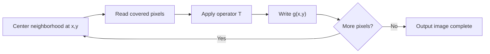

# Cornell Notes

## Topic: Background

**Source:** Section 3.1, printed pp. 105–107 (PDF pp. 128–130).

**Learning outcomes**

- Distinguish spatial-domain, point, and neighborhood processing.
- Trace how a moving neighborhood generates an output image.
- Explain why enhancement quality depends on the application.

---

## Cue Column

- What is the spatial domain?
- What do $f$, $g$, and $T$ represent?
- When does an operation become point processing?
- What happens at image borders?
- How should enhancement quality be judged?

---

## Notes Section

### 1. Spatial-domain model

The **spatial domain** is the image plane itself. Spatial methods operate directly on pixels, unlike frequency-domain methods that operate on a transform of the image.

$$g(x,y)=T[f(x,y)]$$

| Symbol | Meaning |
|---|---|
| $f(x,y)$ | input image intensity at $(x,y)$ |
| $g(x,y)$ | output image intensity at $(x,y)$ |
| $T$ | operator defined over a neighborhood of $(x,y)$ |

$T$ may use one image or several images. This chapter mainly considers one input image.

### 2. Moving-neighborhood processing

A neighborhood is usually a small, rectangular region centered at $(x,y)$. The operator visits every image location, normally in row-major order, and writes one result to the corresponding output location.

For a $3\times3$ averaging operator centered at $(100,150)$:

$$g(100,150)=\frac{1}{9}\sum_{i=-1}^{1}\sum_{j=-1}^{1}f(100+i,150+j)$$

This includes the center pixel plus its eight neighbors.

> **Implementation rule:** Read from the original input and write to a separate output. In-place writes can contaminate later neighborhoods with already-filtered values.

### 3. Point processing versus spatial filtering

The smallest neighborhood is $1\times1$. Then the output depends only on the input intensity at the same coordinate:

$$s=T(r)$$

Here, $r=f(x,y)$ and $s=g(x,y)$. This is an **intensity transformation** or **point operation**.

| Property | Point operation | Neighborhood operation |
|---|---|---|
| Inputs per output | One pixel | Multiple nearby pixels |
| Uses spatial context | No | Yes |
| Typical implementation | Lookup table | Sliding mask/kernel |
| Examples | Negative, gamma, threshold | Blur, sharpen, median |

A neighborhood plus its operation is called a **spatial filter**, **mask**, **kernel**, **template**, or **window**.

### 4. Border handling

Near an edge, part of the neighborhood lies outside the image. A policy must be chosen:

- ignore unavailable neighbors and adjust the computation;
- pad with zeros;
- pad with a fixed intensity;
- replicate or reflect border pixels.

The required padding width depends on the filter radius. Border policy is part of the algorithm: different policies produce different edge pixels.

### 5. Enhancement is task-specific

Image enhancement makes an image more suitable for a **specific** use. No transformation is universally best.

- For human viewing, the observer ultimately judges usefulness.
- For machine perception, use a measurable downstream result, such as recognition accuracy.
- Also account for processing time, memory, and hardware limits.

A transform useful for an X-ray may be unsuitable for infrared satellite imagery. “Looks stronger” does not necessarily mean “contains more valid information.”

### Common mistakes

- Calling every sliding-mask operation convolution; correlation and convolution differ for asymmetric masks.
- Filtering in place without proving that changed pixels cannot affect later outputs.
- Omitting the border policy.
- Treating visual appeal as an objective guarantee of better data.
- Confusing enhancement with restoration: enhancement is application-oriented, not necessarily an estimate of the original scene.

### Quick activity

For the neighborhood

$$
\begin{bmatrix}
1&2&3\\
4&5&6\\
7&8&9
\end{bmatrix}
$$

an averaging operator returns

$$g(x,y)=\frac{1+2+\cdots+9}{9}=5.$$

Changing only the center from $5$ to $50$ changes the result to $10$. The example shows that a neighborhood operator can respond strongly to one outlier; later, median filtering addresses this case.

### Self-check

1. Why is $s=T(r)$ spatial-domain processing even though it uses no neighboring pixels?
2. Why can zero padding create dark borders after averaging?
3. Which quality measure is more suitable for an OCR preprocessing method: visual preference or recognition rate?
4. What bug can result from writing filtered values back into the input during a scan?

Answers

1. It operates directly on image pixel intensities.
2. Artificial zero-valued neighbors lower averages near the boundary.
3. Recognition rate, subject to resource constraints.
4. Later outputs may consume earlier outputs instead of the original pixels, making the result scan-order dependent.

---

## Summary Section

Spatial processing maps an input image to an output by applying an operator at every pixel. A $1\times1$ operator is a point transform; a larger neighborhood is a spatial filter. Correct implementation requires explicit output buffering, border handling, and a task-specific success criterion.

**Next:** [Basic Intensity Transformation Functions](02_basic_intensity_transformation_functions.md)
