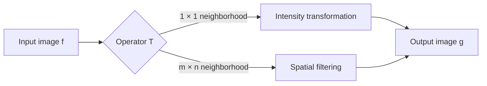

# Cornell Notes

## Topic: Background

**Source:** Section 3.1, printed pp. 105–107 (PDF pp. 128–130).

---

### Cue Column

- What is the spatial domain?
- How do intensity transformations differ from spatial filters?
- What does a neighborhood operator do?

---

### Notes Section

Spatial-domain processing operates directly on image pixels:

$$g(x,y)=T[f(x,y)]$$

Here, $f$ is the input image, $g$ is the output, and $T$ is an operator applied over a neighborhood around $(x,y)$.

- A **point operation** uses a $1\times1$ neighborhood. Its output depends only on the corresponding input pixel.
- A **neighborhood operation** uses nearby pixels. Moving the neighborhood across the image produces the output.
- An **intensity transformation** maps input level $r$ to output level $s$:

$$s=T(r)$$

- A **spatial filter** combines neighborhood values using a mask or kernel.
- Enhancement is application-dependent. No universal measure says one enhanced image is always best.

---

### Summary Section

Spatial methods directly manipulate pixels. Point transforms remap individual intensities; spatial filters compute each output from a local neighborhood.

**Next:** [Basic Intensity Transformation Functions](02_basic_intensity_transformation_functions.md)
