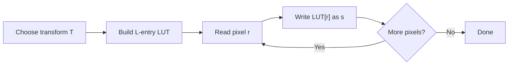

# Cornell Notes

## Topic: Basic Intensity Transformation Functions

**Source:** Section 3.2, printed pp. 107–120 (PDF pp. 130–143).

**Learning outcomes**

- Predict how negative, logarithmic, and power-law curves redistribute intensities.
- Select a point transform from the imaging objective.
- Implement transforms safely with normalization, clipping, and lookup tables.
- Decompose and reconstruct an image using bit planes.

---

## Cue Column

- Why are lookup tables useful?
- Which transform exposes dark detail?
- How does gamma correction differ from arbitrary gamma enhancement?
- Why should contrast mappings usually remain monotonic?
- What information lives in high- and low-order bit planes?

---

## Notes Section

### 1. Point-transform implementation

Each input intensity $r$ maps independently to an output intensity $s$:

$$s=T(r)$$

For an 8-bit image, $T$ can be precomputed as a 256-entry lookup table (LUT). Per-pixel processing then becomes one indexed read.

Use floating-point or sufficient fixed-point precision while constructing the LUT. Round and clip only at the output boundary.

### 2. Image negative

For $L$ allowed intensity levels:

$$s=L-1-r$$

The transform reverses brightness order. It is useful when light or gray detail lies inside a large dark region.

**Example — 8-bit input**

$$r=40\quad\Rightarrow\quad s=255-40=215$$

Applying the transform twice restores the input:

$$T(T(r))=L-1-(L-1-r)=r$$

### 3. Log transformation

$$s=c\log(1+r),\qquad r\ge0$$

The $1$ makes the transform defined at $r=0$. The curve:

- expands a narrow range of low values;
- compresses a wide range of high values;
- reduces dynamic range.

A common scaling constant maps the largest input to $L-1$:

$$c=\frac{L-1}{\log(1+r_{\max})}$$

**Source example:** A Fourier spectrum spanning approximately $0$ to $1.5\times10^6$ becomes roughly $0$ to $6.2$ after a natural logarithm with $c=1$. Linear display scaling can then reveal weak spectral detail that bright peaks otherwise hide.

> Log display changes visibility, not the underlying spectral information.

The inverse-log curve expands high values and compresses low values.

### 4. Power-law (gamma) transformation

$$s=cr^\gamma,\qquad c>0,\quad \gamma>0$$

For normalized $r\in[0,1]$, choose $c=1$:

| Exponent | Effect |
|---|---|
| $0<\gamma<1$ | expands dark values; image usually appears lighter |
| $\gamma=1$ | identity |
| $\gamma>1$ | compresses dark values; image usually appears darker |

**Contrast example**

For normalized $r=0.25$:

$$r^{0.5}=0.5,\qquad r^2=0.0625$$

The fractional exponent lifts the dark value; the larger exponent pushes it darker.

#### Gamma correction

Many capture, print, and display devices have power-law responses. Gamma correction applies an inverse response before output.

If a display behaves approximately as

$$I_{\text{shown}}=r^{2.5},$$

pre-correct with

$$r_{\text{corrected}}=r^{1/2.5}=r^{0.4}.$$

Then, ideally,

$$\left(r^{0.4}\right)^{2.5}=r.$$

This is calibration. Choosing gamma only because an image “looks better” is contrast enhancement, not device correction.

**Source observations:** In a dark MRI example, $\gamma=0.4$ exposed useful detail; $\gamma=0.3$ began to look washed out. In a washed-out aerial image, $\gamma=4$ improved contrast; $\gamma=5$ lost dark detail. Parameter extremes trade one hidden range for another.

### 5. Piecewise-linear transforms

Piecewise functions offer arbitrary control but require breakpoints and output values.

#### Contrast stretching

Using control points $(r_1,s_1)$ and $(r_2,s_2)$:

- $(r_1,s_1)=(r_{\min},0)$;
- $(r_2,s_2)=(r_{\max},L-1)$

produces full-range linear stretching:

$$s=(r-r_{\min})\frac{L-1}{r_{\max}-r_{\min}}$$

for $r_{\min}\le r\le r_{\max}$.

Usually require $r_1\le r_2$ and $s_1\le s_2$. A monotonically increasing transform preserves intensity ordering and avoids reversal artifacts.

If $r_1=r_2$ with outputs $0$ and $L-1$, the limiting case is thresholding:

$$s=
\begin{cases}
0,&r<T\\
L-1,&r\ge T
\end{cases}$$

#### Intensity-level slicing

To highlight $[A,B]$:

1. **Binary slicing:** map $A\le r\le B$ high; map everything else low.
2. **Background-preserving slicing:** alter only $A\le r\le B$; retain other values.

The first emphasizes shape. The second preserves surrounding tonal context or measurement values.

**Source example:** Slicing the bright range of an aortic angiogram isolates contrast-filled blood vessels. Preserving their grayscale values instead supports intensity measurements over time.

### 6. Bit-plane slicing

An 8-bit pixel can be written as

$$r=\sum_{k=0}^{7}b_k2^k,\qquad b_k\in\{0,1\}$$

Bit plane $k$ contains $b_k$ from every pixel:

$$b_k=(r\gg k)\mathbin{\&}1$$

For decimal $194$:

$$194=11000010_2=128+64+2$$

Only bit planes with weights $128$, $64$, and $2$ are set.

Reconstruct selected planes $S$ with

$$\hat r=\sum_{k\in S}b_k2^k$$

High-order planes usually hold dominant structure. Low-order planes contribute subtle detail and may resemble noise. This is image-dependent; do not discard them without measuring reconstruction error or downstream performance.

**Source example:** Keeping the four highest planes reconstructed the example image acceptably while requiring half the raw bit-plane storage. Two planes yielded only four possible output levels and a visibly flat result.

### 7. Selection guide

| Goal | First transform to try | Main risk |
|---|---|---|
| Reverse dark/light presentation | Negative | Interpretation unfamiliarity |
| Display huge dynamic range | Log | Over-compression of bright differences |
| Reveal dark detail | $\gamma<1$ | Washed-out highlights/background |
| Darken washed-out image | $\gamma>1$ | Lost shadow detail |
| Expand a known occupied range | Contrast stretch | Outlier-driven endpoints |
| Separate two intensity classes | Threshold | Lost grayscale context |
| Highlight a known band | Level slicing | Similar-valued unrelated regions |
| Inspect quantization significance | Bit planes | Discarding useful low-bit detail |

### 8. Embedded implementation notes

For an 8-bit camera stream:

- precompute a 256-byte LUT for any fixed point transform;
- process pixels in place safely because point transforms do not read neighbors;
- use a wider intermediate for fixed-point multiplication;
- saturate to $[0,255]$ instead of allowing integer wraparound;
- regenerate the LUT only when parameters change.

No frame buffer beyond the input is required for a point transform unless the acquisition/display pipeline demands one.

### Common mistakes

- Applying $r^\gamma$ directly to integers $0$–$255$ while assuming normalized behavior.
- Forgetting to scale $s$ back to $[0,L-1]$.
- Calling arbitrary brightness tuning “gamma correction.”
- Choosing contrast-stretch endpoints from isolated outliers.
- Assuming equalization or wider range always means better visual information.
- Reconstructing bit planes without their weights $2^k$.
- Allowing overflow or wraparound instead of clipping.

### Quick activities

1. Normalize $r=64$ from an 8-bit image, apply $\gamma=0.5$, then return to 8-bit:

   $$r_n=\frac{64}{255}\approx0.251,\quad s\approx255\sqrt{0.251}\approx128$$

2. Extract bit 5 from $194$ using zero-based indexing:

   $$b_5=(194\gg5)\mathbin{\&}1=0$$

3. Design a binary slicing transform for $80\le r\le120$:

   $$s=255$$ inside the band; $s=0$ otherwise.

### Self-check

1. Why does a log transform help display a Fourier spectrum?
2. For normalized input, which gamma makes a dark image lighter?
3. Why should a contrast-stretching curve normally be monotonic?
4. How many intensity levels can two retained bit planes represent?
5. Why is in-place processing safe here but generally unsafe for spatial filtering?

Answers

1. It compresses large values while expanding visibility among low values.
2. $0<\gamma<1$.
3. It preserves intensity ordering and avoids reversal artifacts.
4. At most $2^2=4$ levels.
5. Each point-transform output depends only on that same pixel's original value; a neighborhood filter needs nearby original values.

---

## Summary Section

Point transforms reshape tonal values without spatial context. Negative reverses levels; log compresses large dynamic ranges; gamma provides flexible dark/light expansion; piecewise mappings target selected ranges; bit planes expose binary significance. Robust implementations normalize correctly, use LUTs where useful, preserve monotonicity when required, and clip outputs explicitly.

**Previous:** [Background](01_background.md)  
**Next:** [Histogram Processing](03_histogram_processing.md)
