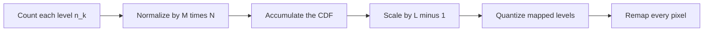

# Cornell Notes

## Topic: Histogram Processing

**Source:** Section 3.3, printed pp. 120–144 (PDF pp. 143–167).

**Learning outcomes**

- Interpret normalized histograms as discrete probability distributions.
- Compute histogram equalization and explain its limitations.
- Distinguish equalization, histogram matching, and local enhancement.
- Use local mean and variance to target selected image regions.

---

## Cue Column

- What information does a histogram discard?
- Why does equalization use a cumulative distribution function (CDF)?
- Why is the discrete result not perfectly uniform?
- How does histogram matching choose output levels?
- When are local statistics preferable?

---

## Notes Section

### 1. Histogram fundamentals

For an $M\times N$ image with $L$ possible levels $r_k$, the histogram is

$$h(r_k)=n_k,\qquad k=0,1,\ldots,L-1,$$

where $n_k$ counts pixels at level $r_k$. Dividing by the pixel count gives

$$p_r(r_k)=\frac{n_k}{MN}.$$

Thus $p_r(r_k)\ge0$ and

$$\sum_{k=0}^{L-1}p_r(r_k)=1.$$

A histogram describes intensity frequency, not pixel position. Different images can have identical histograms but completely different spatial structure.

Broad occupancy often indicates stronger global contrast. Concentration near the low or high end often indicates a dark or bright image. These are clues, not guarantees of visual quality.

### 2. Histogram equalization

For continuous normalized intensity $r\in[0,1]$, define

$$s=T(r)=\int_0^r p_r(w)\,dw.$$

This is the input CDF. It is monotonic, stays in $[0,1]$, and—under ideal continuous assumptions—produces a uniform output density.

For discrete images:

$$s_k=(L-1)\sum_{j=0}^{k}p_r(r_j).$$

Round or otherwise quantize $s_k$ to an available output level, then replace every pixel of level $r_k$ by that mapped level.

#### Worked example

Suppose a $4\times4$, 3-bit image has counts

| $r_k$ | 0 | 1 | 2 | 3 | 4 | 5 | 6 | 7 |
|---|---:|---:|---:|---:|---:|---:|---:|---:|
| $n_k$ | 4 | 4 | 0 | 0 | 4 | 0 | 0 | 4 |
| CDF | 0.25 | 0.50 | 0.50 | 0.50 | 0.75 | 0.75 | 0.75 | 1.00 |

With $L=8$ and nearest-integer quantization:

$$s_k=\operatorname{round}(7\,\mathrm{CDF}(r_k)).$$

Occupied levels map as

$$0\mapsto2,\qquad1\mapsto4,\qquad4\mapsto5,\qquad7\mapsto7.$$

The output uses only four levels. Equalization spreads them, but cannot invent enough distinct samples to make all eight bins equally populated.

> **Discrete limitation:** Equalization does not generally produce a flat histogram. Quantization, repeated CDF values, and unavailable output levels prevent exact uniformity.

### 3. Histogram matching

Equalization has a fixed target: approximately uniform intensity occupancy. **Histogram matching** or **specification** instead targets a chosen distribution $p_z(z)$.

Let

$$s=T(r)$$

be the input CDF mapping and

$$s=G(z)$$

be the target CDF mapping. Then

$$z=G^{-1}[T(r)].$$

For discrete levels, exact inversion may not exist. Choose the target level whose CDF is closest to the equalized input value while preserving monotonic order.

Procedure:

1. compute the input normalized histogram and CDF;
2. compute the target normalized histogram and CDF;
3. for each input level, find the closest target CDF value;
4. build one LUT and remap the image.

A specified histogram must be valid: all values nonnegative, total probability one.

### 4. Local histogram processing

A global histogram can hide a small region whose distribution differs from the entire image. Local processing centers a neighborhood $S_{xy}$ at each pixel, computes its histogram, then transforms the center pixel using those local statistics.

Benefits:

- exposes details in locally dark or low-contrast areas;
- adapts to illumination changes across the image.

Costs and risks:

- greater computation;
- possible noise amplification in nearly uniform regions;
- abrupt appearance changes if neighborhood statistics are unstable.

A naive implementation rebuilds the histogram for every neighborhood. A sliding implementation subtracts the column leaving the window and adds the entering column. Its update cost depends mainly on window height rather than full window area.

### 5. Enhancement using local statistics

The global mean and variance are

$$m_G=\sum_{i=0}^{L-1}r_i p(r_i),$$

$$\sigma_G^2=\sum_{i=0}^{L-1}(r_i-m_G)^2p(r_i).$$

For neighborhood $S_{xy}$, define local mean $m_S(x,y)$ and local standard deviation $\sigma_S(x,y)$. A common rule enhances a center pixel only when

$$m_S(x,y)\le k_0m_G$$

and

$$k_1\sigma_G\le\sigma_S(x,y)\le k_2\sigma_G.$$

Then

$$g(x,y)=
\begin{cases}
E f(x,y),&\text{if all local conditions hold},\\
f(x,y),&\text{otherwise},
\end{cases}$$

where $E>1$. The mean condition selects dark neighborhoods. The variance bounds reject both very flat background and already high-contrast regions. Constants $k_0$, $k_1$, $k_2$, and $E$ are application parameters, not universal values.

### Embedded implementation notes

- Use $L$ counters; 256 bins suffice for an 8-bit grayscale histogram.
- Choose counter width for the maximum pixel count; $MN$ can overflow 16-bit storage.
- Compute the CDF with a wide accumulator.
- Convert the CDF directly into a 256-entry LUT.
- For streaming local histograms, retain enough rows for the moving window plus column summaries if memory permits.
- Define rounding consistently; changing floor to nearest alters mapped levels.

### Common mistakes

- Writing $p_r(r_k)=n_k/L$ instead of $n_k/(MN)$.
- Claiming discrete equalization guarantees a uniform histogram.
- Assuming histogram similarity implies spatial similarity.
- Using an invalid target distribution for matching.
- Recomputing every local histogram from scratch unnecessarily.
- Applying local equalization without checking noise amplification.
- Mixing variance $\sigma^2$ with standard deviation $\sigma$ in threshold conditions.

### Quick activity

For counts $[1,1,2,0]$ in a 2-bit image, verify

$$p=[0.25,0.25,0.50,0],\qquad\mathrm{CDF}=[0.25,0.50,1,1].$$

Using nearest-integer quantization with $L=4$ gives mappings

$$0\mapsto1,\qquad1\mapsto2,\qquad2\mapsto3.$$

### Self-check

1. What spatial information does a histogram retain?
2. Why is the equalization mapping monotonic?
3. Why can several input levels map to one output level?
4. What extra input does histogram matching require?
5. Why use both local mean and variance in selective enhancement?

Answers

1. None; it retains only intensity counts.
2. A CDF never decreases.
3. Discrete output levels require quantization, and nearby CDF values may quantize identically.
4. A valid desired output distribution or histogram.
5. Mean selects brightness class; variance selects local contrast and excludes unsuitable regions.

---

## Summary Section

Histograms estimate intensity probabilities while discarding location. Equalization applies the input CDF; matching composes input and target CDFs; local methods adapt using neighborhood distributions or statistics. Discrete quantization, numeric width, noise sensitivity, and efficient sliding updates determine practical results.

**Previous:** [Basic Intensity Transformations](02_basic_intensity_transformation_functions.md)  
**Next:** [Fundamentals of Spatial Filtering](04_fundamentals_of_spatial_filtering.md)
