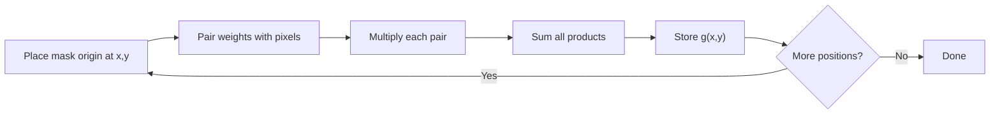

# Cornell Notes

## Topic: Fundamentals of Spatial Filtering

**Source:** Section 3.4, printed pp. 144–152 (PDF pp. 167–175).

**Learning outcomes**

- Compute linear correlation and convolution at one image location.
- Explain the $180^\circ$ kernel rotation in convolution.
- Express spatial filtering as a vector dot product.
- Select explicit kernel-origin and border conventions.

---

## Cue Column

- How does a mask produce one output pixel?
- Which indices distinguish correlation from convolution?
- When do both operations produce the same result?
- Why are odd-sized masks convenient?
- What implementation choices affect boundary pixels?

---

## Notes Section

### 1. Spatial filtering mechanics

A spatial filter consists of a neighborhood and an operation applied to its pixels. A **linear** filter forms a sum of products between coefficients $w(s,t)$ and image values.

For an $m\times n$ mask, odd dimensions are commonly written as

$$m=2a+1,\qquad n=2b+1.$$

Odd dimensions provide one unambiguous center coefficient at $(0,0)$. Even masks remain possible, but their origin must be stated explicitly.

At each image coordinate:

1. place the mask origin over $(x,y)$;
2. pair each coefficient with its covered pixel;
3. multiply each pair;
4. sum the products;
5. store the result at $g(x,y)$.

### 2. Correlation

Correlation applies the mask as written:

$$g_{\mathrm{corr}}(x,y)=\sum_{s=-a}^{a}\sum_{t=-b}^{b}w(s,t)f(x+s,y+t).$$

The coefficient at offset $(s,t)$ multiplies the pixel at the same offset from $(x,y)$.

### 3. Convolution

Convolution reverses the offset signs:

$$g_{\mathrm{conv}}(x,y)=\sum_{s=-a}^{a}\sum_{t=-b}^{b}w(s,t)f(x-s,y-t).$$

Equivalently, rotate the mask by $180^\circ$, then correlate. If

$$w(s,t)=w(-s,-t),$$

the kernel is symmetric under $180^\circ$ rotation, so correlation and convolution are identical.

> Image-processing software often uses “convolution” loosely for either operation. Verify the API convention whenever an asymmetric derivative or feature-detection mask is used.

### 4. Worked asymmetric example

Take a one-dimensional neighborhood

$$[10,20,30]$$

and kernel

$$w=[-1,0,1].$$

Correlation gives

$$(-1)(10)+0(20)+1(30)=20.$$

Convolution rotates the kernel to $[1,0,-1]$:

$$1(10)+0(20)-1(30)=-20.$$

The magnitude matches; the sign reverses. Direction-sensitive filters therefore expose correlation/convolution mistakes.

For symmetric $w=[1,2,1]$, rotation changes nothing, so both give

$$1(10)+2(20)+1(30)=80.$$

### 5. Vector representation

Arrange the $mn$ coefficients and matching pixels in the same order:

$$\mathbf{w}=[w_1,w_2,\ldots,w_{mn}]^T,$$

$$\mathbf{z}=[z_1,z_2,\ldots,z_{mn}]^T.$$

Then the filter response is

$$R=\mathbf{w}^T\mathbf{z}=\sum_{k=1}^{mn}w_kz_k.$$

This form makes the linear structure explicit. It also clarifies that coefficient order and pixel order must agree.

### 6. Creating masks

Two basic routes are common:

- **Specify the desired sum of products directly.** Example: average all values, approximate a derivative, or emphasize the center.
- **Sample a continuous function.** Choose mask coordinates, evaluate the function, then normalize or otherwise scale the coefficients.

Before using a mask, check:

- coefficient sum;
- symmetry;
- expected response to a constant image;
- expected response to a simple step or impulse;
- required numeric range.

For smoothing, a coefficient sum of one usually preserves constant brightness. For derivative masks, a coefficient sum of zero usually produces zero response in a constant region.

### 7. Border and output policies

Near image boundaries, some required pixels lie outside the image.

| Policy | Behavior | Typical consequence |
|---|---|---|
| Valid only | compute where mask fully overlaps | smaller output or untouched border |
| Zero padding | assume outside pixels are zero | artificial dark boundary |
| Replication | repeat nearest border pixel | flat extension |
| Reflection | mirror pixels across edge | often smoother transition |
| Wrapping | read opposite edge | suitable only for periodic data |

Also specify:

- output size;
- anchor/origin for even masks;
- rounding rule;
- clipping or saturation rule;
- whether intermediate signed/negative values are retained.

### 8. Embedded implementation notes

- Keep the input immutable during neighborhood filtering unless using a proven line-buffer schedule.
- Accumulate in a wider signed type. A $3\times3$ 8-bit sum already reaches $2295$ before weighting.
- Delay division and clipping until accumulation completes.
- Fixed normalization denominators can use integer rounding; document the rule.
- Separable kernels reduce an $m\times n$ filter to one horizontal plus one vertical pass when $w(s,t)=u(s)v(t)$.
- Streaming hardware can use line buffers instead of a complete second frame.

### Common mistakes

- Swapping $a$ and $b$ when mapping rows and columns.
- Calling correlation convolution without checking kernel symmetry.
- Rotating a symmetric kernel unnecessarily—not wrong, only wasted work.
- Clipping each product or partial sum instead of the final result.
- Accumulating unsigned derivative responses that can be negative.
- Leaving border behavior to an undocumented library default.
- Using in-place raster scanning and consuming modified neighbors.

### Quick activity

For

$$
\mathbf{z}=
\begin{bmatrix}
1&2&3\\
4&5&6\\
7&8&9
\end{bmatrix},\qquad
\mathbf{w}=
\begin{bmatrix}
0&0&0\\
-1&0&1\\
0&0&0
\end{bmatrix},
$$

correlation returns

$$-1(4)+1(6)=2.$$

Convolution returns $-2$ because the asymmetric kernel is rotated.

### Self-check

1. Why are odd mask dimensions convenient?
2. What single operation converts correlation into convolution?
3. When are correlation and convolution guaranteed equal?
4. Why should derivative-filter accumulation use a signed type?
5. What simple test checks whether a smoothing mask preserves a constant image?

Answers

1. They provide a unique center coefficient and origin.
2. Rotate the mask by $180^\circ$ before correlation.
3. When the mask has $180^\circ$ rotational symmetry.
4. Derivative responses can be negative.
5. Verify that its coefficients sum to one.

---

## Summary Section

Linear spatial filtering computes a dot product between a mask and each image neighborhood. Correlation uses the mask as written; convolution rotates it by $180^\circ$. Kernel origin, ordering, borders, intermediate width, and clipping are part of the algorithm and must remain explicit.

**Previous:** [Histogram Processing](03_histogram_processing.md)  
**Next:** [Smoothing Spatial Filters](05_smoothing_spatial_filters.md)
