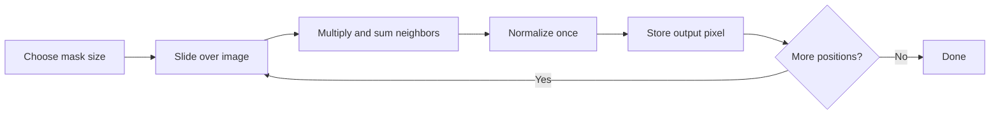
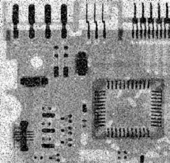
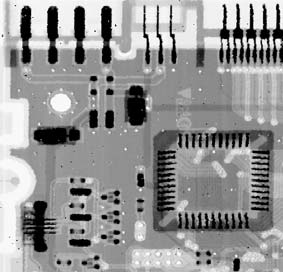

# Cornell Notes

## Topic: Smoothing Spatial Filters

**Source:** Section 3.5, printed pp. 152–157 (PDF pp. 175–180).

**Learning outcomes**

- Explain the noise-reduction/detail-loss tradeoff of averaging.
- Compute box, weighted-average, and median outputs.
- Select a smoothing method from the noise model.
- Estimate arithmetic, buffering, and overflow requirements.

---

## Cue Column

- Why does averaging reduce random variation?
- Why does it blur edges?
- What does mask size control?
- Why is the median robust to impulse noise?
- Which numeric hazards matter on embedded targets?

---

## Notes Section

### 1. Purpose and unavoidable tradeoff

Smoothing reduces noise and small detail by attenuating rapid intensity changes. Edges also are rapid changes; therefore stronger smoothing normally means weaker edges.

Mask size defines the spatial scale removed. Features smaller than the mask are suppressed most strongly. Choose the smallest mask that adequately reduces the target noise.

### 2. Linear averaging filters

A weighted average over neighborhood $S_{xy}$ is

$$g(x,y)=\frac{\sum_{(s,t)\in S_{xy}}w(s,t)f(s,t)}{\sum_{(s,t)\in S_{xy}}w(s,t)}.$$

For a $3\times3$ box filter, every weight is one:

$$w=\frac{1}{9}
\begin{bmatrix}
1&1&1\\
1&1&1\\
1&1&1
\end{bmatrix}.$$

A center-weighted alternative is

$$w=\frac{1}{16}
\begin{bmatrix}
1&2&1\\
2&4&2\\
1&2&1
\end{bmatrix}.$$

Both coefficient sums equal one, so both preserve a constant image. The weighted mask gives closer pixels more influence, generally producing less severe blur than equal weighting of the same support.

For independent, zero-mean noise, averaging $K$ equally weighted samples reduces noise variance ideally by approximately $K$ and standard deviation by $\sqrt K$. Real image pixels are correlated, and edges violate the constant-signal assumption, so actual behavior differs.

### 3. Why averaging blurs

When a mask overlaps both sides of an edge, its output combines distinct region intensities. The sharp transition becomes intermediate values spread over several pixels. Enlarging the mask broadens this transition.

### 4. Order-statistic filters

Order-statistic filters sort or rank neighborhood intensities. They are nonlinear; no fixed weighted sum describes them.

- **Median:** middle ranked value; highly effective against salt-and-pepper noise.
- **Maximum:** removes dark impulses; enlarges bright regions.
- **Minimum:** removes bright impulses; enlarges dark regions.
- **Midpoint:** $(z_{\max}+z_{\min})/2$; useful for some uniform or Gaussian-like noise, vulnerable to impulses.

For odd sample count $K$, the median is rank $(K+1)/2$. For even $K$, define whether the implementation averages the middle pair or chooses one.

### 5. Worked examples

For values

$$[2,3,3,4,250],$$

the mean is

$$\frac{262}{5}=52.4,$$

while the median is $3$. One bright impulse dominates the mean but not the median.

For the $3\times3$ neighborhood

$$
\begin{bmatrix}
10&10&10\\
10&255&10\\
10&10&10
\end{bmatrix},
$$

the box average is

$$\frac{8(10)+255}{9}\approx37,$$

whereas the median is $10$. The median removes this isolated bright impulse while retaining the surrounding level.

The median is not universally better: on finely textured images or thin lines, it can remove valid structures resembling impulses.

#### Extracted source figure: averaging versus median filtering

| Noisy input | $3\times3$ averaging | $3\times3$ median |
|---|---|---|
|  |  |  |

*Figure 3.35. Source: Gonzalez and Woods, Section 3.5, printed p. 157 (PDF p. 180). Native raster panels extracted from the locally supplied textbook PDF for study reference.*

#### How to read the comparison

Compare residual white and black impulses first, then inspect traces and component boundaries. Averaging spreads impulses into gray neighborhoods and softens edges. The median removes most isolated impulses while retaining sharper boundaries.

#### Interpretation limits

This example supports median filtering for salt-and-pepper noise, not for every noise model. It does not establish equal performance on Gaussian noise, texture, or valid one-pixel features.

### 6. Embedded implementation notes

- A $3\times3$ 8-bit box sum requires at least 12 unsigned bits because its maximum is $9\times255=2295$.
- Divide once after summing; do not round every term.
- For box filters, running horizontal/vertical sums avoid repeated additions.
- Streaming implementations need line buffers for previous rows, not necessarily a complete frame.
- Small fixed-size medians can use a sorting network or selection routine; a general full sort is unnecessary.
- Replicate or reflect borders when artificial dark padding is unacceptable.
- Keep input and output separate unless a proven rolling-buffer design preserves all required original samples.

### Common mistakes

- Claiming smoothing removes noise without losing detail.
- Forgetting to normalize a weighted mask.
- Using too narrow an accumulator.
- Assuming the median is optimal for Gaussian noise.
- Treating the median as a linear convolution.
- Choosing mask size without relating it to feature size.
- Comparing filters under different border policies.

### Quick activity

For values $[4,5,5,6,30]$:

$$\text{mean}=10,\qquad\text{median}=5.$$

If $30$ is impulse noise, the median better estimates the local background. If $30$ belongs to a real thin bright feature, removing it may be wrong.

### Self-check

1. Why does a larger averaging mask blur more?
2. What coefficient condition preserves a constant image?
3. Which order-statistic filter removes isolated bright impulses?
4. Why can median filtering damage thin structures?
5. What is the maximum $5\times5$ box-filter sum for 8-bit pixels?

Answers

1. It mixes intensities across a wider spatial area.
2. The normalized coefficients sum to one.
3. The minimum filter can remove bright impulses; the median usually removes mixed salt-and-pepper impulses with less shape expansion.
4. Their pixels can be statistical outliers inside the neighborhood.
5. $25\times255=6375$.

---

## Summary Section

Linear smoothing averages neighbors, reducing noise while spreading edges. Weighted masks control spatial influence; order-statistic filters use ranks instead of sums. Noise type, feature scale, border policy, accumulator width, and buffering determine the practical choice.

**Previous:** [Spatial Filtering Fundamentals](04_fundamentals_of_spatial_filtering.md)  
**Next:** [Sharpening Spatial Filters](06_sharpening_spatial_filters.md)
