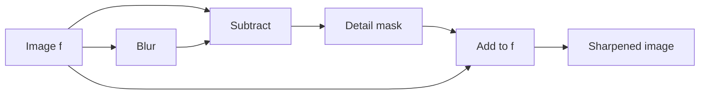

# Cornell Notes

## Topic: Sharpening Spatial Filters

**Source:** Section 3.6, printed pp. 157–169 (PDF pp. 180–192).

---

### Cue Column

- Why do derivatives emphasize edges?
- How does the Laplacian sharpen an image?
- What are unsharp masking and highboost filtering?
- How do gradient operators differ from the Laplacian?

---

### Notes Section

Sharpening emphasizes transitions, fine detail, or isolated discontinuities using derivatives.

#### Second derivative: Laplacian

For discrete images:

$$\nabla^2 f(x,y)=f(x+1,y)+f(x-1,y)+f(x,y+1)+f(x,y-1)-4f(x,y)$$

Depending on the mask sign convention, sharpen with:

$$g=f-\nabla^2f$$

or $g=f+\nabla^2f$. The Laplacian is isotropic but amplifies noise.

#### Unsharp masking and highboost

Blur the image $\bar f$, then form a detail mask:

$$g_{mask}=f-\bar f$$

Unsharp masking adds the mask back:

$$g=f+g_{mask}$$

Highboost scales the original contribution:

$$g=Af-\bar f,\qquad A\ge1$$

#### First derivative: gradient

$$\nabla f=\begin{bmatrix}G_x\\G_y\end{bmatrix},\qquad
|\nabla f|=\sqrt{G_x^2+G_y^2}$$

A common cheaper approximation is $|G_x|+|G_y|$. Roberts and Sobel masks approximate directional derivatives. Gradient magnitude is strong at edges and weak in constant regions.

---

### Summary Section

The Laplacian uses second derivatives; gradient masks use first derivatives. Unsharp masking isolates high-frequency detail by subtracting a blurred image, then restores that detail with adjustable gain.

**Previous:** [Smoothing Spatial Filters](05_smoothing_spatial_filters.md)  
**Next:** [Combining Enhancement Methods](07_combining_spatial_enhancement_methods.md)
