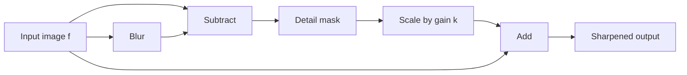

# Cornell Notes

## Topic: Sharpening Spatial Filters

**Source:** Section 3.6, printed pp. 157–169 (PDF pp. 180–192).

**Learning outcomes**

- Relate finite differences to edges and fine detail.
- Apply Laplacian sharpening with the correct sign convention.
- Distinguish unsharp masking from highboost filtering.
- Compute and approximate gradient magnitude using Sobel masks.

---

## Cue Column

- Why do derivatives suppress constant regions?
- Why does the Laplacian require signed intermediate values?
- Which sign combines a given Laplacian mask with the image?
- What does highboost gain control?
- How do first and second derivatives differ visually?

---

## Notes Section

### 1. Derivatives and image detail

Sharpening emphasizes transitions, thin structures, and isolated discontinuities. Discrete derivatives respond weakly in constant or slowly varying regions and strongly where intensity changes rapidly.

A first finite difference is

$$\frac{\partial f}{\partial x}\approx f(x+1,y)-f(x,y).$$

A second finite difference is

$$\frac{\partial^2f}{\partial x^2}\approx f(x+1,y)+f(x-1,y)-2f(x,y).$$

Second derivatives often produce paired positive/negative responses around ramps and stronger responses at fine detail. Both derivatives amplify high-frequency noise.

### 2. Laplacian

The two-dimensional Laplacian is

$$\nabla^2f=\frac{\partial^2f}{\partial x^2}+\frac{\partial^2f}{\partial y^2}.$$

Using four neighbors:

$$\nabla^2 f(x,y)=f(x+1,y)+f(x-1,y)+f(x,y+1)+f(x,y-1)-4f(x,y).$$

Its mask is

$$
\begin{bmatrix}
0&1&0\\
1&-4&1\\
0&1&0
\end{bmatrix}.
$$

Including diagonal neighbors gives center coefficient $-8$ with eight surrounding $+1$ coefficients.

For a negative center coefficient, sharpen by subtraction:

$$g=f-\nabla^2f.$$

If every mask sign is reversed, sharpen by addition:

$$g=f+\nabla^2f.$$

The rule is not “always add” or “always subtract.” Inspect the mask sign. The combined sharpening mask for the four-neighbor, negative-center form is

$$
\begin{bmatrix}
0&-1&0\\
-1&5&-1\\
0&-1&0
\end{bmatrix}.
$$

Its coefficients sum to one, preserving constant regions.

> Displaying the raw Laplacian usually requires rescaling or offsetting because it contains negative values. Rescaling is for visualization; retain signed values for sharpening arithmetic.

### 3. Unsharp masking and highboost filtering

First blur the image:

$$\bar f=\text{lowpass}(f).$$

Create the unsharp mask:

$$g_{\mathrm{mask}}=f-\bar f.$$

Add scaled detail back:

$$g=f+k g_{\mathrm{mask}}.$$

- $k=1$: classical unsharp masking.
- $k>1$: highboost sharpening.
- $0<k<1$: milder sharpening.

Equivalent form:

$$g=(1+k)f-k\bar f.$$

Some texts write $g=Af-\bar f$ with $A\ge1$; this corresponds to a particular parameterization. State the formula used before comparing gain values.

### 4. Gradient

The gradient vector is

$$\nabla f=
\begin{bmatrix}
G_x\\
G_y
\end{bmatrix}
=
\begin{bmatrix}
\partial f/\partial x\\
\partial f/\partial y
\end{bmatrix}.$$

Its magnitude is

$$M(x,y)=\sqrt{G_x^2+G_y^2}.$$

A cheaper approximation is

$$M(x,y)\approx|G_x|+|G_y|.$$

The approximation avoids a square root but overestimates some diagonal responses. Another cheap approximation is $\max(|G_x|,|G_y|)$, with different error behavior.

Common Sobel correlation masks are

$$G_x=
\begin{bmatrix}
-1&0&1\\
-2&0&2\\
-1&0&1
\end{bmatrix},\qquad
G_y=
\begin{bmatrix}
-1&-2&-1\\
0&0&0\\
1&2&1
\end{bmatrix}.$$

Using convolution reverses both masks and therefore response signs. Gradient magnitude remains unchanged, but signed orientation does not.

Sobel combines differentiation with limited smoothing through weights $1,2,1$. Roberts uses a smaller $2\times2$ support, giving higher localization but more noise sensitivity and an origin convention that must be explicit.

### 5. Worked example

For a horizontal Sobel neighborhood

$$
\begin{bmatrix}
10&10&10\\
10&10&100\\
10&10&100
\end{bmatrix},
$$

correlation with $G_x$ gives

$$(-10+10)+(-20+200)+(-10+100)=270.$$

The large positive response indicates intensity increasing toward the right under this correlation convention.

For a constant $3\times3$ neighborhood, every derivative-mask response is zero because the coefficients sum to zero.

### 6. Embedded implementation notes

- Keep derivative responses signed; Sobel values can be negative.
- For 8-bit pixels, $G_x$ or $G_y$ can reach magnitude $1020$, requiring more than signed 10 bits.
- $G_x^2+G_y^2$ needs wider storage than either component.
- Delay absolute value, scaling, and clipping until after signed filtering.
- Use $|G_x|+|G_y|$ when square-root cost matters and its approximation error is acceptable.
- Reuse line buffers across blur, Laplacian, or Sobel stages when schedules permit.
- Sharpen noise only after deciding whether denoising should precede the derivative.

### Common mistakes

- Combining a Laplacian with the wrong sign.
- Clipping negative Laplacian values before adding them to the image.
- Calling the raw derivative image the final sharpened image.
- Confusing highboost parameterizations.
- Computing Sobel in unsigned arithmetic.
- Assuming convolution and correlation preserve signed edge direction.
- Applying excessive gain, creating halos and saturated pixels.

### Quick activity

For a constant neighborhood of value $50$, the four-neighbor Laplacian is

$$4(50)-4(50)=0.$$

For center $100$ surrounded by four values $50$:

$$\nabla^2f=4(50)-4(100)=-200.$$

Using the negative-center convention:

$$g=100-(-200)=300,$$

which must later be scaled or clipped for an 8-bit output.

### Self-check

1. Why do derivative masks usually sum to zero?
2. When should the Laplacian be added instead of subtracted?
3. What is the unsharp mask?
4. Why must raw Laplacian values remain signed?
5. What information can convolution reverse even when Sobel magnitude is unchanged?

Answers

1. To produce zero response in constant regions.
2. When the chosen mask has a positive center and negative neighbors.
3. The original image minus its blurred version.
4. Negative responses contribute correctly during sharpening; early clipping destroys them.
5. The sign of directional responses and therefore gradient orientation convention.

---

## Summary Section

Sharpening extracts rapid spatial changes, then combines them with the image. Laplacian sharpening depends on mask sign; unsharp masking adds high-frequency residuals with adjustable gain; gradients estimate directional first derivatives. Signed wide intermediates, noise control, and late clipping are essential.

**Previous:** [Smoothing Spatial Filters](05_smoothing_spatial_filters.md)  
**Next:** [Combining Enhancement Methods](07_combining_spatial_enhancement_methods.md)
