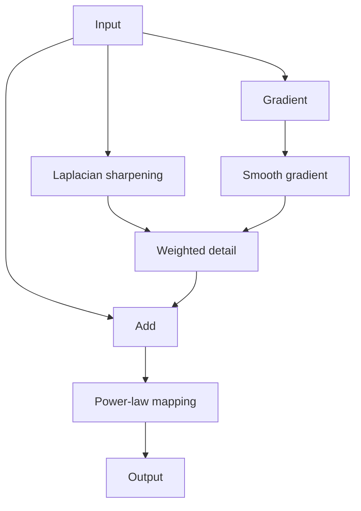

# Cornell Notes

## Topic: Combining Spatial Enhancement Methods

**Source:** Section 3.7, printed pp. 169–173 (PDF pp. 192–196).

---

### Cue Column

- Why combine enhancement operations?
- In what order should smoothing, derivatives, and intensity mapping occur?
- How do masks control where enhancement applies?

---

### Notes Section

One operator rarely handles noise, contrast, and detail simultaneously. A practical pipeline combines complementary methods.

A representative strategy:

1. Apply the Laplacian to reveal fine detail.
2. Add the Laplacian result to the original image.
3. Compute a gradient image for prominent edges.
4. Smooth the gradient to create a less noisy weighting mask.
5. Multiply the sharpened image by that mask.
6. Add the weighted detail to the original.
7. Apply a power-law transform to adjust the final dynamic range.

Order matters. Derivatives can amplify noise; smoothing the control mask before combining reduces this effect. Intermediate images should retain sufficient numeric range to avoid clipping.

---

### Summary Section

Composite enhancement assigns one operation to each problem: derivatives recover detail, smoothing stabilizes masks, arithmetic combines results, and point transforms set final contrast.

**Previous:** [Sharpening Spatial Filters](06_sharpening_spatial_filters.md)  
**Next:** [Fuzzy Techniques](08_fuzzy_techniques.md)
