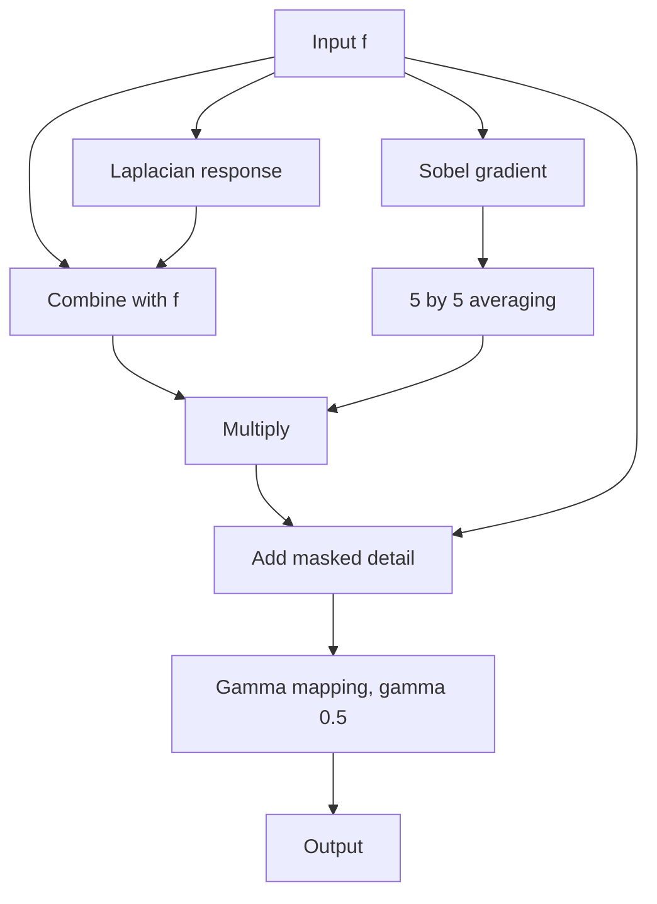

# Cornell Notes

## Topic: Combining Spatial Enhancement Methods

**Source:** Section 3.7, printed pp. 169–173 (PDF pp. 192–196).

**Learning outcomes**

- Assign a distinct purpose to every stage in a composite enhancement pipeline.
- Trace the whole-body bone-scan example through its intermediate images.
- Explain why operation order, numeric range, and masking matter.
- Evaluate enhancement without mistaking it for new evidence.

---

## Cue Column

- Why is one operator often insufficient?
- Why smooth a gradient before using it as a mask?
- Which image should receive the weighted detail?
- Why delay clipping until the final stage?
- How should medical enhancement be interpreted?

---

## Notes Section

### 1. Why combine methods?

An image may simultaneously have poor contrast, blurred detail, noise, and a wide dynamic range. One transform rarely addresses all four safely. A composite method gives each stage one job:

- Laplacian: recover fine detail;
- gradient: locate strong boundaries;
- smoothing: suppress noisy variation in the gradient mask;
- multiplication: gate detail spatially;
- addition: combine enhancement with the original;
- gamma mapping: set final display contrast.

The stages are coupled. Changing one affects the numeric range and meaning of later stages.

### 2. Source example: whole-body bone scan

Let the input be $f$. The source pipeline can be represented as follows.

1. Compute a Laplacian image:

   $$l=\nabla^2f.$$

2. Add or subtract it according to the chosen Laplacian sign convention, producing a sharpened image:

   $$s=f-l$$

   for a negative-center Laplacian mask.

3. Compute the Sobel gradient magnitude:

   $$g\approx|G_x|+|G_y|.$$

4. Smooth the gradient using a $5\times5$ averaging filter:

   $$\bar g=\operatorname{avg}_{5\times5}(g).$$

5. Multiply the sharpened image by the smoothed gradient mask:

   $$m=s\,\bar g.$$

6. Add the masked detail to the original:

   $$e=f+m.$$

7. Apply a power-law transform with $\gamma=0.5$:

   $$o=c e^{0.5}.$$

### 3. Why the smoothed gradient acts as a mask

The gradient is large at prominent transitions but also responds to noise. Multiplying directly by an unsmoothed gradient can create a speckled enhancement. Averaging the gradient:

- broadens strong edge support;
- reduces isolated derivative responses;
- creates smoother spatial gain.

Multiplication makes enhancement strong where the mask is large and weak where it is small. The mask should therefore be normalized or scaled deliberately; otherwise its magnitude can dominate the product.

### 4. Why order matters

- **Differentiate before denoising:** strong noise amplification.
- **Clip the Laplacian early:** loss of negative information needed for correct recombination.
- **Gamma before derivative stages:** changes local slopes, therefore changes detected edges.
- **Smooth after multiplication:** does not stabilize the control mask in the same way.
- **Add every derivative globally:** enhances noise and unimportant texture.

There is no universally correct order, but every chosen order must match a stated purpose.

### 5. Numeric-range discipline

Intermediate Laplacian and Sobel values exceed the input range and may be negative. Products require still wider storage. Therefore:

1. retain signed, high-precision intermediate data;
2. scale masks before multiplication;
3. avoid display normalization between computational stages;
4. clip or quantize once, near final output.

An intermediate image displayed for study may be normalized independently. That displayed version must not be fed back into the algorithm unless the normalization is explicitly part of it.

### 6. Interpretation limits

Enhancement redistributes existing measurements. It does not prove that a highlighted structure is anatomically real, remove acquisition uncertainty, or replace the original scan.

For medical use:

- preserve the original image;
- record all parameters;
- compare enhanced and original views;
- validate against expert interpretation and downstream performance;
- treat enhancement as inspection support, not replacement evidence.

### Embedded implementation notes

- Fuse stages only after confirming fused arithmetic matches the reference pipeline.
- Reuse line buffers for Laplacian, Sobel, and averaging where their schedules align.
- Normalize the smoothed gradient into a documented fixed-point range before multiplication.
- Calculate worst-case bounds for every intermediate and product.
- Keep a low-resolution reference implementation for bit-exact comparison.
- Expose only parameters that need tuning; fixed source-derived choices need no speculative configuration layer.

### Common mistakes

- Applying the wrong Laplacian sign.
- Multiplying by an unscaled Sobel magnitude.
- Using display-normalized intermediate images for computation.
- Clipping after each stage.
- Assuming stage order is interchangeable.
- Evaluating only visual sharpness while ignoring noise and saturation.
- Presenting enhanced medical imagery without the original or processing record.

### Quick activity

Suppose one pixel has

$$f=80,\qquad l=-20,\qquad\bar g=0.25.$$

With negative-center Laplacian convention:

$$s=f-l=100,$$

$$m=s\bar g=25,$$

$$e=f+m=105.$$

Before final gamma mapping, masked enhancement increased the pixel by $25$. If $\bar g$ were zero, the original $80$ would remain unchanged.

### Self-check

1. Why smooth the gradient rather than the final image?
2. What does multiplying by the gradient-derived mask accomplish?
3. Why should intermediate visualization scaling remain separate from computation?
4. Which stage adjusts final dynamic range?
5. Why must the original medical image remain available?

Answers

1. To stabilize the spatial control signal before it gates detail.
2. It applies stronger detail enhancement near selected boundaries and less elsewhere.
3. Display scaling can alter signs and relative magnitudes required by later arithmetic.
4. The final power-law or gamma transform.
5. Enhancement can introduce artifacts or hide information; it is not replacement evidence.

---

## Summary Section

Composite enhancement succeeds when every stage has one explicit role. The source pipeline sharpens with the Laplacian, locates boundaries with Sobel, smooths the gradient into a mask, gates detail by multiplication, adds it to the original, then applies gamma mapping. Correct ordering, scaling, signed precision, provenance, and interpretation safeguards are essential.

**Previous:** [Sharpening Spatial Filters](06_sharpening_spatial_filters.md)  
**Next:** [Fuzzy Techniques](08_fuzzy_techniques.md)
