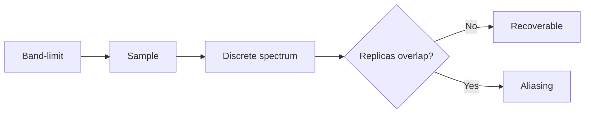

# Cornell Notes

## Topic: Sampling and the Fourier Transform of Sampled Functions

**Source:** Section 4.3, printed pp. 211–219 (PDF pp. 234–242).

---

### Cue Column

- How does impulse-train sampling affect the spectrum?
- What causes aliasing?
- What sampling rate permits recovery?

---

### Notes Section

Sampling multiplies a continuous function by an impulse train of spacing $\Delta t$. In frequency, this replicates its spectrum every $1/\Delta t$.

For maximum signal frequency $u_{max}$, exact recovery requires the Nyquist condition

$$\frac{1}{\Delta t}>2u_{max}.$$

If replicas overlap, high frequencies masquerade as lower ones: aliasing. An antialiasing low-pass filter limits bandwidth before sampling. Reconstruction then interpolates samples with an ideal sinc kernel; practical systems approximate it.

---

### Summary Section

Sampling repeats spectra. Band-limiting plus a rate above twice the highest frequency prevents overlap.

**Previous:** [Preliminary Concepts](02_preliminary_concepts.md)  
**Next:** [One-Dimensional DFT](04_one_dimensional_discrete_fourier_transform.md)
