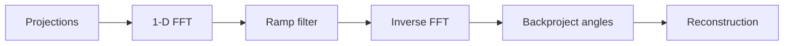

# Cornell Notes

## Topic: Image Reconstruction from Projections

**Source:** Section 5.11, printed pp. 362–387 (PDF pp. 385–410).

---

### Cue Column

- What is a projection and a sinogram?
- How does the Fourier slice theorem enable reconstruction?
- Why is filtered backprojection needed?

---

### Notes Section

A projection integrates image values along parallel lines. The Radon transform at angle $\theta$ is

$$P_\theta(t)=\iint f(x,y)\delta(t-x\cos\theta-y\sin\theta)dxdy.$$

The Fourier slice theorem states that the 1-D Fourier transform of $P_\theta$ equals a radial slice through the 2-D transform of $f$. Plain backprojection smears each measurement across its acquisition line, producing blur. Filtered backprojection first applies a ramp-like frequency filter, then backprojects over angles.

Sparse angles, noise, and limited view create characteristic streaks and missing-direction artifacts.

---

### Summary Section

Tomographic reconstruction recovers an image from line integrals; filtering compensates for backprojection blur.

**Previous:** [Geometric Mean Filter](10_geometric_mean_filter.md)  
**Next:** [Color Fundamentals](../06_color_image_processing/01_color_fundamentals.md)
