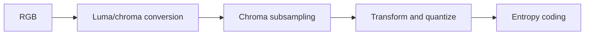

# Cornell Notes

## Topic: Color Image Compression

**Source:** Section 6.9, printed pp. 454–455 (PDF pp. 477–478).

---

### Cue Column

- Why transform color before compression?
- What permits chroma subsampling?
- Which artifacts reveal excessive compression?

---

### Notes Section

Color compression commonly converts RGB into luminance plus chrominance. Human vision retains finer luminance detail than chromatic detail, so chroma planes can often be sampled more coarsely. A typical pipeline is

Loss must be judged after reconstruction: excessive quantization creates blocking, ringing, contouring, or color bleeding. Subsampling is less suitable for synthetic graphics, text, and sharp colored boundaries.

---

### Summary Section

Color compression exploits channel decorrelation and lower chromatic acuity, trading chroma resolution and coefficient precision for fewer bits.

**Previous:** [Noise in Color Images](08_noise_in_color_images.md)  
**Next:** Chapter 7 — Wavelets and Multiresolution Processing
