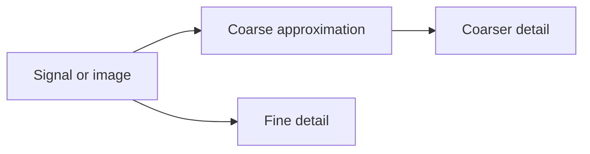

# Cornell Notes

## Topic: Background

**Source:** Section 7.1, printed pp. 462–476 (PDF pp. 485–499).

---

### Cue Column

- Why analyze an image at multiple scales?
- How do wavelets differ from Fourier bases?
- What are scaling and wavelet functions?

---

### Notes Section

Fourier coefficients locate frequency but not where a short-lived feature occurs. Wavelets use shifted and scaled, spatially localized functions, preserving both scale and position. Coarse approximations describe broad structure; details record changes lost between successive resolutions.

A continuous wavelet family derives from a mother wavelet $\psi$:

$$\psi_{a,b}(t)=\frac{1}{\sqrt{|a|}}\psi\!\left(\frac{t-b}{a}\right),\qquad a\ne0.$$

Small $|a|$ captures fine, high-frequency behavior; large $|a|$ captures broad, low-frequency behavior. A valid analyzing wavelet has zero mean and finite energy. Discrete dyadic scales make computation practical. Scaling functions span approximation spaces; wavelet functions span the detail needed to move to the next finer space.

---

### Summary Section

Wavelets localize scale and position. Multiresolution analysis separates coarse content from progressively finer details.

**Previous:** [Color Image Compression](../06_color_image_processing/09_color_image_compression.md)  
**Next:** [Multiresolution Expansions](02_multiresolution_expansions.md)
