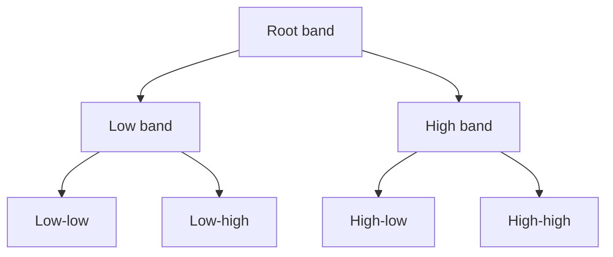

# Cornell Notes

## Topic: Wavelet Packets

**Source:** Section 7.6, printed pp. 510–520 (PDF pp. 533–543).

---

### Cue Column

- How do wavelet packets extend the DWT tree?
- What is a best basis?
- Why avoid decomposing every node blindly?

---

### Notes Section

The ordinary DWT recursively splits only the low-frequency approximation. A wavelet-packet transform may split approximation and detail nodes, creating a full binary tree of increasingly narrow frequency bands.

Each admissible pruning of that tree defines a basis. A best-basis search compares the cost of retaining a parent against the summed cost of its children. For additive cost $C$:

$$C(\text{parent})\le C(\text{left})+C(\text{right})$$

means keep the parent; otherwise retain the split. Entropy-like costs favor representations with energy concentrated in fewer coefficients.

Full trees increase computation and may overfit a particular signal. Select the tree using a task-relevant cost, then transmit or preserve its structure with the coefficients.

---

### Summary Section

Wavelet packets generalize multiresolution trees by allowing every band to split; best-basis pruning chooses useful resolution adaptively.

**Previous:** [Two-Dimensional Wavelet Transforms](05_two_dimensional_wavelet_transforms.md)  
**Next:** [Image Compression Fundamentals](../08_image_compression/01_fundamentals.md)
