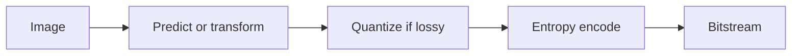

# Cornell Notes

## Topic: Basic Compression Methods

**Source:** Section 8.2, printed pp. 542–613 (PDF pp. 565–636).

---

### Cue Column

- When should predictive, transform, or dictionary coding be used?
- Why does entropy coding shorten common symbols?
- Where does loss enter a codec?

---

### Notes Section

Entropy coders represent probable symbols with fewer bits. Huffman coding uses integral-length prefix words; arithmetic coding represents an entire message as a subinterval and can approach entropy more closely. Run-length coding is effective for long repeated regions; dictionary methods replace recurring strings with references.

Predictive coding transmits a prediction error:

$$e[n]=x[n]-\hat x[n],\qquad \hat x[n]=\sum_{k=1}^{p}a_kx[n-k].$$

Small, concentrated residuals cost fewer bits. Transform coding decorrelates blocks or subbands, quantizes coefficients according to importance, then entropy-codes them. Quantization

$$q=\operatorname{round}(c/\Delta)$$

is usually the lossy step; larger $\Delta$ lowers rate but increases distortion. JPEG-like block coding favors low-frequency coefficients, while wavelet coders exploit multiscale coefficient trees and avoid block boundaries.

Method choice follows data structure: flat runs favor RLE, repeated sequences favor dictionaries, local correlation favors prediction, and energy compaction favors transforms.

---

### Summary Section

Practical codecs combine a redundancy-removing model, optional quantization, and lossless entropy coding; quantization controls the main rate–distortion tradeoff.

**Previous:** [Fundamentals](01_fundamentals.md)  
**Next:** [Digital Image Watermarking](03_digital_image_watermarking.md)
