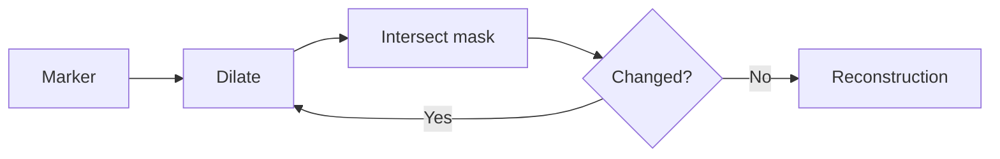

# Cornell Notes

## Topic: Basic Morphological Algorithms

**Source:** Section 9.5, printed pp. 642–664 (PDF pp. 665–687).

---

### Cue Column

- How are boundaries, holes, and components extracted?
- What makes reconstruction different from ordinary dilation?
- How do thinning and skeletons preserve shape?

---

### Notes Section

Boundary extraction subtracts an erosion:

$$\beta(A)=A-(A\ominus B).$$

Hole filling and connected-component extraction use iterative geodesic dilation constrained by a mask. Starting from marker $X_0$, update

$$X_k=(X_{k-1}\oplus B)\cap A$$

until $X_k=X_{k-1}$. The mask prevents growth across forbidden pixels; convergence yields the reachable component. Morphological reconstruction generalizes this marker-under-mask process and often preserves surviving contours better than unconstrained opening.

Thinning removes matched boundary pixels while preserving connectivity; thickening is its dual. Skeletonization represents an object by medial structure plus scale information. A set-based skeleton component is

$$S_k(A)=(A\ominus kB)-[(A\ominus kB)\circ B].$$

The union of valid $S_k$ forms the skeleton, and dilating each component by $kB$ reconstructs the original set under the model.

---

### Summary Section

Complex morphology builds on erosion, dilation, set difference, and constrained iteration to extract boundaries, regions, components, thin forms, and skeletons.

**Previous:** [Hit-or-Miss Transformation](04_hit_or_miss_transformation.md)  
**Next:** [Gray-Scale Morphology](06_gray_scale_morphology.md)
