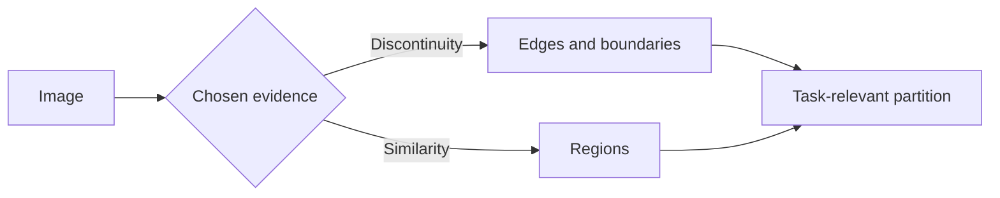

# Cornell Notes

## Topic: Fundamentals

**Source:** Section 10.1, printed pp. 690–691 (PDF pp. 713–714).

---

### Cue Column

- What is segmentation?
- Which two image properties drive most methods?
- When is a segmentation useful?

---

### Notes Section

Segmentation partitions an image domain $R$ into nonempty, connected regions $R_i$ whose union is $R$. Regions should satisfy a chosen homogeneity predicate $P$ while adjacent regions should fail that predicate:

$$\bigcup_{i=1}^{n}R_i=R,\quad R_i\cap R_j=\varnothing,\quad P(R_i)=\mathrm{true},\quad P(R_i\cup R_j)=\mathrm{false}.$$

Most methods exploit either **discontinuity** (abrupt intensity, color, or texture changes) or **similarity** (pixels sharing a model). Edge detection follows discontinuities; thresholding and region methods organize similar samples.

Segmentation quality is task-dependent. A useful partition preserves boundaries and regions needed by later measurement or recognition; it need not reproduce every visible detail. Noise, weak boundaries, illumination variation, texture, and touching objects make the problem ambiguous.

---

### Summary Section

Segmentation converts pixels into task-relevant regions by testing discontinuity or similarity under an explicit criterion.

**Previous:** [Gray-Scale Morphology](../09_morphological_image_processing/06_gray_scale_morphology.md)  
**Next:** [Point, Line, and Edge Detection](02_point_line_and_edge_detection.md)
