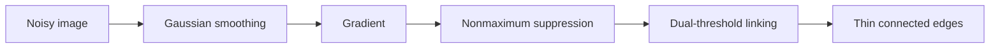

# Cornell Notes

## Topic: Point, Line, and Edge Detection

**Source:** Section 10.2, printed pp. 692–737 (PDF pp. 715–760).

---

### Cue Column

- How do derivatives reveal discontinuities?
- What distinguishes points, lines, and edges?
- Why combine smoothing, nonmaximum suppression, and hysteresis?

---

### Notes Section

A spatial mask responds strongly when its local pattern matches an isolated point, oriented line, or transition. First derivatives produce peaks near edges; second derivatives cross zero near transition centers but amplify noise.

For image $f$, gradient magnitude and direction are

$$\nabla f=\begin{bmatrix}f_x\\f_y\end{bmatrix},\qquad |\nabla f|=\sqrt{f_x^2+f_y^2},\qquad \alpha=\operatorname{atan2}(f_y,f_x).$$

Roberts, Prewitt, and Sobel masks approximate $f_x,f_y$. Sobel includes mild smoothing. The Laplacian

$$\nabla^2f=f_{xx}+f_{yy}$$

is isotropic but normally requires prior smoothing. The Laplacian of Gaussian combines both operations; its zero crossings propose edges at a selected scale.

Reliable edge extraction separates **detection** from **localization**. A Canny-style pipeline smooths with a Gaussian, computes gradients, thins responses by nonmaximum suppression, then links strong and connected weak responses using two thresholds. Hough voting can convert sparse edge pixels into parametric lines: for each edge point, votes satisfy

$$\rho=x\cos\theta+y\sin\theta.$$

Example: a vertical step has large $f_x$, small $f_y$, and gradient direction normal to the edge; nonmaximum suppression retains only the local peak across that normal.

---

### Summary Section

Derivative masks detect local discontinuities; smoothing, thinning, linking, and voting turn noisy responses into usable geometric evidence.

**Previous:** [Fundamentals](01_fundamentals.md)  
**Next:** [Thresholding](03_thresholding.md)
