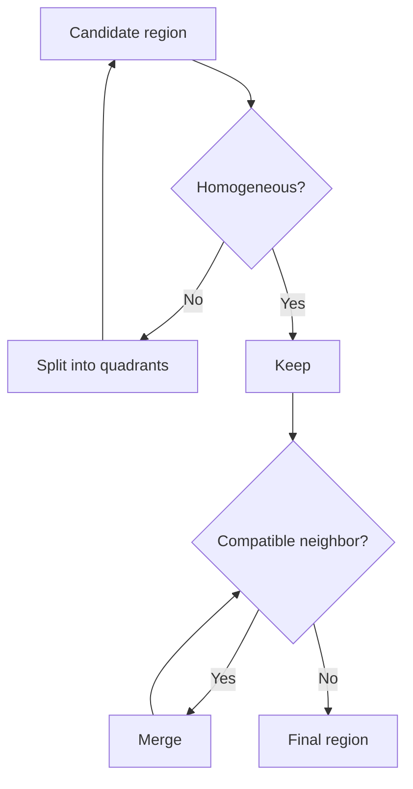

# Cornell Notes

## Topic: Region-Based Segmentation

**Source:** Section 10.4, printed pp. 763–768 (PDF pp. 786–791).

---

### Cue Column

- How does region growing differ from edge detection?
- What makes a good seed and similarity predicate?
- How do splitting and merging cooperate?

---

### Notes Section

Region methods construct connected sets directly. **Region growing** starts from seeds and repeatedly attaches neighboring pixels satisfying a predicate based on intensity, color, texture, or a region model. Seed placement and update order matter when classes overlap.

A simple acceptance rule compares candidate value $z$ with current region mean $\mu_R$:

$$|z-\mu_R|\le T.$$

Updating $\mu_R$ adapts the model but can cause gradual leakage across weak boundaries. Connectivity, maximum variance, and boundary evidence can constrain growth.

**Split-and-merge** begins with the whole image. A quadtree recursively splits any block failing $P(R)$; adjacent blocks are then merged when their union satisfies $P$. Splitting finds local consistency, while merging removes artificial rectangular divisions.

---

### Summary Section

Region growing builds from trusted seeds; split-and-merge searches hierarchically. Both require a meaningful homogeneity predicate and connectivity rule.

**Previous:** [Thresholding](03_thresholding.md)  
**Next:** [Segmentation Using Morphological Watersheds](05_segmentation_using_morphological_watersheds.md)
