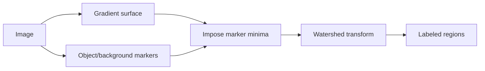

# Cornell Notes

## Topic: Segmentation Using Morphological Watersheds

**Source:** Section 10.5, printed pp. 769–777 (PDF pp. 792–800).

---

### Cue Column

- What topographic model defines a watershed?
- Why does a raw watershed oversegment?
- How do markers control the result?

---

### Notes Section

Treat a grayscale image—usually a gradient magnitude—as terrain. Low values form catchment basins; flooding from each minimum expands basins. Where floods would meet, dams form **watershed lines**, producing closed region boundaries.

Every insignificant local minimum can seed a basin, so noise and texture cause severe oversegmentation. Smoothing can reduce minima but may also move boundaries. **Marker-controlled watershed** instead specifies trusted internal markers for objects and external markers for background, modifies the surface so relevant markers become the effective minima, then floods that constrained surface.

A practical sequence is:

Distance transforms help separate touching binary objects: peaks of distance-to-background become internal markers, and watershed ridges divide objects near their contact zones.

---

### Summary Section

Watershed segmentation turns a scalar surface into catchment basins. Markers suppress irrelevant minima and make boundaries correspond to known objects and background.

**Previous:** [Region-Based Segmentation](04_region_based_segmentation.md)  
**Next:** [Use of Motion in Segmentation](06_use_of_motion_in_segmentation.md)
