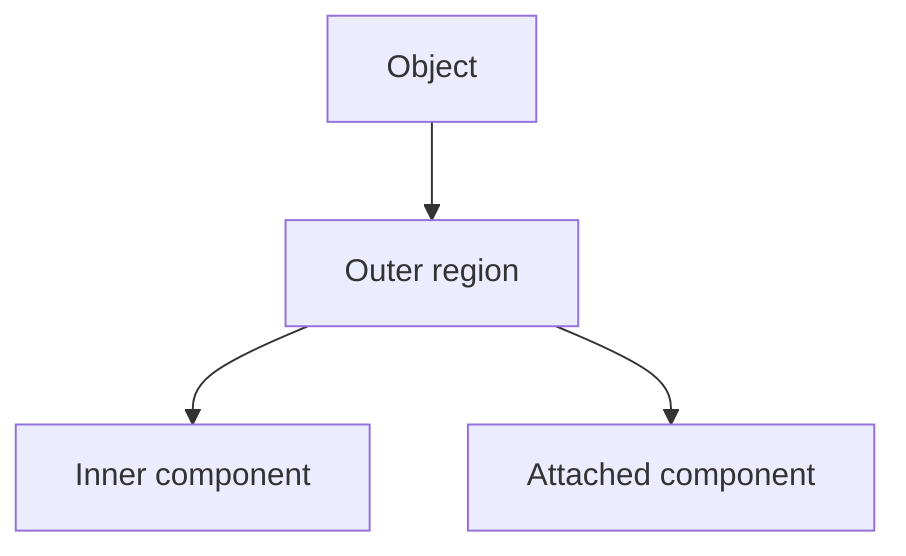

# Cornell Notes

## Topic: Relational Descriptors

**Source:** Section 11.5, printed pp. 852–856 (PDF pp. 875–879).

---

### Cue Column

- Why describe relations between regions?
- What does a region adjacency graph encode?
- How can strings and trees represent structure?

---

### Notes Section

Object identity often depends on arrangement rather than isolated region features. Relational descriptors encode statements such as adjacent, inside, above, left-of, near, or connected-by.

A **region adjacency graph** maps each segmented region to a node and shared boundaries to edges. Node attributes store color, area, or shape; edge attributes store contact length, distance, or orientation. Graph descriptions tolerate varying region size but depend on stable segmentation and meaningful relation thresholds.

Boundaries or skeleton paths can be partitioned into primitives and encoded as strings. Trees naturally represent containment: the parent is an enclosing region, children are enclosed components. These structures support matching at multiple levels.

Example: a symbol with one small region inside a larger ring differs relationally from two side-by-side regions even when the component descriptors are identical.

---

### Summary Section

Relational descriptors preserve adjacency, containment, ordering, and geometry between parts, adding organization that individual feature vectors omit.

**Previous:** [Principal Components for Description](04_principal_components_for_description.md)  
**Next:** [Patterns and Pattern Classes](../12_object_recognition/01_patterns_and_pattern_classes.md)
