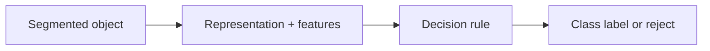

# Cornell Notes

## Topic: Patterns and Pattern Classes

**Source:** Section 12.1, printed pp. 861–865 (PDF pp. 884–888).

---

### Cue Column

- What is a pattern?
- How does a class model variation?
- What separates feature extraction from classification?

---

### Notes Section

A pattern is an observation represented for recognition: a feature vector, string, tree, or graph. A pattern class groups observations assigned the same semantic label despite nuisance variation.

For vector representation,

$$x=[x_1,x_2,\ldots,x_d]^T,$$

features should separate classes while remaining stable under expected noise, translation, scale, viewpoint, or illumination. Feature extraction maps raw measurements to $x$; classification maps $x$ to a label $\omega_i$. Training estimates models or decision rules from labeled or unlabeled examples.

A complete system keeps preprocessing consistent and evaluates unseen data. Class imbalance, overlapping distributions, outliers, and distribution shift can dominate classifier choice. Rejecting uncertain inputs may be safer than forcing every sample into a known class.

---

### Summary Section

Recognition represents observations as patterns, extracts stable discriminative structure, then assigns pattern classes using a learned or designed rule.

**Previous:** [Relational Descriptors](../11_representation_and_description/05_relational_descriptors.md)  
**Next:** [Recognition Based on Decision-Theoretic Methods](02_recognition_based_on_decision_theoretic_methods.md)
