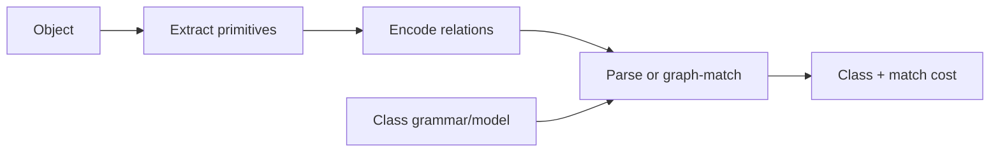

# Cornell Notes

## Topic: Structural Methods

**Source:** Section 12.3, printed pp. 903–906 (PDF pp. 926–929).

---

### Cue Column

- When is structural recognition preferable to feature vectors?
- What are primitives and production rules?
- Why is structural matching difficult?

---

### Notes Section

Structural recognition models an object as primitives plus their arrangement. Primitives may be line segments, curve types, boundary tokens, or regions. A grammar specifies valid compositions using production rules; parsing asks whether an observed primitive sequence or graph can be generated by a class grammar.

A simple string grammar can express repeated or nested arrangements. Graph matching handles richer adjacency and containment but exact matching is brittle: segmentation errors insert, delete, split, or merge primitives. Practical systems therefore use attributed primitives, error-tolerant parsing, edit costs, or probabilistic rules.

Vector and structural methods are complementary. Statistical features efficiently capture appearance variation; structural models explain part organization. Hybrid systems can score local parts statistically, then enforce global relations structurally.

Example: the same set of strokes can represent different symbols when order and attachment differ; a bag of stroke counts cannot distinguish them, while a relational grammar can.

---

### Summary Section

Structural methods recognize objects through primitives and relations. They explain composition well but require tolerant parsing when extraction is imperfect.

**Previous:** [Recognition Based on Decision-Theoretic Methods](02_recognition_based_on_decision_theoretic_methods.md)  
**Next:** End of chapter sequence.
