# Cornell Notes

## Topic: Short Introduction of Mechatronic Systems

## Date: 08/09/2026

---

<p align="center"><strong><em>"DO NOT JUST TALK ABOUT IT — SHOW IT"</em></strong></p>

---

### Cue Column (Questions, Keywords, or Prompts)

- From Mechanical to Mechatronic Systems
- Example of Mechatronic Systems
- Functions of Mechatronic Systems

---

### Notes Section (Main Notes)

### From Mechanical to Mechatronic Systems

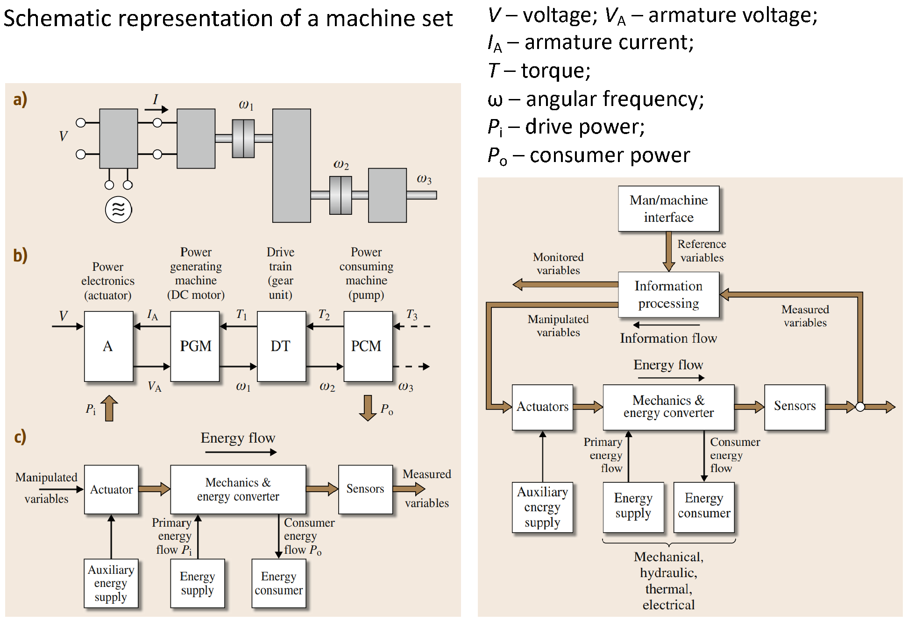

*Source: Chapter 1 PDF, page 4.*

The image explains how a mechanical machine becomes a mechatronic system by combining energy flow with information and feedback control.

Read the left side from top to bottom:

- (a) **A physical machine:** an electric motor drives a pump through a transmission. Electrical energy becomes rotational motion, then useful pumping work.
- (b) **The same machine represented as functional blocks:** power electronics → power-generating machine (motor) → drivetrain → power-consuming machine (pump). This helps you see each component’s role.
- (c) **A generalized model:** an actuator influences the mechanical process, while sensors measure its behavior. This model applies to many machines, beyond this particular motor and pump.

**The right-hand diagram adds the information-processing layer.** A controller receives sensor measurements, compares them with desired values, and sends commands to the actuator. A human–machine interface lets the operator set targets and monitor operation.

For example, if the goal is to maintain a pump’s speed:
1. The operator sets the desired speed.
2. A sensor measures actual speed.
3. The controller adjusts the motor’s electrical input when the speed differs from the target.

The two arrow styles highlight the central distinction: energy flow makes the machine do work; information flow regulates how that work is performed. Their integration is what makes the overall system mechatronic.

**Mechatronics**: synergetic integration of different disciplines

These integrated mechanical–electronic systems are increasingly called **mechatronic systems.**

The word *Mechatronics* was probably first created by a Japanese engineer, Tetsuro Mori, in 1969 and had a trademark by a Japanese company until 1972.

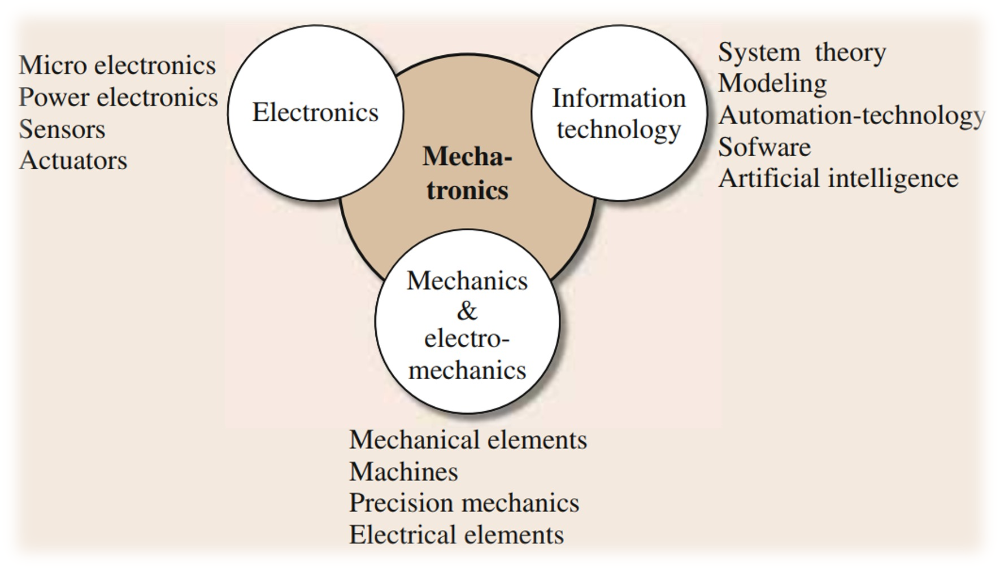

*Source: Chapter 1 PDF, page 5.*

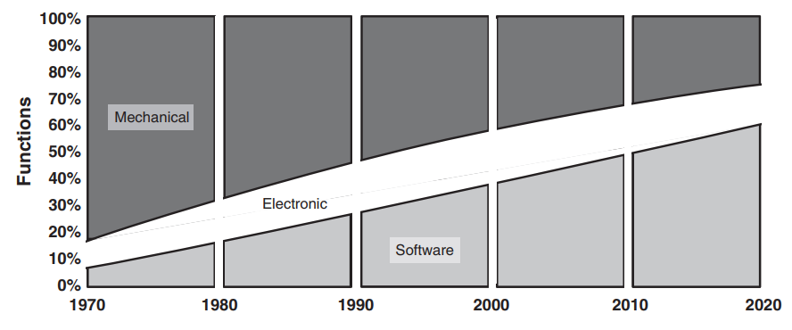

*Source: Chapter 1 PDF, page 5.*

### Difference of Industrial Automation and Mechatronics

While *mechatronics* and *industrial automation* are two fields that share certain similarities, they have many distinct differences as well.

The solution of tasks to design mechatronic systems is performed on the mechanical as well as on the digital-electronic side.
- Interrelations during the design and construction of mechatronic systems.

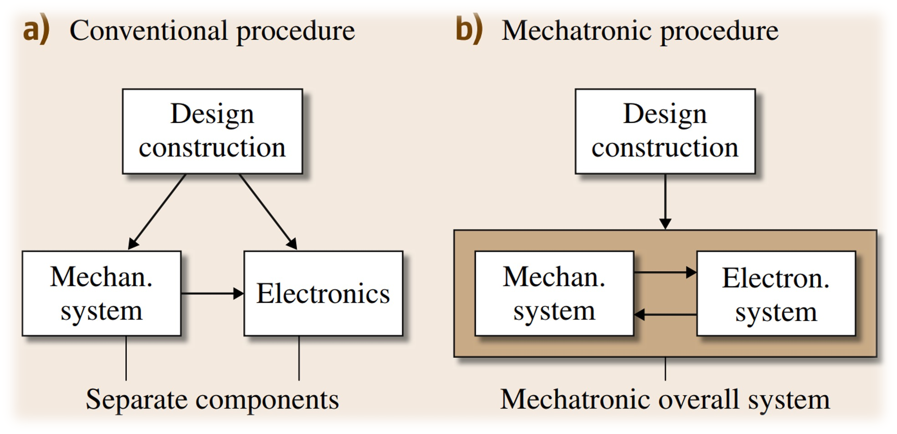

*Source: Chapter 1 PDF, page 6.*

Simultaneous engineering has to take place, with the goal of designing an overall integrated system (an organic system) and also creating synergetic effects.

On the **left—conventional design**, the mechanical system and electronics are designed largely as separate components, then connected. For example, you start with an existing pump and add sensors, a motor controller, and a PLC to automate its operation.

On the **right—mechatronic design**, mechanics and electronics are developed together as one system. The two-way arrow means decisions in either area influence the other. For example, the pump mechanism, motor, sensors, and control algorithm are chosen together to achieve the required performance.

| Conventional approach                           | Mechatronic approach                                     |
| ----------------------------------------------- | -------------------------------------------------------- |
| Design components separately, then connect them | Design interacting components together                   |
| Adapt controls to the mechanical design         | Let control capabilities influence the mechanical design |
| Focus on individual components                  | Optimize the overall system                              |

However, **the figure compares design approaches; it does not strictly separate industrial automation from mechatronics.** Industrial automation concerns making industrial processes operate automatically. Mechatronics concerns integrating mechanics, electronics, and control in a system’s design.

They overlap: an automated production line can contain many mechatronically designed machines, such as robots and servo-driven positioning systems.

### Examples of Mechatronic Systems

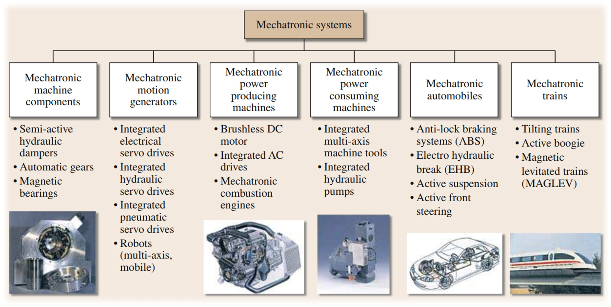

*Source: Chapter 1 PDF, page 7.*

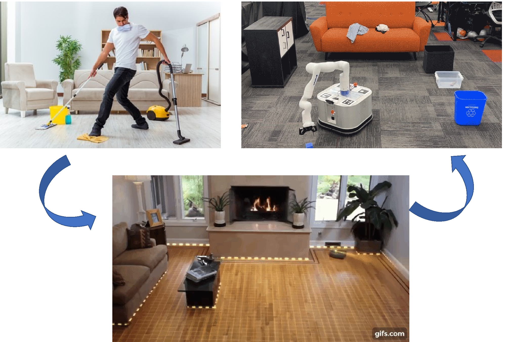

*Source: Chapter 1 PDF, page 13.*

### Functions of Mechatronic Systems

Properties of conventional and mechatronic desined systems

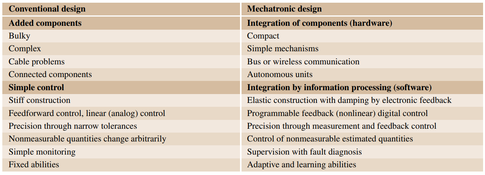

*Source: Chapter 1 PDF, page 8.*

There are 2 generations of control strategy shown in the table:

**Feedforward control** predicts the required control action from the command or a measured disturbance. It acts before the output error appears.
- For example, when a washing machine receives a heavier load estimate, *feedforward control* can immediately increase motor torque. It does not need to wait for the drum speed to fail first.

```text
Command/disturbance → controller → machine → output
```

- Because *pure feedforward control* does not correct unexpected errors by itself, practical systems often combine it with feedback.

**Linear analog feedback control** continuously measures the output, compares it with the desired value, and uses the error to adjust the actuator. "Linear" means the controller follows a relationship such as:

\(u(t)=K\,e(t)\)

where \(e(t)=r(t)-y(t)\). An analog controller implements this continuously with physical electronic circuits, such as operational amplifiers, resistors, and capacitors. Traditional analog PID controllers are a common example.

```text
Desired value ─→ comparison ─→ analog controller ─→ machine
                    ↑                              │
                    └──────── measured output ─────┘
```

**Programmable nonlinear digital feedback control** performs the feedback calculation in software running on a microcontroller, PLC, DSP, or computer. “Programmable” means its behavior can be changed in software. “Nonlinear” means its output does not have to be proportional to the error across the whole operating range.

For example, a digital motor controller might use:
- Different gains at low and high speeds
- Current and voltage limits
- Dead-zone compensation
- Lookup tables
- Mode switching
- Adaptive or model-based algorithms
Its simplified operation is:

```text
Sensor → ADC → software algorithm → PWM/DAC → actuator
              ↑
        desired value
```

The table’s main comparison is therefore:

| Control type                            | Basic behavior                                                              |
| --------------------------------------- | --------------------------------------------------------------------------- |
| Feedforward                             | Acts from a model, command, or disturbance prediction                       |
| Linear analog feedback                  | Continuously corrects measured error using fixed analog circuitry           |
| Programmable nonlinear digital feedback | Corrects error using software that can implement complex, changing behavior |

One subtle point: these categories are not mutually exclusive. A modern digital mechatronic controller commonly combines **feedforward and feedback**, and its feedback algorithm may contain both linear and nonlinear parts.

### Integration Forms of Processes with Electronics

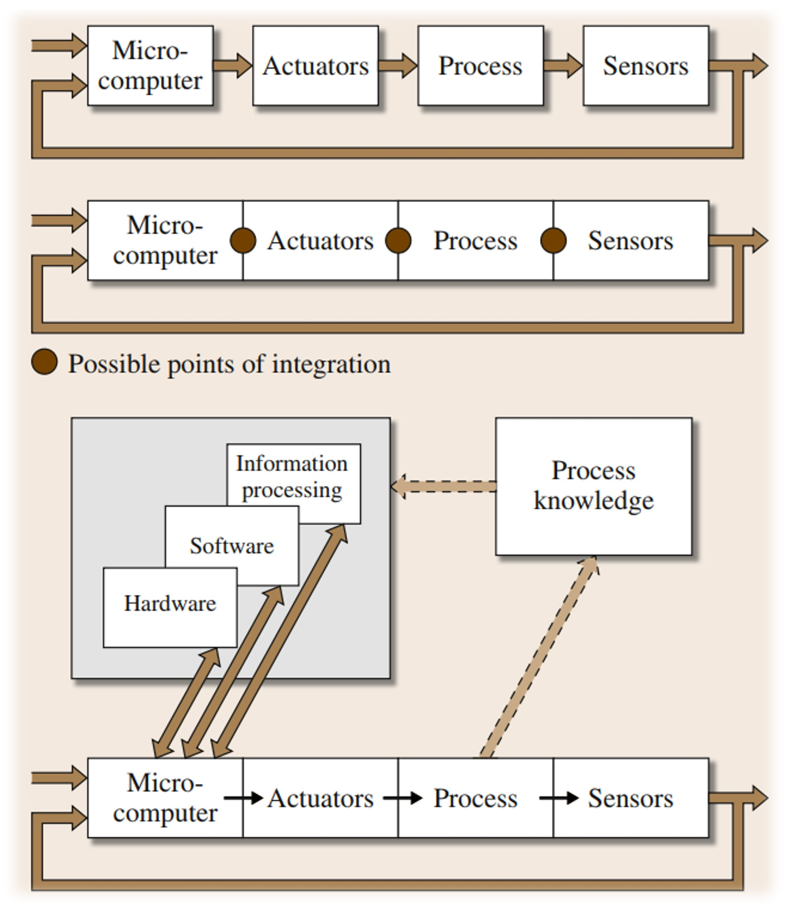

*Source: Chapter 1 PDF, page 9.*

This figure shows three increasing levels of integration in a mechatronic system. Each uses the same basic chain:

```text
Microcomputer → Actuators → Process → Sensors
       ↑                                │
       └────────── feedback ────────────┘
```

The **microcomputer** calculates control commands, the actuator converts those commands into physical action, the process is the machine being controlled, and the sensor measures the result.

#### General scheme of a (classical) mechanical-electronic system

In the top diagram, each block is a separate component:

```text
[Microcomputer] → [Actuators] → [Process] → [Sensors]
```

The controller, actuator, mechanical process, and sensors are designed and installed as distinct units. They communicate through external wiring and interfaces.
A traditional production machine with a separate PLC cabinet, motor drive, motor, and external sensors is a good example.

#### Integration through Components (Hardware Integration)

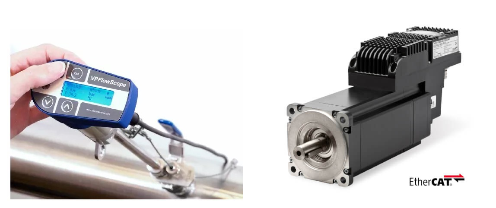

*Source: Chapter 1 PDF, page 10.*

In the middle diagram, the components remain functionally different, but some are physically combined. The brown dots mark possible integration points.
For example:
- A sensor can be embedded inside the machine.
- A motor can include its encoder and drive electronics.
- A controller and actuator electronics can share one housing.
- Components can use a common communication bus.

```text
[Controller | Actuator | Process | Sensor]
             integrated assembly
```

This typically makes the product smaller, reduces wiring, and can improve reliability.

### Integration by Information Processing (Software Integration)

The bottom diagram adds integration through information processing. The physical chain still exists, but the microcomputer now uses:
- Hardware
- Software
- Information processing
- Knowledge about the process

The arrows show that software can connect information from several parts of the system. Instead of merely reacting to one sensor value, the controller can combine measurements, mathematical models, operating rules, and previous behavior.

For example, a washing machine may use motor-current measurements to estimate the laundry load, detect imbalance, choose a suitable drum motion, and adjust water and energy consumption. One physical sensor can therefore support several software functions.

The dashed links to process knowledge mean that good software control depends on understanding how the machine behaves. That knowledge may be represented by equations, calibration data, lookup tables, or diagnostic rules.

```text
Classical system     → components are connected
Hardware integration → components are physically combined
Software integration → functions and information are combined
```

A modern mechatronic product usually uses both hardware and software integration. Hardware makes the system compact; software gives it adaptable, intelligent behavior.

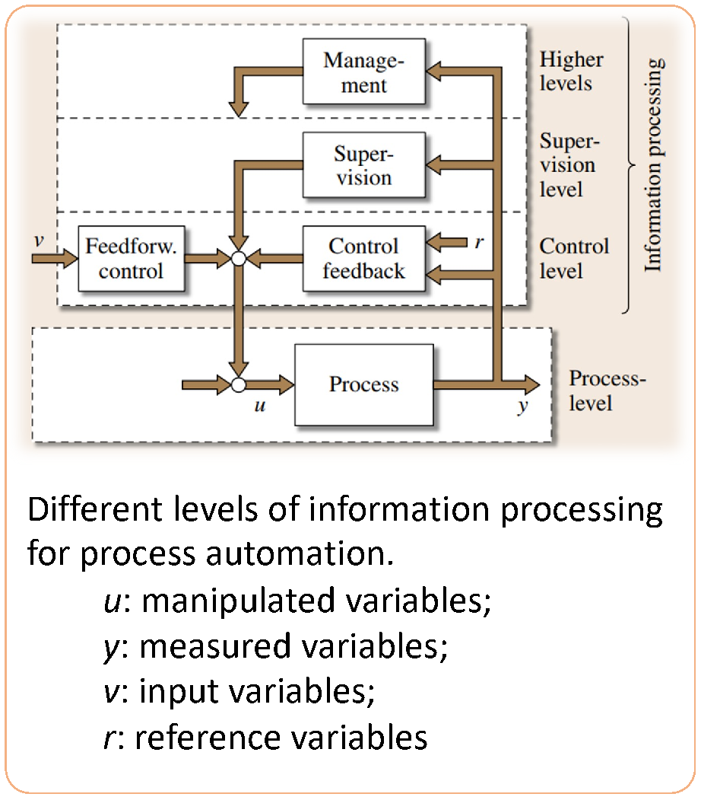

*Source: Chapter 1 PDF, page 11.*

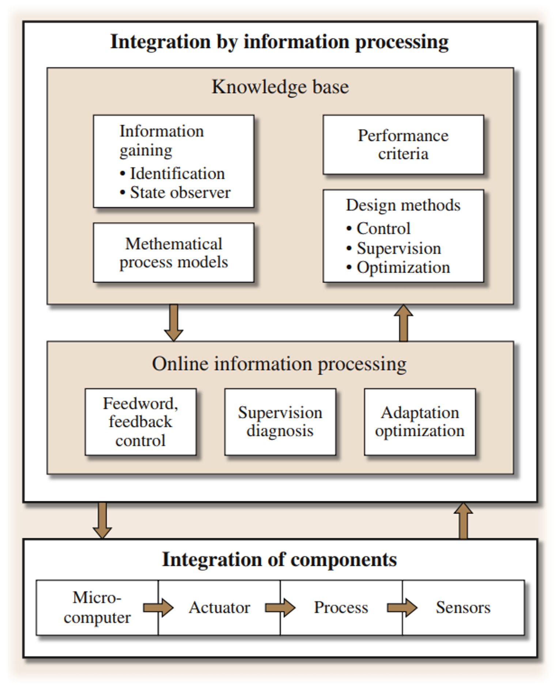

*Source: Chapter 1 PDF, page 11.*

### Integrated Supervision and Fault Diagnosis


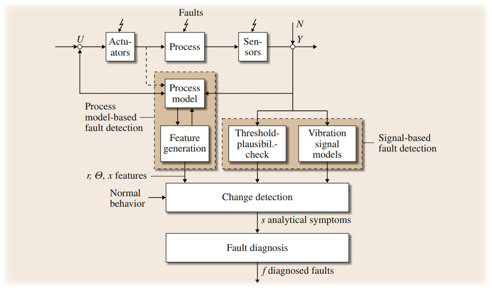

*Source: Chapter 1 PDF, page 12.*

---

### Summary Section (Summary of Notes)

Brief summary of the key ideas and takeaways
